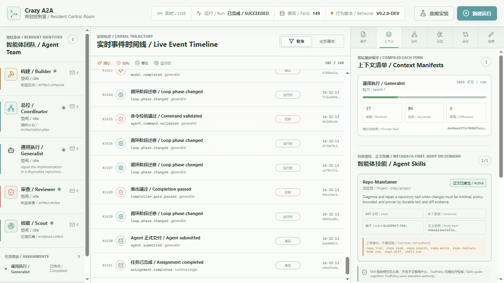

# Crazy Harness

[](https://github.com/BaoBao1996121/crazy-harness/actions/workflows/ci.yml)
[](LICENSE)
[](pyproject.toml)

**A from-scratch, event-driven, resident Agent Team runtime built to make every model decision, tool effect, recovery boundary, and context mutation inspectable.**

Crazy 是一个不依赖现有 Agent 框架接管主循环、手工实现的事件驱动 Harness。CI/CD disposable dev 只是可替换的业务落点，核心是 Agent Loop、Context、工具副作用、崩溃恢复和常驻 A2A Teamwork。



## 当前可运行能力

- SQLite 常驻 Control Plane：单调 Event cursor、Projection 重建、HTTP API 与 SSE
- React/TypeScript Control Room：Agent、Timeline、Context、A2A、Dream/Memory、Evolution、Chaos
- 显式 Agent Loop phase、typed command、response reuse 与 crash recovery
- AssignmentContract、LocalPlan、CompletionGate、bounded nudge；轮次与工具调用预算由 Harness 硬执行
- append-only EventLog、持久 Mailbox、Wait/Wake、OperationLedger
- 每轮 ContextManifest、Microcompact、Artifact Offloading、九维 Full Compact、ACL History recall
- native tool-call adapter、authority-first CapabilityCompiler、每轮可审计 Manifest；大目录可用 `capability.search` 检索短元数据，下一轮按来源事件披露完整原生 Tool Schema
- MCP 首个真实协议纵切：官方稳定 SDK、授权后动态挂载、Tool Search 延迟披露、原生 Tool Calling 与统一执行边界；外部 Transport 仍在 Phase 2 实施中
- Agent Skills 渐进披露纵切：显式可信 global/project/agent source、metadata-first 目录、`skill.activate` 按需正文、EventLog 恢复与 AgentLoop 保护槽；`allowed-tools` 只作提示，执行权仍归 ToolPolicy
- Hook 后重校验、ToolPolicy、连续安全段并发、GuardedLocalRuntime
- Playwright BrowserRuntime：screenshot、DOM、console、network 证据
- 声明式 TeamContract DAG、可插拔 SupervisorPolicy、PlanPatch Candidate 与 ControlKernel 契约防篡改校验
- 持久 Assignment Lease：Acquire、Heartbeat/Renew、Deadline Expire、备用 Agent 接管与旧 Delivery fencing
- v0.6 受控并发：有界 Worker Pool、Agent 间 Round-Robin、持久背压、SQLite Delivery + AgentRun + Worker Slot 原子 Claim、TTL 自动续期与单调 fencing token
- DispatchContext 将执行权与 CancellationToken 带入 Handler；旧 Worker 不能写可信运行事实、提交正式 Kernel 事实或 Ack，排队/在途 Run 均支持幂等协作式取消
- Coordinator / Scout / Scout Backup / Builder / Reviewer 按能力动态委派，并支持受控一跳 A2A 对账
- Team Worker 不再是直接伪造结果的事件处理器：Scripted Model 只提供确定性动作，每个 Assignment 都创建独立 child AgentRun，并由与单 Agent 共用的 canonical AgentLoop 逐轮推进；正式结果必须匹配持久 Contract、可回溯到 Seed/可信 Observation 的 Model/Command/Gate/Submission 链，以及以 `operation.completed` 收尾的合同 Tool Evidence
- Builder 可在自己的 child AgentRun 中进入 Wait；受控 Peer Request 会创建独立 Peer child AgentRun，响应经 Kernel 校验与 provenance 绑定后镜像回 Builder，再由下一次唤醒恢复原 Loop
- Command 的 accepted/rejected Event、正式事实、Projection 与 Ledger 终态在一个 SQLite 事务中原子提交；动态 Lease/唯一性条件在同一写事务内重检，事务内崩溃会整批回滚
- 正式 Event 同时充当持久 Outbox：若 Kernel 提交后、Mailbox 路由前崩溃，Runtime 会按 Event cursor 和确定性 Delivery ID 补投
- ResidentRuntime 监督 Handler 与调度周期普通异常；EventStore 暂时无法记录故障时使用有界内存缓冲并在恢复后补写；同一 Delivery 持久重试最多 3 次后进入 Dead Letter，并在根 `task_id` 上终结仍在运行的 Run/Assignment/Lease
- Resident Generalist：完整 Contract 随 Assignment 持久化；逐轮唤醒 canonical AgentLoop，真实读写 disposable repo、运行测试并由 CompletionGate 准出
- TaskPack 注册表：同一 Resident Runtime 可切换 Repo Maintainer 与 Evidence Research，恢复时按持久化 Pack ID 重建工具、Skill、Contract 与 Gate
- Evidence Research：来源 metadata 先行披露，Playwright Chromium 打开 allowlisted 页面，生成带规范引用的 `report.md`，并将提交 Artifact 绑定到校验后的 SHA-256 与引用列表
- dry replay、baseline-vs-candidate Eval、Memory candidate、Controlled Evolution

## 安装

```powershell
cd crazy-harness
python -m pip install -e ".[dev,examples,browser,mcp]"
python -m playwright install chromium
```

## 一键验收

```powershell
python work\check_course_ready.py
```

报告写入 `runs/course_ready/readiness_report.md`。当前 required checks 全部通过；DeepSeek 密钥与 Docker 主机是独立外部条件。

## 运行

单 Agent：

```powershell
python -m crazy_harness.cli run dev-release --mode mock --runs-dir runs\manual
```

课程版常驻事件驱动团队：

```powershell
python -m crazy_harness.cli run dev-release --team --mode mock --runs-dir runs\manual
```

Resident Control Plane（API、SSE 与前端共用一个服务）：

```powershell
cd frontend
npm ci
npm run build
cd ..
python -m crazy_harness.control_plane --port 8765 --data-dir runs\control_plane_v01
```

浏览器打开 `http://127.0.0.1:8765`。

“新建运行”提供两条执行路径；单 Agent 模式可继续选择 TaskPack：

- `repo-maintainer`：按需激活维护 Skill，真实读写 disposable repo、运行测试，并用测试和 diff 证据准出。
- `evidence-research`：按需激活研究 Skill，用真实 Chromium 打开本地证据源，写入报告并通过引用、结构和 Hash 门禁。
- `Agent Team 演示`：Supervisor 根据持久 TeamContract、AgentCard、状态与负载逐阶段生成 PlanPatch；Team Worker 使用 Scripted Model 驱动 canonical AgentLoop，真实展示 Assignment child AgentRun、Builder Wait/Resume、Peer child AgentRun 与 Kernel 结果晋升。

Tool Search 大目录演示（持久 Mailbox -> Scheduler -> AgentLoop -> 搜索 -> 下一轮 Schema 披露 -> 原生工具调用）：

```powershell
python work\run_capability_search_demo.py
```

MCP 延迟发现演示（官方 FastMCP memory transport -> tools/list -> 本地授权挂载 -> Tool Search -> tools/call）：

~~~powershell
python work\run_mcp_capability_demo.py
~~~

Agent Skills 不需要单独的演示脚本：在 Control Room 新建默认“单 Agent 真循环”，打开“上下文 / Context”即可观察 Skill 目录存根、来源/Scope、激活 Event、正文长度与 Hash；正文不会出现在目录 Event 或界面状态中。

重建完整学习证据：

```powershell
python work\generate_learning_evidence.py --output runs\learning_evidence
```

真实 DeepSeek V4 Flash 冒烟：

```powershell
$env:DEEPSEEK_API_KEY="..."
$env:DEEPSEEK_MODEL="deepseek-v4-flash"
$env:CRAZY_RUN_LLM_TESTS="1"
python -m pytest -q -m llm tests\e2e\test_resident_repo_maintainer_llm.py
```

## 学习入口

1. [`docs/README.md`](docs/README.md)：公开文档地图与建议阅读顺序。
2. [`docs/GENERAL_AGENT_TEAM_MASTER_PLAN.md`](docs/GENERAL_AGENT_TEAM_MASTER_PLAN.md)：通用 Agent Team 北极星、组件地图与实施路线。
3. [`docs/DURABLE_SUPERVISOR_WALKTHROUGH.md`](docs/DURABLE_SUPERVISOR_WALKTHROUGH.md)：动态编排、PlanPatch 信任边界、Lease 与故障转移。
4. [`docs/ARCHITECTURE_WALKTHROUGH.md`](docs/ARCHITECTURE_WALKTHROUGH.md)：静态架构、单 Agent 与 Teamwork 运行路径。
5. [`docs/HARNESS_CORE_ESSENTIALS.md`](docs/HARNESS_CORE_ESSENTIALS.md)：Agent Loop、Context、Memory、A2A 与 Eval 核心机制。
6. [`docs/EVIDENCE_RESEARCH_TASKPACK.md`](docs/EVIDENCE_RESEARCH_TASKPACK.md)：第二个 Golden Task 如何复用同一 Runtime，并用浏览器证据和引用门禁准出。
7. [`docs/AGENT_SKILLS_PROGRESSIVE_DISCLOSURE_WALKTHROUGH.md`](docs/AGENT_SKILLS_PROGRESSIVE_DISCLOSURE_WALKTHROUGH.md)：Skill 三层披露、Scope/信任边界与真实 Trace。
8. [`docs/MCP_DELAYED_DISCOVERY_WALKTHROUGH.md`](docs/MCP_DELAYED_DISCOVERY_WALKTHROUGH.md)：MCP 延迟发现、Tool Search 与执行边界。
9. [`docs/HARNESS_16H_ACTUAL_CODE_LEARNING_GUIDE.md`](docs/HARNESS_16H_ACTUAL_CODE_LEARNING_GUIDE.md)：课程版真实代码、测试与 Trace 手册。
10. [`labs/16h_sprint/README.md`](labs/16h_sprint/README.md)：八个学习块、known-good、Bug Card 与伪代码模板。

回来后的第一条学习命令：

```powershell
python labs\16h_sprint\block_01_agent_loop\run_demo.py
```

## 诚实边界

- GuardedLocalRuntime 是受控主机 subprocess，不是隔离沙箱。
- Resident Repo Maintainer 会真实修改每次运行独立创建的 disposable workspace，但测试文件被策略写保护。
- Evidence Research v1 只浏览本地 allowlisted HTML Fixture；它证明浏览器证据、渐进披露和引用 Gate，不冒充开放互联网检索或自然语言语义事实核验。
- 火山云第一版仅生成 disposable dev dry-run plan，不修改云资源。
- Resident v0.1 的 Dream 是确定性后台蒸馏，真实生成并治理 MemoryCandidate；尚未证明长期收益。
- Evolution 真实停在 Offline Replay；Shadow、Canary 与 Git Promotion 尚未执行。
- 课程路径保留 JSONL；Resident Control Plane 使用 SQLite。两者都不宣称生产吞吐或分布式容错。
- MCP 当前只完成官方 memory transport 的真实协议纵切；外部 stdio/Streamable HTTP 长连接、OAuth、通知与重连仍未完成。
- Skill 当前完成可信文件源、Scope 覆盖、按需正文激活和持久恢复；千级目录检索、资源正文按需读取、文件监听热更新、真实 DeepSeek 触发质量与受控 Skill Evolution 尚未完成。
- Team v0.6 已真实验证两路 Assignment 并行、容量/背压、跨 Runtime 三层 Claim、续期降级、统一 Event Fencing、取消和终态重放；每个 Scheduler 进程的总并发默认 2，单 Agent 的持久容量默认 1，跨进程外部写入检查默认 1 秒，均是初始值。跨 Scheduler 已防止同一 Agent 容量超卖，但尚未实现跨进程总容量槽；公平性也只覆盖单 Scheduler 进程。Team 模型仍是 Scripted Model；在线 DeepSeek Team、Remote A2A Adapter 与 Single-vs-Team 收益评测尚未完成。外部 HTTP 副作用仍需 OperationLedger、业务幂等键或对账，Fencing 不能撤回已发出的请求。

## 参与项目

先阅读 [`CONTRIBUTING.md`](CONTRIBUTING.md) 与 [`SECURITY.md`](SECURITY.md)。Crazy 欢迎围绕可恢复 Runtime、Context/Memory、MCP/A2A、Sandbox、Eval 和受控 Evolution 的小步 PR；任何新机制都必须给出关闭该机制的基线与可重放证据。

## License

Apache-2.0。第三方协议、模式借鉴与可选依赖见 [`docs/THIRD_PARTY_LICENSE_MATRIX.md`](docs/THIRD_PARTY_LICENSE_MATRIX.md)。
