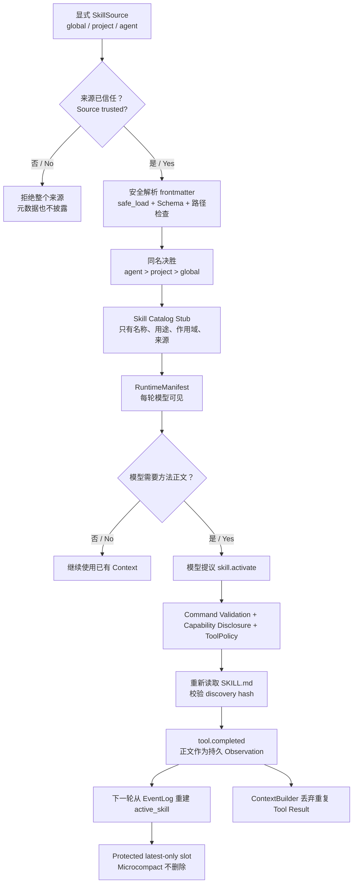
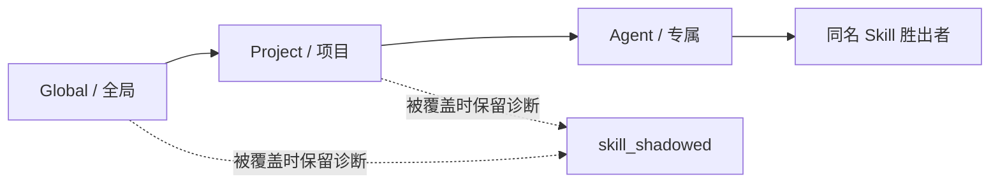

# Agent Skills 渐进式披露实现手册

> 一句话结论：**模型先看 Skill 的名称和用途；需要时通过受控工具加载正文；Harness 再从持久事实重建受保护的 active Skill。Skill 负责“怎么做”，ToolPolicy 决定“能不能做”。**

## 1. 这条纵切解决什么问题

如果把所有 Skill 正文永久塞进系统提示词，Skill 越多，Context 越贵，彼此干扰也越严重。如果只把 Skill 当普通文件，模型又不知道什么时候应该读取它。

本项目采用 Agent Skills 的三层 Progressive Disclosure：

| 层级 | 模型看到什么 | 何时看到 |
|---|---|---|
| Catalog Stub / 目录存根 | `name`、`description`、`scope`、`source_id` | 每轮 RuntimeManifest |
| Skill Body / 技能正文 | `SKILL.md` frontmatter 后的说明 | 显式调用 `skill.activate` 后，从下一轮开始 |
| Resources / 配套资源 | `scripts/`、`references/`、`assets/` 的文件名 | 激活时只列目录；内容读取仍需后续受控工具 |

这不是减少本地文件读取，而是减少**模型上下文曝光**。第一版 Loader 扫描时会读取有界的 `SKILL.md` 来校验和计算 hash，但正文不会进入模型 Context。

规范依据：[Agent Skills Specification](https://agentskills.io/specification)、[Adding skills support to an agent](https://agentskills.io/client-implementation/adding-skills-support)、[Anthropic Skills repository](https://github.com/anthropics/skills)。

## 2. 真实运行链路



关键因果关系：

1. `description` 是触发器，不是正文摘要；它需要同时说明“做什么”和“何时使用”。
2. `skill.activate` 是一个普通只读 Tool，因此仍走模型建议、Command 校验、能力披露和 Tool 执行边界。
3. 只有成功的 `tool.completed(skill.activate)` 才能形成 active Skill；模型声称“我已激活”不算事实。
4. 进程在激活后崩溃，下一进程可直接从 EventLog 恢复正文，不需要重新采样模型，也不依赖内存状态。
5. 激活 Tool Result 不再作为普通历史重复进入 Context；正文只在 `active_skills` 保护槽出现一次。

## 3. Scope、优先级与信任



背诵规则：**Agent 专属覆盖项目级，项目级覆盖全局；同一层先比显式 priority，再用 source_id 做稳定决胜。**

`SkillSource.trusted` 必须由宿主显式填写，没有“看到一个目录就自动相信”的逻辑。未信任的 project checkout 会在 Catalog 生成前被拒绝，因此恶意 `description` 也不会先进入系统提示词。

当前 `RepoMaintainerTaskPack` 只默认信任项目自身受版本控制的 `.agents/skills`，不会自动加载待修复目标仓库里的 Skill。Loader 与测试已经覆盖 global/project/agent 三种 Scope，后续 Gateway 配置再决定具体挂载哪些来源。

## 4. 为什么 `allowed-tools` 不能授予权限

`SKILL.md` 本身就是会进入模型 Context 的说明文本。如果一份 Skill 写下 `allowed-tools: shell.admin` 就能扩权，那么“提示词注入”会直接变成“权限提升”。

因此本项目把该字段解析为 `allowed_tools_hint`：

```text
Skill declared hint
        ↓
帮助模型理解这套方法通常需要什么工具
        ↓
不修改 PolicyContext.allowed_tools
        ↓
真正调用仍由 ToolPolicy / Approval / Sandbox 决定
```

Control Room 明确显示“工具提示，不是权限”。面试时可以说：**Skill 是认知能力，Tool 是执行能力；认知内容不能自我授权。**

## 5. 两个容易漏掉的安全点

### 5.1 TOCTOU：发现后文件被替换

Loader 发现 Skill 时保存完整文件 hash；激活时重新读取并比较。hash 不一致就返回错误，要求刷新 Catalog，避免“扫描时安全、使用时被换成恶意正文”。

### 5.2 路径与资源逃逸

- 只扫描每个显式 Root 的直接子目录和精确文件名 `SKILL.md`。
- `SKILL.md` resolve 后必须仍在 Root 内。
- `scripts/`、`references/`、`assets/` 资源 resolve 后必须仍在 Skill 目录内。
- 第一版不自动执行 `scripts/`，也不把资源正文随激活一起加载。

## 6. 对照源码

| 代码 | 负责什么 |
|---|---|
| `crazy_harness/core/skills/models.py` | Scope、Source、Catalog Stub、Activation 与诊断 Schema |
| `crazy_harness/core/skills/loader.py` | 信任门、规范校验、优先级、hash 与资源枚举 |
| `crazy_harness/core/skills/activation.py` | `skill.activate` Tool，以及从 EventLog 恢复 active Skill |
| `crazy_harness/core/agents/loop.py` | 把 active Skill 放入每轮 latest-only 保护槽 |
| `crazy_harness/core/context/builder.py` | 丢弃重复的激活 Tool Result，避免正文出现两次 |
| `crazy_harness/taskpacks/repo_maintainer.py` | 真实 TaskPack 装配、Catalog 审计事件与 Capability 身份 |
| `.agents/skills/repo-maintainer/SKILL.md` | 当前可运行的项目级示例 Skill |
| `frontend/src/lib/skills.ts` | 从持久事件生成不含正文的前端 Skill 视图 |

建议断点顺序：

1. `FileSystemSkillLoader.discover`
2. `SkillActivationService.handle`
3. `AgentLoop._execute_via_pipeline`
4. `active_skill_activations`
5. `AgentLoop._protected_task_brief`
6. `ContextBuilder._event_to_item`

## 7. 真实证据

Control Plane 运行：`run_34af94cedc50`

| 证据 | 实测值 |
|---|---:|
| 持久事件 | 149 |
| 模型调用 | 7 |
| CapabilityManifest | 7 |
| Catalog 条目 | 1，且不含 `body` |
| 激活 Skill | `repo-maintainer`，project scope |
| 激活正文 | 657 字符 |
| 最终结果 | `completion.gate.passed -> agent.submitted -> run.succeeded` |

Control Room：`http://127.0.0.1:8765/?run=run_34af94cedc50`，进入“上下文”页查看“智能体技能 / Agent Skills”。

截图：

- `output/playwright/skill-catalog-desktop.png`
- `output/playwright/skill-catalog-mobile.png`

390px 和 1280px 视口均无横向溢出，浏览器控制台 0 error / 0 warning。

## 8. 面试版回答

> 我没有把 Skill 当成另一种 Tool。Tool 解决“模型能做什么”，Skill 解决“模型应该怎么做”。启动时只把 name、description、scope 和 source 暴露给模型；模型需要时调用只读的 `skill.activate`，Harness 校验来源 hash 后把正文写成 `tool.completed`。下一轮从 EventLog 重建 active Skill，并放进不会被 Microcompact 清掉的 latest-only 保护槽，同时过滤原 Tool Result，确保正文只出现一次。project/global/agent 同名冲突按 agent > project > global 决胜；未信任来源连 description 都不会曝光；`allowed-tools` 只是提示，永远不能绕过 ToolPolicy。

## 9. 当前边界与下一步

已经真实完成：

- Agent Skills frontmatter 的安全解析和关键规范校验。
- global/project/agent Scope、确定性覆盖、未信任阻断。
- body 按需激活、hash 防替换、EventLog 崩溃恢复。
- active Skill latest-only 保护和重复结果清理。
- 真实 TaskPack、Mailbox、Scheduler、AgentLoop、Control Room 链路。

尚未完成：

- 千级 Skill 目录的检索召回、漏召回率 Eval 和动态 Schema 裁剪。
- Skill resource 的专用按需读取 Tool；当前只列安全相对路径。
- 运行中的 hot reload / file watcher；当前改变文件后要求显式 refresh。
- Skill 触发质量、任务成功率、Token/延迟成本的真实 DeepSeek A/B 评测。
- Skill Candidate -> Offline Eval -> Shadow -> Promotion 的受控 Evolution。

所以当前可以声称“Agent Skills 渐进披露机制与真实运行纵切完成”，不能声称“大规模 Skill 检索质量和自动进化已经完成”。
