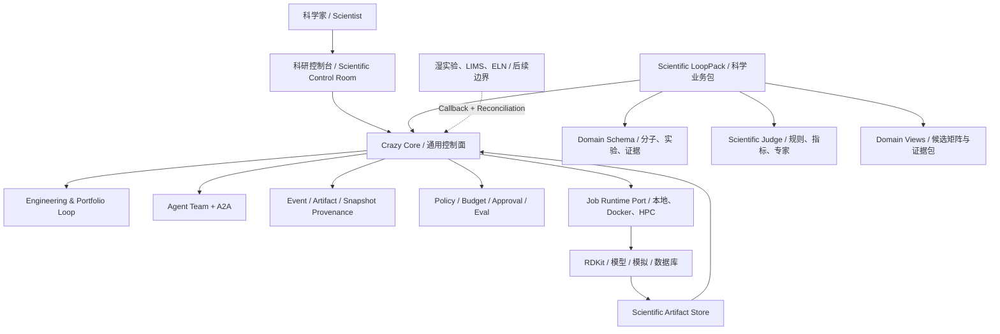

# Crazy Scientific Harness：Anew Labs 差距分析与演进路线

> 文档类型：Current-State Gap Analysis / Target Architecture Decision  
> 事实截止：2026-07-28  
> 目标：判断 Crazy 当前实现能承接 Anew Labs 哪一层业务，并确定下一条真实、可学习、可替换的科学纵切。

## 0. 结论先行

**Crazy 不应复制 AnewOmni、AnewSampling 或 scNext 这类科学模型；它最适合演进为这些模型之上的 Scientific Harness：负责长期任务、异构工具、证据谱系、独立评测、人工审批和实验反馈。**

当前 Crazy 已经具备这一方向最难补的一部分通用骨架，但还只是本地 Agent 工程平台：

- 已有：持久事件、Mailbox、Scheduler、AgentLoop、受控 A2A、Tool Policy、Checkpoint、Eval Campaign 和 Engineering Loop 父状态机。
- 半成品：Engineering Loop 尚未接入真实 child Run；Memory Recall、Full Compact 自动触发、真实 DeepSeek 收益和强沙箱尚未完成。
- 几乎没有：科学领域 Schema、科研 Artifact、批量候选组合、GPU/HPC Job、领域 Judge、科研人工审批、数据/模型/环境谱系和湿实验系统连接。

因此下一步不是“增加几个制药 Agent”，而是完成一次关键跃迁：

> 从 **Agent Run Ledger**，升级为能够承载真实计算任务的 **Scientific Experiment Ledger**。

## 1. Anew Labs 的公开业务边界

**Anew 公开呈现的是“科学模型栈 + 先进计算 + 高通量湿实验反馈 + 自有药物管线”，不只是一个聊天式科研助手。**

| 公开模块 | 官网披露的定位 | 对 Harness 的含义 |
|---|---|---|
| scNext | 从单细胞静态数据预测细胞轨迹和扰动响应 | 上游模型需要数据版本、模型版本、批量推理和生物学评测 |
| AnewOmni | 统一生成小分子、多肽和抗体结合物的全原子模型 | 候选生成是一个可替换 Tool/Model Port，不应写入 Core |
| AnewSampling | 生成蛋白质-配体动态构象系综 | 输出是大型科学 Artifact，不适合直接塞入 LLM Context |
| AnewSynth | 专家规则约束的合成路线规划与 RPF 评分 | 体现 Generator、Rule Validator、Expert Judge 和 Gate 分离 |
| AnewMind | 官网仅称 Research Assistant，用于体验平台能力 | 可推断为统一入口，但其内部编排架构未公开，不能当作已知事实 |
| Pipeline | 覆盖 Exploratory、Hit ID、Hit-to-Lead、Lead Optimization、IND Enabling | 平台要承载跨阶段、跨天、跨专业、可追溯的长期研发状态 |

Anew 官网还明确提出将 AI、先进计算平台和高通量湿实验组成反馈环。其后端岗位要求对接核心算法模块、维护稳健调用链、建设大规模任务调度和分布式计算环境，并与专家探索新药研发工作流。这说明目标企业需要的不只是 Agent 对话，而是 **科研任务控制面**。

### 信息边界

- AnewFEP 出现在本地学习材料中，但截至本次检索，未在官网当前平台/研究页面找到可核实的独立产品页；本文不把它当作已确认公开产品。
- 官网承诺逐步开源研究框架，但没有证明所有模型都有稳定公开 API；第一阶段不依赖 Anew 私有接口。
- 官网性能和实验成功率属于企业公开陈述；没有在本项目中独立复现。

## 2. 当前 Crazy 的真实资产

**Crazy 当前最有价值的不是 Agent 数量，而是模型之外的控制权已经逐步回到 Harness。**

| 当前模块 | 已实现的真实能力 | 映射到科研平台 |
|---|---|---|
| EventStore + Projection | 事件持久化、重放、当前状态投影 | 实验/计算过程的 provenance 与审计历史 |
| Durable Mailbox + Scheduler | Delivery、Claim、Lease、续租、取消、Dead Letter | 秒级到多天科学任务的待办、唤醒与恢复基础 |
| Canonical AgentLoop | Context 编译、Response 持久化、Command Validation、Tool、Observation、Gate | LLM 只能建议，科学工具和规则产生事实 |
| Supervisor + Kernel | 动态 PlanPatch、Assignment、child Run、Promotion | 多专业 Agent 分工，候选结果经控制面晋升 |
| 受控一跳 A2A | 子 Agent 按缺口请求同伴，深度和预算受限 | 专家对账，不共享完整私有上下文 |
| Tool/Skill/MCP Harness | Policy、渐进披露、Tool Search、延迟发现原语 | 把科学模型、数据库、CLI 和远程服务包装成能力端口 |
| Context/Offload | 每轮重编译、Microcompact、大结果落盘引用 | 构象、轨迹、表格等大 Artifact 不污染 LLM Context |
| Eval Campaign | 同题配对、多 Trial、独立 Scorer、恢复 | 方法/模型/Agent 策略的受控比较基础 |
| Composite Checkpoint | 内容寻址 Workspace Snapshot、Event Prefix、Fork Restore | 冻结一个可复现实验分支；不伪装成撤销湿实验 |
| Engineering Loop EL1 | Candidate、child Run、Evaluation、Decision、Active 谱系 | 与 Design-Make-Test-Analyze 外层实验循环同构 |
| Control Room | FastAPI、HTTP/SSE、双语运行时间线 | 科研运行控制台的技术底座 |

### 尚不能宣称的能力

- Scripted Golden 证明了治理链可运行，不证明 Team 或 DeepSeek 在真实科研任务上更强。
- GuardedLocalRuntime 不是 Docker/HPC 强隔离环境。
- Memory 目前偏准入机制，尚未形成可靠的领域 Recall。
- Engineering Loop 当前是 EL1 父状态机，真实 child Agent Run、独立 Evaluator、API/UI 尚未接通。
- Checkpoint 能恢复本地文件和状态引用，不能自动撤销外部数据库写入、云作业或湿实验。

## 3. 最宝贵但尚未充分表达的价值

**当前架构的潜力已经超过“多 Agent Demo”，但还没有用科学实验语言表达出来。**

1. **Maker/Checker 分离**：生成候选的 Agent 不能同时决定自己是否科学正确；Evaluator、规则和专家 Gate 必须独立。
2. **长期任务不是长对话**：科研运行应由 Durable Job、Artifact 和 Callback 推进，Agent 只在需要解释、规划或纠偏时被唤醒。
3. **证据比摘要更重要**：A2A 可以传结论摘要，但正式晋升必须指向原始输入、模型、参数、环境、日志和输出 Artifact。
4. **Engineering Loop 是通用实验方法**：它不仅能做代码改进，也能表达 Candidate -> Run -> Evaluate -> Decide -> Next Candidate。
5. **Checkpoint 是假设分支**：科研人员可以从同一已验证状态 Fork 两条候选路线；旧历史保持不可变。
6. **Eval Campaign 是方法治理**：比较的不只是 Single/Team，也可以是模型版本、参数、采样策略和评审策略。
7. **Event-driven A2A 适合科学计算**：外部 GPU/HPC 作业完成时以事件唤醒下一阶段，不需要 Agent 常驻轮询。

## 4. 与 Anew 类平台的核心 Gap

**最大 Gap 不在 Prompt，而在科学对象、计算执行、领域评价和组织治理。**

| 维度 | Crazy 当前 | Anew 类业务需要 | 判断 |
|---|---|---|---|
| 通用编排与恢复 | 本地 MVP+，已有可靠骨架 | 跨服务、跨机器、跨天运行 | 可扩展，不必重写 |
| Engineering Loop | EL1，串行单 Candidate 父协议 | 批量候选、并行实验、约束/Pareto 决策 | 先完成 EL2，再增加 Portfolio 语义 |
| 科学领域模型 | 无 | 分子、蛋白、细胞、实验、Assay、Protocol Schema | 新增 Domain Pack，不进入 Core |
| 科学 Artifact | 通用文件/JSON/Hash | SDF、PDB/mmCIF、轨迹、AnnData、图表、Notebook、报告 | 需要类型注册、元数据和对象存储抽象 |
| 计算 Runtime | 本地命令与浏览器 | Docker、GPU、Slurm/K8s、长作业 Callback、资源配额 | 关键平台缺口 |
| 模型/工具连接 | Repo/Research ToolPack | 领域模型、RDKit、数据库、模拟和合成规划 | 通过 Adapter/Port 渐进接入 |
| 科学 Judge | 通用 Scorer、Scripted Golden | 物理/化学规则、基准指标、重复实验、专家审批 | 最大质量缺口 |
| 不确定性 | 通用成功/失败/Unknown | 置信区间、重复、分布、适用域、证据等级 | 需要进入正式 Evaluation Schema |
| 数据谱系 | Event、Snapshot、Artifact Hash | 数据集/模型/参数/随机种子/容器/批次全谱系 | 现有机制可复用，Schema 需扩展 |
| 人在回路 | CompletionGate 为主 | Scientist Review、预算审批、发布/合成 Gate | 需要持久 Approval Task |
| UI | Agent 时间线和控制台 | 候选矩阵、实验分支、结构/曲线/指标、证据包 | 需要领域视图，不应重做底层 UI |
| 安全治理 | 本地 disposable 环境定位 | RBAC、租户/IP、审计、Secrets、用途与生物安全 | 生产前硬门槛，MVP 只做边界声明 |
| 湿实验/LIMS/ELN | 无 | 实验下发、批次状态、结果回流与对账 | 第一阶段明确不接入 |

## 5. 目标架构：Core 不绑定制药，Scientific LoopPack 承接业务

**推荐保持 Crazy Core 领域无关，在其上新增 Scientific Harness 层和可替换的 Pharma LoopPack。**



### 核心抽象建议

| 抽象 | 责任 | 为什么不放具体药研逻辑 |
|---|---|---|
| `LoopPack` | 声明 Contract、Candidate、Evaluator、Gate、View | 同一 Core 可替换代码、科研、运营等业务 |
| `ScientificJob` | 描述资源、环境、输入、超时、回调和幂等键 | 本地进程、Docker、Slurm 应共享生命周期协议 |
| `ScientificArtifact` | 类型、Hash、Schema、来源、预览、保留策略 | 大文件留在 Store，Context 只拿摘要和引用 |
| `ExperimentEvaluation` | 指标、误差、不确定性、适用域、证据和 Reviewer | 避免把一个总分冒充科学结论 |
| `ApprovalTask` | 谁在什么证据下批准什么不可逆动作 | 湿实验、付费 GPU 和外部写入不能靠 LLM 自批 |
| `PortfolioIteration` | 一批 Candidate 的并行运行、淘汰、晋升和下一轮 | 药研通常不是串行优化一个候选 |

## 6. 第一条真实纵切：分子候选批量初筛与证据评审

**这是当前最窄、最真实、最能展示 Harness 价值的业务楔子。**

### 输入与输出

- 输入：一组公开或教学用 SMILES、目标属性约束、预算和评测合同。
- 工具：第一版使用 RDKit 计算可复现描述符和结构规则；昂贵 Docking/FEP 先定义 Adapter，不伪造结果。
- 输出：每个候选的不可变 Evidence Bundle、机器指标、规则告警、独立 Reviewer 意见和人工 Gate 请求。
- 结论边界：只能做计算初筛与工作流验证，不能声称成药性、临床有效性或真实合成可行性。

### Team 分工

| Agent/组件 | 责任 | 正式事实从哪里来 |
|---|---|---|
| Protocol Agent | 把目标和约束编译为评测合同 | 合同 Schema + 人工确认 |
| Property Agent | 请求描述符/过滤工具并解释结果 | RDKit Tool Artifact |
| Evidence Agent | 检查输入、版本、缺失值和证据完整性 | Provenance Rules |
| Reviewer Agent | 发现冲突、适用域和过度结论 | 独立 Context + Evidence Refs |
| Deterministic Judge | 计算硬指标、规则和准出 | 程序，不由 LLM 自报 |
| Scientist Gate | 批准晋升、继续计算或停止 | 持久 Approval Event |

### 为什么它比直接接 Anew 模型更适合第一步

1. RDKit 可本地真实运行，不依赖未公开 API。
2. 候选批量处理会逼出 Portfolio、并发、Artifact 和失败隔离这些真实问题。
3. Judge 有部分确定性依据，能避免“LLM 说很好所以很好”。
4. 后续可把 AnewOmni、AnewSampling、AnewSynth 或其他模型作为 Adapter 替换/追加，不改 Core。
5. UI 能直观看见候选漏斗、证据来源、失败原因和迭代谱系，适合学习与开源展示。

## 7. 后续实施顺序

**先把通用外层循环跑真，再加科学对象；不要反过来用 Pharma Demo 掩盖底层缺口。**

| 阶段 | 目标 | 关键产物 | 准出条件 | 粗略投入* |
|---|---|---|---|---|
| S0 决策冻结 | 固化本报告与边界 | Gap Matrix、目标架构、首个 Use Case | Core/Domain/Out-of-scope 分界明确 | 已完成 |
| S1 Generic EL2 | 接通真实 Engineering Loop | 两轮 child Agent Run、Snapshot 继承、独立 Eval、API/UI | 当前 EL2 RED 转绿；崩溃后可恢复 | 2-4 个开发日 |
| S2 Scientific Kernel | 加入科学通用协议 | ScientificJob、Artifact、Evaluation、Approval、Portfolio Schema | 确定性 Fixture 可批量运行、恢复和审计 | 3-5 个开发日 |
| S3 Pharma Golden | 真实 RDKit 候选初筛 | Pharma LoopPack、4 角色 Team、Evidence Bundle、候选矩阵 UI | 同一输入可复现；Maker 不能越过 Judge/Gate | 4-7 个开发日 |
| S4 Compute Runtime | 承载异构长作业 | Docker Adapter、Callback/Reconcile、资源预算、缓存 | 人工杀进程/超时后不丢任务、不盲目重做副作用 | 1-2 周 |
| S5 Scientific Eval | 验证是否真有收益 | Baseline vs Agent/Team Campaign、错误分类、成本/延迟 | 多 Trial 报告区分质量、方差和成本 | 1-2 周 |
| S6 Enterprise Bridge | 连接真实组织环境 | Object Store、Slurm/K8s Port、RBAC、Secrets、审计导出 | 只在有真实环境和用户后启动 | 待验证 |

\* 投入是当前代码熟悉度下的工程预估，不是承诺；真实依赖安装、数据清洗和领域评审可能显著放大成本。

### 两条并行但不同的路线

- **平台主线**：S1 -> S2 -> S4，增强任何业务都能复用的持久运行、Artifact 和外部 Job 能力。
- **学习纵切**：S3 -> S5，用小规模真实科学任务逼出问题，并用 Eval 判断 Team 是否值得。

## 8. 暂不做的事情

**主动不做，是为了让第一版的每一项能力都是真的。**

- 不训练或复刻 Anew 的基础模型。
- 不把 LLM 评价当作药化、生物或临床真相。
- 不接真实湿实验自动下发，不承诺外部副作用自动回滚。
- 不先上完整 LIMS/ELN、多租户、合规认证或大规模 K8s。
- 不把 Anew 私有 API 的存在当作前提。
- 不用大量角色名称制造“Agent Team 已经很强”的错觉。

## 9. 关键风险与停止条件

| 风险 | 对策 | 停止条件 |
|---|---|---|
| 科学结果看似合理但错误 | 确定性工具、领域规则、适用域、独立 Reviewer、人工 Gate | 无法给出证据引用的结论不得晋升 |
| 科学依赖安装吞噬项目 | 第一版只选 RDKit，复杂模型走 Adapter | 单工具环境配置超过 1 天仍不稳定则换 Fixture/容器 |
| 多 Agent 没有收益 | 同题 Single/Team Campaign，记录质量、成本、延迟 | Team 无稳定收益则保留 Single，Team 只用于必要角色分离 |
| 大 Artifact 挤爆 Context | Store + Hash + Preview + On-demand Read | 原始轨迹/结构禁止默认进入 Prompt |
| 外部 Job 重复执行 | Idempotency Key、Ledger、Reconcile、人工处理 Unknown | 无法对账的副作用工具不得自动重试 |
| 过早绑定制药 | Domain Pack 依赖只能指向 Core Port | Core 出现 SMILES/PDB 等领域类型时触发架构审查 |
| 数据/IP/双用途风险 | 仅公开教学数据、最小权限、用途审计 | 未完成安全审查前禁止生产凭据和敏感生物数据 |

## 10. 最终决策

**下一次恢复编码从当前 EL2 RED 继续；EL2 转绿后，不立刻扩更多通用模块，而是实现 Scientific Kernel 和 RDKit Candidate Triage Golden。**

决策顺序：

```text
完成 Generic Engineering Loop EL2
-> 抽象 ScientificJob / Artifact / Evaluation / Approval / Portfolio
-> 跑通 RDKit 候选批量初筛
-> 建候选矩阵与证据谱系 UI
-> 做 Single vs Team 科学任务评测
-> 根据证据决定 Docker/HPC、更多模型 Adapter 和湿实验连接
```

这条路线同时满足三个目标：

1. **学习**：亲手摸到 Harness 在真实科研任务中的控制点。
2. **项目**：保持 Core 通用，并形成有辨识度的 Scientific Harness 示例。
3. **目标企业匹配**：能够具体讲清算法模块调用链、长任务调度、证据与评测，而不是只会讲 Prompt 和角色扮演。

## 11. 设计审查

设计审查：5/5 通过。

1. 外部依赖：Anew 官网能力和招聘要求已核对；RDKit 可用性仍需在 S3 编码前做环境 Spike。
2. 性能数字：未承诺模型性能或平台吞吐；阶段时间均标记为工程预估。
3. 异常路径：覆盖长作业超时、崩溃、Unknown Effect、证据缺失、大 Artifact 和人工审批。
4. 阈值依据：没有把评分阈值写死；属性阈值必须来自具体任务合同或领域资料。
5. 需求边界：明确区分当前实现、目标架构、企业公开事实和推断；湿实验、基础模型与生产合规不纳入 MVP。

## 12. 事实来源

### 本地实现

- [`CURRENT_PLATFORM_ARCHITECTURE_LEARNING_GUIDE.md`](CURRENT_PLATFORM_ARCHITECTURE_LEARNING_GUIDE.md)
- [`DURABLE_ENGINEERING_LOOP_DESIGN.md`](DURABLE_ENGINEERING_LOOP_DESIGN.md)
- `crazy_harness/control_plane/runtime.py`
- `crazy_harness/control_plane/engineering_loops.py`
- `crazy_harness/core/agents/loop.py`
- `crazy_harness/control_plane/team_workers.py`
- `crazy_harness/control_plane/checkpoints.py`
- `crazy_harness/control_plane/eval_campaigns.py`

### Anew Labs 官方资料

- [Research Philosophy and Publications](https://anewbt.com/research/)
- [Platform and Pipelines](https://anewbt.com/pipelines/)
- [AnewOmni](https://anewbt.com/research/anewomni/)
- [AnewSampling](https://anewbt.com/research/anewsampling/)
- [AnewSynth](https://anewbt.com/research/anewsynth/)
- [scNext](https://anewbt.com/research/scnext/)
- [scPertBench](https://anewbt.com/research/scpertbench)
- [Careers: Backend Engineer - Drug Discovery](https://anewbt.com/careers/)

### 已有知识库

- `R143_ClaudeScience_AI制药科研工作台调研.md`：科研 Artifact、Reviewer、HPC、provenance 与风险边界。
- 用户提供的《AI 制药业务基础拉齐攻略》：药研阶段、工具异构、证据链和 Anew 产品学习映射。
