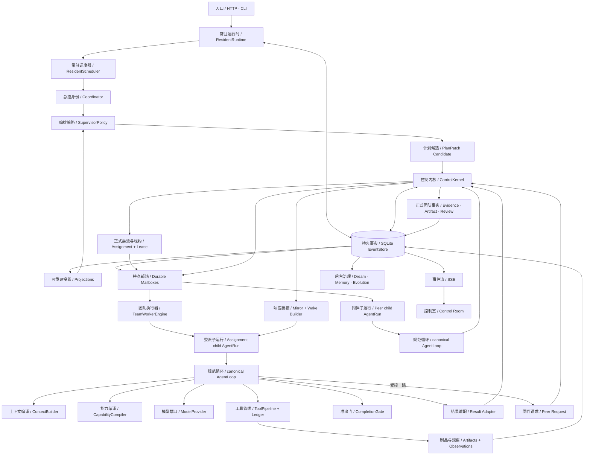
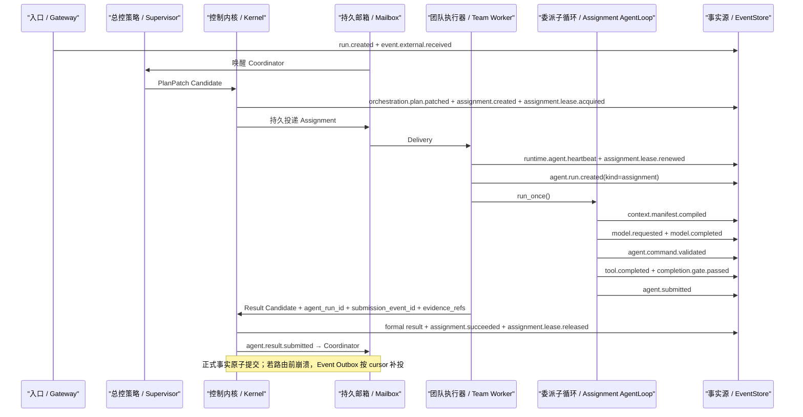
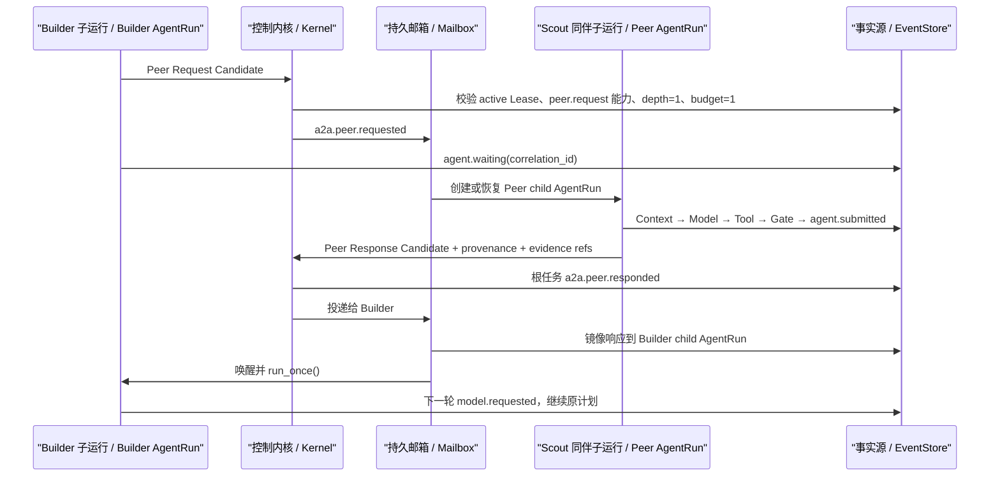
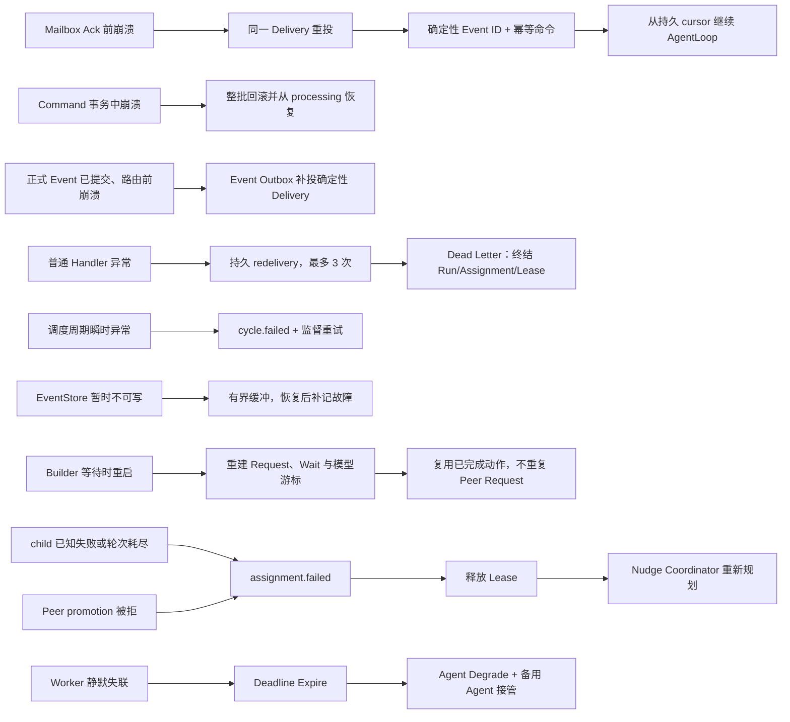
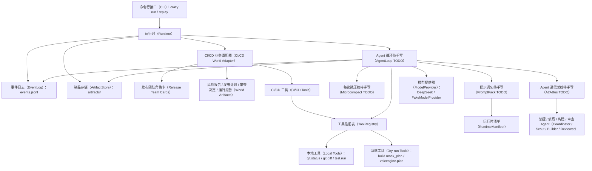
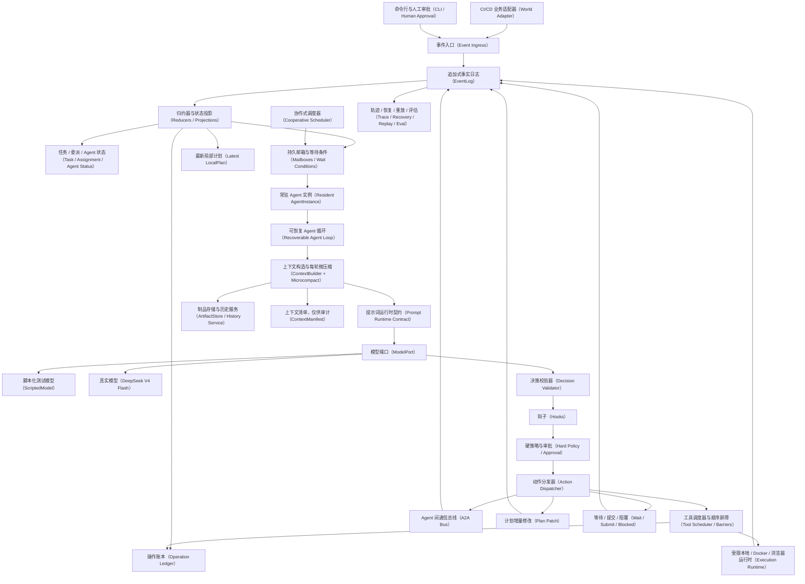
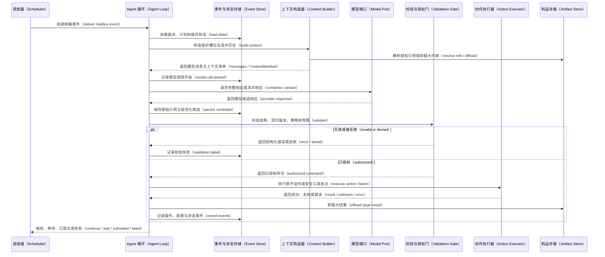
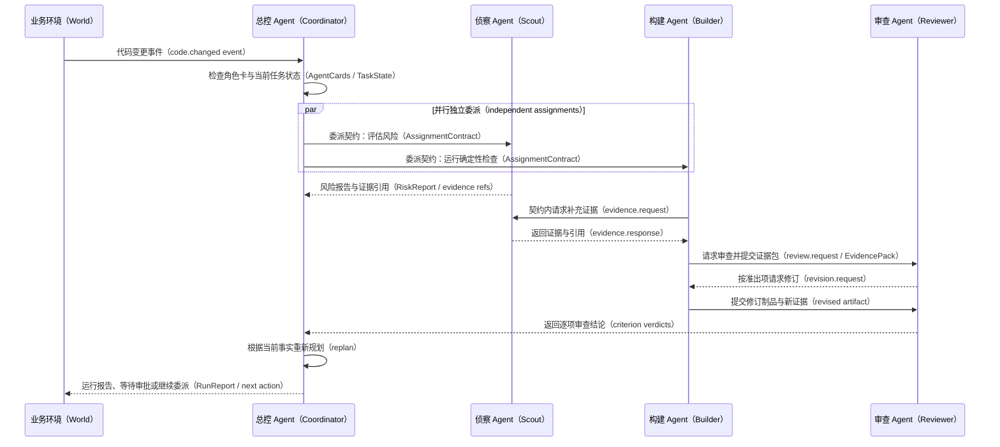

# Crazy Harness 架构走读

> 日期：2026-07-18
> 当前状态：已按 `control_plane/team_workers.py`、`kernel.py`、`runtime.py` 与 `taskpacks/resident_team.py` 重新核对
> 历史说明：本文后半部分保留 2026-07-10 的 MVP-0 设计快照，相关标题均标为“历史存档”，不能当作当前实现状态

## 一句话结论

当前 Crazy 已经形成一条本地、持久、事件驱动的 Team 执行链：Supervisor 动态提出 PlanPatch，Kernel 产生 Assignment 与 Lease，Durable Mailbox 唤醒 Team Worker；每个 Assignment 和 Peer Request 都进入隔离 child AgentRun，由 canonical AgentLoop 逐轮执行，最终结果仍需 Kernel 校验 provenance 与 evidence 后才能晋升为根任务正式事实。

## 当前实现全景



| 架构名词 | 当前含义 |
|---|---|
| ResidentRuntime / 常驻运行时 | 持有 Gateway、Store、Scheduler、Kernel、Mailbox 与 Worker 注册；后台线程常驻，Agent 本身是可随时唤醒的逻辑身份，不是永久占用线程。 |
| EventStore / 事实源 | SQLite append-only Event 与命令状态的持久来源；Projection、UI 和恢复逻辑都从它重建，内存对象不是权威。 |
| ResidentScheduler / 常驻调度器 | 等待内存 wake signal、最近 Deadline 或 1 秒外部写入兜底，以 Round-Robin 将未 Ack Delivery 准入有界线程池；SQLite Delivery + AgentRun + Worker Slot Claim 防重复、重入和跨 Scheduler 容量超卖。 |
| SupervisorPolicy / 编排策略 | 根据 TeamContract、AgentCard、完成阶段、Attempt、状态和负载提出下一份 PlanPatch，不直接创建正式 Assignment。 |
| ControlKernel / 控制内核 | 校验 Schema、身份、权限、预算、Contract、Lease、provenance 与 evidence；唯一能把 Candidate 转为正式 Team 事实的边界。 |
| Assignment / 正式委派 | Supervisor 候选获准后产生的工作合同，包含目标、准出条件、能力、结果种类、Attempt 与持有者。 |
| Lease / 执行租约 | 限定某 Agent 在某段时间内提交该 Assignment 结果的权力；支持 Heartbeat/Renew、Expire、Release 与旧 Delivery fencing。 |
| Durable Mailbox / 持久邮箱 | 每个逻辑 Agent 的待处理 Delivery 集合；至少一次投递、显式 Ack，进程退出后未完成消息仍存在。 |
| TeamWorkerEngine / 团队执行器 | 将一次 Delivery 翻译为一次 canonical AgentLoop 推进，并处理 child run 创建、Wait/Resume、结果适配与已知失败传播。 |
| AgentRun / Agent 子运行 | 一次具体执行实体。根 Run 保存团队任务；Assignment child AgentRun 与 Peer child AgentRun 各自保存私有 Context、LocalPlan、模型轨迹和工具证据。 |
| canonical AgentLoop / 规范循环 | 单 Agent 与 Team Worker 共用的真实循环：编译 Context、调用模型、持久化 Response、校验 Command、执行 Tool、记录 Observation、运行 CompletionGate。 |
| Promotion / 结果晋升 | child `agent.submitted` 先成为 Candidate；Kernel 绑定 Assignment、Lease、AgentRun、submission 和 evidence refs 后才写根任务正式事实。 |
| Atomic Command / 原子命令 | Kernel 将决策 Event、正式 Event、Projection 与 Command Ledger 终态放在同一 SQLite 事务中提交。 |
| Event-as-Outbox / 事件即发件箱 | 正式 Event 同时是待投递记录；Runtime 以 Mailbox Delivery 作为回执，崩溃后补投缺失回执。 |
| Dead Letter / 死信 | 同一 Delivery 达到初始失败阈值后的隔离事实；同时终结仍在运行的 Run/Assignment/Lease，避免任务悬空或毒消息饿死其他 Worker。 |

## Team Assignment 执行路径



当前 Resident Demo 的 TeamContract 是 `evidence + risk -> artifact -> review`。这不是代码里写死的 A-B-C 消息链：DAG 由 TaskPack 声明，Supervisor 每次都依据最新公共事实提出下一份委派，Kernel 再检查依赖和能力。两个根阶段会由不同 Worker 真实并行，`artifact` 只在两份正式 Evidence 都完成后启动。受控并发、Claim、Fencing 与取消详见 [`CONTROLLED_CONCURRENCY_WALKTHROUGH.md`](CONTROLLED_CONCURRENCY_WALKTHROUGH.md)。

Team Worker 使用 Scripted Model 提供可复现的动作序列，但每一步都真实经过公共 AgentLoop。需要记住的区分是：

```text
Scripted Model = 当前动作建议是确定性的
canonical AgentLoop = Context、Command、Tool、Gate、持久化与恢复路径都是真实的
```

## Builder 与 Peer 的 Wait/Resume



| 共享给对方 | 不共享给对方 |
|---|---|
| Assignment 标识、Sender/Receiver、Correlation ID | 完整消息历史 |
| 受限 Brief、Scope、Permissions、Schema | 系统提示词与隐藏推理 |
| Kernel 已接受的公共 Evidence Ref | LocalPlan 与完整私有 Context |
| 简短 Peer Response 与引用 | 其他 AgentRun 的原始 Tool 输出 |

A2A 的根任务消息和双方 child run 轨迹使用不同 `task_id`。Peer Response 先在根任务成为正式事实，再由 Bridge 生成 Builder 私有镜像；这既保留公共审计链，也避免把 Scout 的完整 Context 直接拼进 Builder。

## Kernel 信任边界

模型输出 JSON、child `agent.submitted` 或数据库中“恰好存在的一个 Event”都不能自动成为事实。当前 Kernel 的 Team 校验至少覆盖：

1. Peer payload 必须通过严格 Schema，未知字段或错误类型持久化为 rejection，而不是让 Handler 因 `TypeError` 崩溃。
2. Peer Request 必须绑定当前 Assignment holder 与未过期 Lease；Assignment 还必须显式拥有 `peer.request` capability。
3. Peer depth 与 budget 由 Harness 固定管理，模型不能把 `peer_budget` 改大。
4. Assignment Result 的 root task 必须与正式 Assignment 一致。
5. `agent_run_id` 必须解析到同 Run、同 Assignment、同 actor 的 seed；seed 必须由正式 Assignment/Peer Request 直接触发，Contract 必须匹配根 Assignment/Peer Contract，`submission_event_id` 必须属于该 child AgentRun。
6. 每个 Model Request 必须沿 causation 回溯到 Seed，或回溯到逐字段核对过的 A2A Bridge Observation；任意孤儿 Event 不能伪造模型执行起点。
7. Evidence Ref 必须存在于同 Run、类型被当前 CommandKind 允许；Tool Result 必须成功、属于当前 child AgentRun 与 actor、拥有 `Model -> Command -> operation.started -> tool.requested -> tool.completed -> operation.completed` 完整链，并覆盖 Contract 要求的工具名。
8. Peer Response 必须与持久 Request 的 assignment、sender、receiver、correlation 和 Peer child AgentRun 一致。
9. submission 必须来自 `model.requested -> model.completed -> submit_output Command -> passed CompletionGate` 的持久链，Candidate 制品字段必须与 submission artifact 一致。
10. Peer Request 双向校验 `peer.request/peer.respond` 并禁止 self request；即使 Lease Projection 尚为 active，墙钟已过期的 Peer Response 也不能晋升。
11. Lease 与 Peer 唯一响应在 SQLite 写锁内再次校验，避免“校验通过、提交前过期/重复”的 TOCTOU 竞态。
12. Command 正式事实与 Ledger 终态原子提交，Mailbox 路由由 Event-as-Outbox 恢复。

因此正确的边界仍是：**模型建议动作，Harness 产生事实；AgentRun 申请交作业，Kernel 决定是否晋升。**

## 恢复与失败传播



已知失败不需要傻等 Deadline：Assignment child 的 failed/stopped/turn budget，以及 Peer child 的 failed/stopped/turn budget 或 Peer promotion rejection，会立即传播到请求方 Assignment。未知失联仍由 Deadline 负责兜底。Lease 提供 at-least-once 与 fencing，不提供跨机器 exactly-once；真正副作用仍需要 OperationLedger、幂等键或外部对账。

## 当前诚实边界

| 能力 | 当前状态 |
|---|---|
| Supervisor + TeamContract DAG + Lease | 本地可运行，策略为确定性 `CapabilitySupervisorPolicy`。 |
| Assignment/Peer child AgentRun | 已接 canonical AgentLoop，可持久 Wait/Resume、重建与 Kernel promotion。 |
| Team 模型 | 仅 Scripted Model；在线 DeepSeek Team 请求被明确拒绝。 |
| A2A Transport | 同进程 SQLite EventStore + Durable Mailbox；Remote A2A 尚未实现。 |
| 并发 | 默认全局 2、单 Agent 1；Round-Robin 准入，SQLite Delivery + AgentRun + Worker Slot Claim，满载保留在 Durable Mailbox。两路并行和跨 Scheduler 容量已用同步屏障实测；尚无生产吞吐数据。 |
| 故障语义 | 本地进程崩溃恢复、重投、Lease fencing 与已知 Peer failure propagation；不是生产级分布式容错。 |
| Team 收益 | 尚无同模型、同任务、同预算的 Single-vs-Team 评测，不能声称 Team 一定优于 Single。 |

补充：当前本地故障语义还覆盖原子 Command、Event Outbox 与有界重试/Dead Letter；这些不等于跨机器 exactly-once。

## 当前源码阅读顺序

| 顺序 | 文件 | 先回答的问题 |
|---:|---|---|
| 1 | `crazy_harness/taskpacks/resident_team.py` | TeamContract、AssignmentContract、Scripted Model 动作与 Team Tool 如何声明？ |
| 2 | `crazy_harness/control_plane/runtime.py` | Scheduler 如何常驻、投递如何路由、Lease 如何续约/过期、TeamWorkerEngine 如何注册？ |
| 3 | `crazy_harness/control_plane/team_workers.py` | Assignment/Peer child AgentRun 如何创建、推进、等待、恢复、晋升与失败？ |
| 4 | `crazy_harness/control_plane/kernel.py` | Proposal 在哪些 Schema、authority、budget、provenance 与 evidence 条件下才成为事实？ |
| 5 | `crazy_harness/core/agents/loop.py` | canonical AgentLoop 的 Context、Model、Command、Tool、Observation 与 Stop 控制权如何分配？ |
| 6 | `tests/control_plane/test_team_worker_agent_loop.py` | 哪些架构语义已经被可执行断言证明？ |

## 历史存档：MVP-0 薄脚手架

> 以下内容冻结于 2026-07-10，只用于理解项目从薄脚手架演进到当前架构的过程。其中“待手写”“尚未实现”和测试数量均是当时事实，不代表当前仓库。当前状态以上文与源码为准。

当时的结论：代码只提供入口、最小事实存储和四个手写槽位，尚不具备真正的常驻恢复、受控 A2A 和 Loop Engineering。



| 图中名词 | 简短含义 |
|---|---|
| 命令行接口（CLI） | 用户启动运行、重放或审批操作的入口。 |
| 运行时（Runtime） | 组装一次 run 所需组件，并驱动当前薄版执行流程。 |
| 事件日志（EventLog） | 将发生过的事件追加写入 `events.jsonl`。 |
| 制品存储（ArtifactStore） | 保存大日志、报告和其他可引用结果的文件目录。 |
| CI/CD 业务适配器（World Adapter） | 把代码变更等业务事件翻译成 Core 能理解的 Event 和 Tool。 |
| 发布团队角色卡（Release Team Cards） | 声明 Coordinator、Scout、Builder、Reviewer 的职责与能力。 |
| World Artifacts | CI/CD World 定义的 RiskReport、ReleasePlan 等结构化产物。 |
| CI/CD 工具（CI/CD Tools） | 业务侧提供的 git、测试、构建计划和火山云规划工具。 |
| 工具注册表（ToolRegistry） | 保存工具 schema、策略元数据与具体执行函数。 |
| 本地工具（Local Tools） | 直接读取仓库状态、diff 或运行测试的真实工具。 |
| 演练工具（Dry-run Tools） | 只生成构建或云操作计划，不产生危险真实副作用。 |
| Agent 循环（AgentLoop） | 把 Context、模型候选动作、工具执行和事件记录串起来的核心控制流。 |
| 每轮微压缩（Microcompact） | 每次构造 Context 时执行的无 LLM 清理与引用化。 |
| 提示词包（PromptPack） | 将角色、任务、运行时信息和策略编译成模型 messages。 |
| 模型提供器（ModelProvider） | 屏蔽 FakeModel 与 DeepSeek 调用格式差异的端口。 |
| Agent 通信总线（A2ABus） | 通过消息而非直接方法调用连接多个 AgentInstance。 |
| 运行时清单（RuntimeManifest） | 告诉模型当前模式、时间、工作目录和可用能力等动态事实。 |
| 四类 Agent | Coordinator 负责全局计划；Scout 收集信息；Builder 执行；Reviewer 独立验收。 |

## 历史存档：当时的目标静态架构

结论：目标系统把持久事实、可重建状态、单轮上下文和外部副作用分成四个层次。



| 图中名词 | 简短含义 |
|---|---|
| 业务适配器（World Adapter） | 把特定业务平台的事件和操作映射到通用 Core。 |
| 事件入口（Event Ingress） | 接收 World、CLI、人工审批或定时器产生的新事件。 |
| 人工审批（Human Approval） | 对高风险动作或关键决策进行人工确认。 |
| 追加式事实日志（EventLog） | 只追加不就地修改的事实源，保存系统真实历史。 |
| 归约器（Reducer） | 按顺序处理事件，把历史折叠成当前状态。 |
| 状态投影（Projection） | 可从 EventLog 重建的 Task、Mailbox、Plan 等当前视图。 |
| 任务（Task） | 一个根事件引起的整组协作工作。 |
| 委派（Assignment） | Coordinator 分给某个 AgentInstance 的单份工作。 |
| Agent 状态（Agent Status） | 描述实例当前是空闲、忙碌、等待、降级还是离线。 |
| 持久邮箱（Mailbox） | 保存某 Agent 尚未消费的事件或消息。 |
| 等待条件（WaitCondition） | 描述 Agent 等待哪类事件、关联 ID、来源和截止时间。 |
| 局部计划（LocalPlan） | 执行 Agent 在当前 Contract 内维护的结构化步骤。 |
| 操作账本（Operation Ledger） | 记录可能产生外部副作用的动作阶段、幂等键和对账状态。 |
| 协作式调度器（Cooperative Scheduler） | 在单进程中确定性地选择下一个可运行 Agent。 |
| 常驻 Agent 实例（Resident AgentInstance） | 拥有持久身份和邮箱、可跨事件继续工作的逻辑实体。 |
| 可恢复 Agent 循环（Recoverable Agent Loop） | 记录 phase 转移并能从崩溃点继续的单 Agent 内核。 |
| 上下文构造器（ContextBuilder） | 每轮选择保护槽位、历史、消息和 Artifact 组成 Context。 |
| 每轮微压缩（Microcompact） | 规则驱动地清理旧表示和引用化大内容，不调用 LLM。 |
| 提示词运行时契约（Prompt Runtime Contract） | 将角色、任务、策略和运行事实编译成稳定提示结构。 |
| 制品存储（ArtifactStore） | 保存大输出、报告、截图和其他可回溯证据。 |
| 历史服务（History Service） | 在权限检查后按 ref 或关键词读取历史事实。 |
| 上下文清单（ContextManifest） | 记录本轮包含和排除了什么、如何变换及原因，只供审计。 |
| 模型端口（ModelPort） | 为真实模型与测试模型提供统一调用接口。 |
| 脚本化测试模型（ScriptedModel） | 按预设响应运行，用于确定性测试、故障注入和恢复验证。 |
| 决策校验器（Decision Validator） | 把模型输出规范化并检查 schema 与 contract version。 |
| 钩子（Hook） | 在关键阶段观察、拒绝、请求审批或提出可审计修改。 |
| 硬策略（Hard Policy） | 模型、Skill 和 Hook 都不能绕过的权限与安全边界。 |
| 动作分发器（Action Dispatcher） | 根据 command 类型把动作交给工具、A2A、计划或完成处理器。 |
| 工具调度器与屏障（Tool Scheduler / Barriers） | 并发安全调用，遇到写操作等不安全调用时保持顺序。 |
| A2A 通信总线（A2A Bus） | 持久投递 Agent 间消息，并处理 ack、重试和去重。 |
| 计划增量修改（Plan Patch） | 带版本地新增、完成、取消或修订 LocalPlan 步骤。 |
| 等待 / 提交 / 阻塞 | Agent Loop 的三类非工具控制动作。 |
| 执行运行时（Execution Runtime） | 在本地、容器或浏览器环境中真正执行工具。 |
| 轨迹 / 恢复 / 重放 / 评估 | 分别负责过程观测、继续任务、复现历史和衡量质量。 |

### 四层含义

| 层 | 代表组件 | 回答的问题 |
|---|---|---|
| 持久事实 | EventLog、ArtifactStore、OperationLedger | 真实发生过什么，外部动作是否可能已生效 |
| 可重建投影 | TaskState、AssignmentState、Mailbox、LocalPlan | 进程重启后现在处于什么阶段 |
| 单轮认知输入 | ContextBuilder、PromptContract、ContextManifest | 这一轮模型被允许看到什么，为什么 |
| 受控执行 | Validator、Hook、Policy、ToolScheduler、Runtime | 模型建议的动作是否能执行，如何避免越权和重复副作用 |

## 历史存档：当时设计的单 Agent 一轮

结论：每一轮都从持久事实重新编译上下文，模型只产出候选 command，Harness 完成校验、执行和状态转移。



| 图中名词 | 简短含义 |
|---|---|
| 调度器（Scheduler） | 从可运行实例中选择本轮由谁执行。 |
| Agent 循环（Agent Loop） | 驱动一次 Context、模型、校验、动作和记录的状态机。 |
| 事件与状态存储（Event Store） | EventLog 保存事实，Reducer 从事实重建当前状态。 |
| 上下文构造器（Context Builder） | 选择保护槽位、近期历史、邮箱和 Artifact 组成模型输入。 |
| 模型端口（Model Port） | 统一 ScriptedModel 与 DeepSeek 的调用方式。 |
| 校验与授权门（Validation Gate） | 组合 schema、contract version、Hook、Policy、审批和预算检查。 |
| 动作执行器（Action Executor） | 执行工具、A2A 消息、Plan Patch 或提交等原子 command。 |
| 制品存储（Artifact Store） | 保存大结果并返回可放入 Context 的引用。 |
| 保护槽位（Protected Slots） | Policy、AgentCard、AssignmentContract 等不可被压缩替代的 latest-only 内容。 |
| 上下文清单（ContextManifest） | 审计这一轮模型看到了什么、没看到什么以及原因。 |
| Provider 响应（Provider Response） | 模型供应商返回的原始内容，先落盘再规范化。 |
| 规范化候选（Normalized Candidate） | Provider Adapter 转换出的内部 typed command 候选。 |
| 契约版本（Contract Version） | 标识动作依据的 AssignmentContract 版本，防止按旧任务执行。 |
| 已授权命令（Authorized Command） | 通过全部校验后才允许交给执行器的动作。 |
| 安全工具批次（Safe Tool Batch） | 相邻且显式并发安全、可以同时执行的一组完整工具调用。 |
| 结果未知（UNKNOWN） | 外部动作可能成功但本地没有确定结果，需要先对账。 |

关键崩溃边界：

- 模型响应已记录、动作未开始：恢复时复用响应，不再次调用模型。
- 操作已标记 started、外部结果未知：恢复为 `UNKNOWN`，先对账。
- 结果已记录、状态投影未更新：reducer 从 EventLog 重建，不重复产生业务效果。

## 历史存档：当时设计的 Teamwork 运行关系

结论：Coordinator 动态维护全局计划，普通 Agent 只在当前 Assignment 内做有界一跳协作。



| 图中名词 | 简短含义 |
|---|---|
| 业务环境（World） | 产生业务事件并接收最终动作或报告的外部环境。 |
| 总控 Agent（Coordinator） | 维护全局计划、创建 Assignment，并根据结果决定下一步。 |
| 侦察 Agent（Scout） | 读取 diff、配置和历史证据，识别风险与缺失信息。 |
| 构建 Agent（Builder） | 运行确定性检查、构建计划或生成候选发布产物。 |
| 审查 Agent（Reviewer） | 独立按 Exit Criteria 检查 Builder 的交付。 |
| 代码变更事件（code.changed） | CI/CD World 中触发本次 Task 的根事件。 |
| 角色卡（AgentCard） | 声明角色能力、接受的输入和可产出的 Artifact。 |
| 任务状态（TaskState） | 由历史事件归约出的全局任务当前状态。 |
| 并行独立委派（Independent Assignments） | 没有数据依赖的 Assignment 可以交给不同 AgentInstance 同时执行。 |
| 委派契约（AssignmentContract） | 每次委派携带的目标、准出条件、权限、预算和证据要求。 |
| 风险报告（RiskReport） | Scout 提交的结构化风险、缺失上下文和建议检查。 |
| 证据引用（Evidence Ref） | 指向 Artifact 或 Event 的受控引用，不直接复制完整上下文。 |
| 证据请求 / 响应 | 普通 Agent 在当前 Contract 内允许的一跳 A2A 对账。 |
| 证据包（EvidencePack） | Reviewer 被授权看到的目标、标准、候选产物、证据和已知限制。 |
| 修订请求（Revision Request） | Reviewer 对未满足 criterion 给出的结构化可修复意见。 |
| 逐项审查结论（Criterion Verdicts） | 对每条 Exit Criterion 分别给出通过、失败和证据。 |
| 重新规划（Replan） | Coordinator 根据最新事实更新滚动 GlobalPlan。 |
| 运行报告（RunReport） | Task 当前结果、时间线、产物、经验和下一步的汇总。 |

这个图不是固定业务链。Scout、Builder、Reviewer 是否出现、是否并行、是否需要第二轮修订，都由当前事件、AgentCard、证据和 Contract 决定。

## 历史存档：当时的已实现模块

### 入口层

- `crazy_harness/cli.py`
  - 支持 `crazy run dev-release --mode ...`
  - 支持 `crazy replay events.jsonl`
  - `run` 进入 CI/CD world，`replay` 读取事件日志。

- `crazy_harness/core/runtime/runner.py`
  - 创建 `run_id`
  - 创建 `runs/<run_id>/events.jsonl`
  - 创建 `runs/<run_id>/artifacts/`
  - seed 一个 `world.event.code_changed`
  - 当前 `run()` 后续故意 `NotImplementedError`，等待核心 loop 接上。

### 核心基础设施

- `crazy_harness/core/events/log.py`
  - append-only JSONL event log。
  - 支持 `append()` 与 `read_all()`。

- `crazy_harness/core/artifacts/store.py`
  - 文件型 artifact store。
  - 支持 `write_json()`、`write_text()`、`read_text()`。

- `crazy_harness/core/models/providers.py`
  - `FakeModelProvider`：测试用确定性模型。
  - `DeepSeekOpenAIProvider`：OpenAI-compatible DeepSeek chat completions provider。

- `crazy_harness/core/tools/registry.py`
  - 工具注册与调用。
  - `ToolSpec` 已包含 `use_when`、`do_not_use_when`、`side_effect_level`、`approval_required`、`output_offload_policy` 等 ToolPolicy 字段。

- `crazy_harness/core/hooks/manager.py`
  - 薄版 hook manager。

- `crazy_harness/core/policy/stop.py`
  - 薄版 stop policy。

### CI/CD World

- `crazy_harness/worlds/cicd/agents.py`
  - 定义 4 个 agent card：
    - Coordinator
    - Scout
    - Builder
    - Reviewer

- `crazy_harness/worlds/cicd/artifacts.py`
  - 定义 CI/CD world artifact schema：
    - `RiskReport`
    - `ReleasePlan`
    - `ToolExecutionResult`
    - `ReviewDecision`
    - `RunReport`
    - `ProgressReport`
    - `UserNotice`

- `crazy_harness/worlds/cicd/tools.py`
  - 已有真实/半真实工具：
    - `git.status`
    - `git.diff`
    - `test.run`
    - `build.mock_plan`
    - `volcengine.plan`

### Toy Service

- `examples/hello-crazy-api/app.py`
  - `health()`
  - `version()`
  - 如果安装 FastAPI，也可作为 FastAPI app 运行。

- `examples/hello-crazy-api/tests/test_app.py`
  - 当前 toy service 测试已通过。

- `examples/hello-crazy-api/Dockerfile`
  - 第一版只生成 build plan，不强制真实 build。

- `examples/hello-crazy-api/crazy.yml`
  - CI/CD world 配置落脚点。

## 历史存档：当时的待手写模块

当前脚手架仍有以下 4 个故意红灯，它们只代表最初的文件槽位，不再代表学习顺序。

| 原槽位 | 正式源码 | 参考实现 | 测试 |
|---:|---|---|---|
| 1 | `crazy_harness/core/a2a/bus.py` | `reference_implementations/a2a_bus.py` | `python -m pytest -q tests/core/test_a2a_bus.py` |
| 2 | `crazy_harness/core/prompts/contract.py` | `reference_implementations/prompt_contract.py` | `python -m pytest -q tests/core/test_prompt_pack.py` |
| 3 | `crazy_harness/core/context/microcompact.py` | `reference_implementations/microcompact.py` | `python -m pytest -q tests/core/test_microcompact.py` |
| 4 | `crazy_harness/core/agents/loop.py` | `reference_implementations/agent_loop.py` | `python -m pytest -q tests/core/test_agent_loop.py` |

修订后的学习顺序从 `Agent Loop` 开始：

1. 先保留一个真实可运行的朴素 loop baseline。
2. 扩写 `AgentLoop` 测试，使其覆盖 phase、typed command、持久记录和崩溃恢复，而不是只把当前薄测试变绿。
3. 你手写第一章核心状态机；Prompt、Context、Tool、Hook、Event 先通过稳定端口接入。
4. 下一章做 Goal、Exit Criteria、LocalPlan、Progress、Budget、Nudge 和完成门槛。
5. 常驻运行时稳定后，再做持久 `A2ABus`；Context 与 Prompt 章节随后分别深化。

原因：

- A2A 是多个 Agent Loop 之间的受控通信；单个 Loop 的控制权与恢复语义不稳时，先写 Bus 只会得到消息容器。
- Context、Prompt、Tool 和 Hook 的深层机制都需要一个真实 Loop 承载，先有内核才能观察它们解决的实际失败。
- 原参考实现仅用于理解旧薄接口，不是第一章 hardened loop 的最终答案；正式实现与测试会在章前设计后增量扩展。

完整章节依赖和准出条件见 `docs/HARNESS_MASTERY_ROADMAP.md`。

## 历史存档：当时的验证状态

2026-07-10 完整状态：

```powershell
python -m pytest -q
```

结果：6 passed、1 skipped、4 failed。4 个失败均来自故意保留的 `HANDWRITE_TODO`，不是本轮文档修改引入的回归。

基础绿灯：

```powershell
python -m pytest -q tests\core\test_event_log.py tests\core\test_artifact_store.py tests\core\test_tool_registry.py tests\worlds\cicd\test_artifact_schemas.py tests\worlds\cicd\test_cicd_tools.py
```

结果：5 tests passed。

Toy service：

```powershell
cd examples\hello-crazy-api
python -m unittest discover -s tests
```

结果：2 tests passed。

当前预期红灯：

```powershell
python -m pytest -q tests\core\test_prompt_pack.py tests\core\test_a2a_bus.py tests\core\test_microcompact.py tests\core\test_agent_loop.py
```

结果：4 tests failed，均为预期 `HANDWRITE_TODO`。

## 历史存档：当时待清理的平行草稿

当前目录里有少量平行草稿文件：

- `crazy_harness/core/a2a/messages.py`
- `crazy_harness/core/prompts/pack.py`
- `crazy_harness/core/context/builder.py`
- `crazy_harness/core/models/base.py`
- `crazy_harness/core/models/fake.py`
- `crazy_harness/core/models/deepseek.py`
- `crazy_harness/core/events/models.py`
- `crazy_harness/core/artifacts/models.py`

当前主线以这些文件为准：

- `crazy_harness/core/a2a/bus.py`
- `crazy_harness/core/prompts/contract.py`
- `crazy_harness/core/context/microcompact.py`
- `crazy_harness/core/agents/loop.py`
- `crazy_harness/core/models/providers.py`
- `crazy_harness/core/events/schemas.py`
- `crazy_harness/core/artifacts/schemas.py`

建议等 4 个核心红灯变绿后，再统一清理或合并平行草稿，避免现在打断手写节奏。
