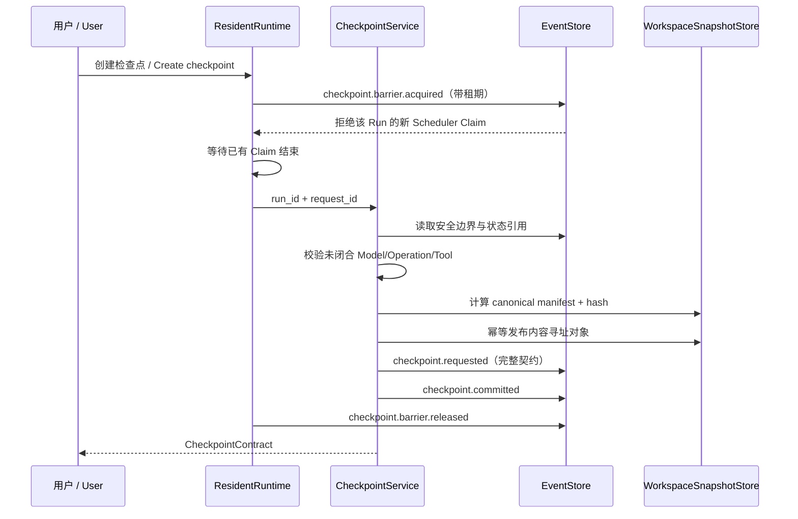
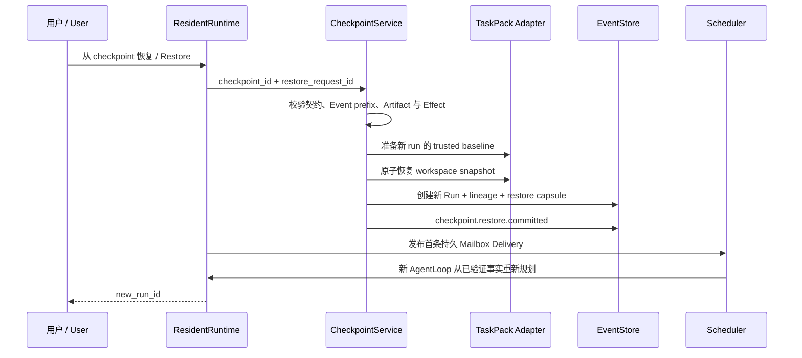

# Composite Checkpoint 复合检查点设计

> 状态：CP0-CP4 已完成；真实 HTTP/UI、Restore 两个发布边界的跨重启恢复、本地 Release 与 GitHub 跨平台 CI 均已通过。第一版限定为本地 `repo-maintainer` 单 Agent、disposable workspace、手动创建与 Fork Restore；Core 契约保持业务无关。

## 1. 一句话结论

Checkpoint 不是复制一份聊天记录，也不是单独保存 Git diff，而是把某个安全 Turn 边界上的工作区版本、Harness 状态引用、制品引用和副作用边界冻结成一个可校验契约；恢复默认创建新 Run，旧历史永不改写。

## 2. 三种方案

| 方案 | 能恢复什么 | 优点 | 根本缺口 |
|---|---|---|---|
| Event cursor only / 仅事件游标 | Harness 逻辑历史 | 最轻；天然适合 Event Sourcing | 文件与外部世界可能已经变化，重放不等于恢复 |
| Git/workspace snapshot / 仅工作区快照 | 本地文件 | 直观；文件 diff 和还原成熟 | 不知道目标、Plan、Context、Artifact 与副作用状态 |
| Composite Checkpoint / 复合检查点 | 文件版本 + 状态引用 + 证据 + Effect 边界 | 能解释“恢复了什么、没恢复什么、为什么能继续” | 契约和校验更复杂，需要 TaskPack Adapter |

**选择：Composite Checkpoint。** Event cursor 和 workspace snapshot 都保留，但只作为复合契约中的两个组成部分。

## 3. 非目标

- 不恢复 Python 调用栈、线程、Socket 或进程内对象。
- 不把旧 Run 的 EventLog 截断、删除或覆写。
- 不复制两个 Agent 的完整 Context、系统提示词或私有 LocalPlan 给对方。
- 不宣称能自动撤销付款、发信、部署、远端数据库写入等外部副作用。
- 第一版不处理 Team 多工作区、Remote A2A、容器镜像或生产环境回滚。

## 4. 核心契约

```text
CheckpointContract
├── identity
│   ├── checkpoint_id
│   ├── request_id + request_fingerprint
│   └── schema_version
├── source_boundary
│   ├── source_run_id / task_id
│   ├── source_event_id / event_count
│   ├── event_prefix_sha256
│   └── turn_id / phase
├── workspace_snapshot
│   ├── object_id / sha256
│   ├── file_count / total_bytes
│   ├── canonical file manifest
│   └── TaskPack + baseline identity
├── state_refs
│   ├── run.created
│   ├── AssignmentContract
│   ├── latest LocalPlan / Progress
│   ├── latest ContextManifest
│   └── ArtifactRefs + content hashes
├── effect_boundary
│   ├── completed operations
│   ├── unresolved operations
│   ├── reversibility class
│   └── restore blockers / required compensation
└── restore_policy
    ├── fork_only
    ├── replan_from_verified_facts
    └── block_unknown_external_effects
```

### 4.1 为什么保存引用，不复制全量 Context

Context 是每轮编译产物，不是唯一事实源。Checkpoint 保存其 Manifest、关键 Artifact 哈希和来源 Event cursor；恢复后的新 Agent 根据这些事实重新编译 Context，并得到一枚“恢复胶囊”。这样可以审计继承关系，也不会把旧 Context 中已经过时、被 Microcompact 清理或权限不属于新 Run 的内容原样灌回去。

### 4.2 恢复胶囊

恢复后的首轮 Context 必须包含：

- 原任务目标、准出条件和约束。
- Checkpoint ID、源 Run、源 Turn 与工作区 Hash。
- 截止该边界已经确认的 Progress、Artifact 与 Evidence 引用。
- 未解决事项和未完成 Plan Step。
- 已发生但未撤销的外部 Effect。
- 明确 Nudge：重新核验当前工作区与外部状态，再制定新 LocalPlan。

它不包含旧模型隐藏推理、完整消息历史或另一个 Agent 的私有 Context。

## 5. 安全边界

Checkpoint 只能在 **Quiescent Boundary / 静止边界** 提交：

1. 没有未闭合的 `model.requested -> model.completed`。
2. 没有未闭合的 `operation.started -> operation.completed`。
3. 没有 `tool.requested` 缺少可信终态。
4. 当前 Run 没有正在执行的 Worker/Delivery Claim。
5. 边界是完整 Turn、CompletionGate 后或 Run 终态，而不是任意 Python 行。

如果检查点请求发生在活跃 Tool 中，Harness 记录 `checkpoint.rejected` 或等待下一安全边界，不能拍下一份“看似完整”的半状态。

## 6. Workspace Snapshot

第一版使用标准库实现内容寻址快照，不要求工作区已经是 Git 仓库：

- 扫描普通文件并按 POSIX 相对路径排序。
- Hash 同时覆盖路径长度、路径、内容长度和内容，避免拼接歧义。
- 拒绝符号链接、设备文件、路径逃逸、大小写碰撞和超出数量/容量预算的文件。
- 写入临时对象，完成 Hash/Manifest 自检后用原子 rename 发布到 `checkpoint_objects/<sha256>`。
- 相同内容复用同一只读对象；恢复前后都重新计算 Hash。
- Baseline 不从工作区盲拷贝，继续由受信 TaskPack 重建并核对身份。

Git 可以作为后续 Adapter 提供更高效的对象复用，但不是 Core 前提。

## 7. Effect Boundary 副作用边界

| Effect 类型 | 示例 | 自动恢复策略 | Restore 结果 |
|---|---|---|---|
| Read only / 只读 | read、search、browser fetch | 不需要撤销，必要时重新取证 | 允许 |
| Workspace local / 本地工作区 | write、patch、生成报告 | 由 Workspace Snapshot 覆盖 | 允许 |
| Idempotent external / 外部幂等 | 带业务幂等键的 PUT | 先对账，再决定复用或重放 | 条件允许 |
| Compensatable / 可补偿 | 创建临时云资源 | 必须有 Adapter 补偿器与结果 Ledger | 条件允许或待人工确认 |
| Irreversible / 不可逆 | 付款、发信、生产发布 | 只记录“已发生”，不能伪造撤销 | 默认阻止自动继续 |
| Unknown / 未知 | Provider 超时后结果不明 | 进入 Unknown，对账前禁止重复执行 | 阻止 |

Checkpoint 恢复的是 Harness 能控制的状态，不是时间机器。外部 Effect 的事实必须随恢复分支继承，不能因为文件回去了就消失。

## 8. 创建协议



### 崩溃恢复

- 屏障获取后崩溃：屏障租期 5 分钟后自动失效，避免 Run 永久冻结；5 分钟是初始值，待大工作区实测调优。
- 对象发布前崩溃：没有 Checkpoint 承诺，用户可用同一请求重试。
- 对象发布后、`requested` 前崩溃：可能留下未引用的内容对象；对象不可变且无调度权，后续由 GC 清理。
- `requested` 后、`committed` 前崩溃：同 `request_id` 复用持久契约，重新校验对象与 Artifact 后补写唯一 `committed`。
- `committed` 后响应丢失：同 `request_id` 返回同一 Checkpoint。

## 9. Fork Restore 协议



关键顺序是 **先恢复并校验工作区，再发布可调度 Delivery**。否则 Scheduler 可能在 Workspace 尚未恢复时唤醒新 Agent。

### 9.1 Restore 崩溃恢复

- 工作区恢复后、`run.created` 前崩溃：同一 `restore_request_id` 派生相同 Run 身份；重启后先校验现有工作区 Hash，再继续发布。
- `checkpoint.restore.committed` 后、Mailbox 投递前崩溃：确定性 Run/Event/Delivery 身份让重试复用已有事实，只补齐缺失投递。
- Mailbox 投递后响应丢失：重复 Restore 返回同一 Run，持久邮箱按 `delivery_id` 去重，不产生第二份任务。
- 任一步发现现有工作区、Checkpoint 对象、Artifact 或 Event prefix 不一致，都失败关闭，不能“尽量继续”。

这套恢复保证的是 **at-least-once 重试 + 幂等事实提交**，不是声称所有外部系统都 exactly-once。新 Run 首次得到调度权的唯一发布点仍是持久 Mailbox Delivery。

### 9.2 为什么默认 Fork，不原地 rewind

- EventLog 是只追加审计事实，原地删除会破坏因果链。
- 原 Run 可能已经触发外部 Effect，文件回滚不能抹掉这些事实。
- Fork 能并排比较原路径和恢复路径，也适合 Eval。
- 重复 Restore 可以用 `restore_request_id` 幂等返回同一分支，或显式新 ID 创建另一个实验分支。

## 10. API 与前端

第一版 HTTP API：

```text
POST /api/runs/{run_id}/checkpoints
GET  /api/runs/{run_id}/checkpoints
GET  /api/checkpoints/{checkpoint_id}
POST /api/checkpoints/{checkpoint_id}/restore
```

Control Room 第一版只提供三个高信号操作：

1. 在安全边界创建检查点。
2. 查看“可恢复、需对账、不可自动撤销”的清单。
3. 从检查点创建恢复分支并跳转到新 Run。

时间线显示 `source run -> checkpoint -> restored run` lineage；不能把恢复后的新 Event 混到旧 Run 时间线里。

## 11. MVP 准出标准

1. 单 Agent 在一个完整 Turn 后创建检查点，继续修改工作区，再 Fork Restore 得到当时的精确文件 Hash。
2. 新 Run 使用新身份，旧 Run、旧 Event 与旧 Artifact 保持不变。
3. 恢复后的首轮 Context 含恢复胶囊，并能继续 canonical AgentLoop。
4. 对同一创建/恢复请求重试不会产生重复 Checkpoint 或重复 Run。
5. 对象篡改、Artifact 缺失、Event prefix 不匹配、路径逃逸、未闭合 Operation 与 Unknown Effect 全部失败关闭。
6. 进程在 requested/object-published/committed 边界崩溃后均可恢复。
7. HTTP 与 Control Room 能看到创建、阻止、恢复和 lineage 全过程。

## 12. 实施分层

| 阶段 | 产物 | 快速验证 |
|---|---|---|
| CP0（完成） | 契约、边界、3 个 Spike | 3 个 20 行内脚本全部 PASS |
| CP1（完成） | WorkspaceSnapshotStore + CheckpointService | 哈希、路径、Artifact、Effect 与半提交测试 |
| CP2（完成） | 单 Agent Fork Restore + 恢复胶囊 | 新 Run 可继续 canonical AgentLoop 到成功 |
| CP3（完成） | HTTP + Control Room + lineage | API、84 条前端测试、桌面/移动截图、真实 UI Restore |
| CP4（完成） | Restore Crash Matrix + 发布 | 两个故障点跨重启；381 passed；Ubuntu/Windows/Frontend CI 全绿 |

## 13. 后续扩展

- Team Composite Checkpoint：每个 child workspace、Team public state、Mailbox cursor 与 Lease boundary。
- Git Adapter：复用 commit/tree/blob，同时保留 Harness Contract。
- Docker Snapshot Adapter：容器文件系统层与 Sandbox image digest。
- Remote Effect Adapter：外部幂等键、查询、补偿与人工审批。
- 自动策略：每个完整 Turn Micro-checkpoint，保留窗口、去重、GC 与用户命名节点。

这些扩展不能改变第一版不变量：旧历史不改写、外部副作用不伪造撤销、恢复前必须校验、恢复分支先准备后发布。
