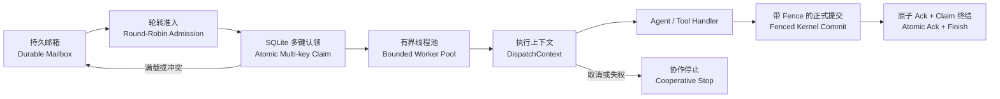
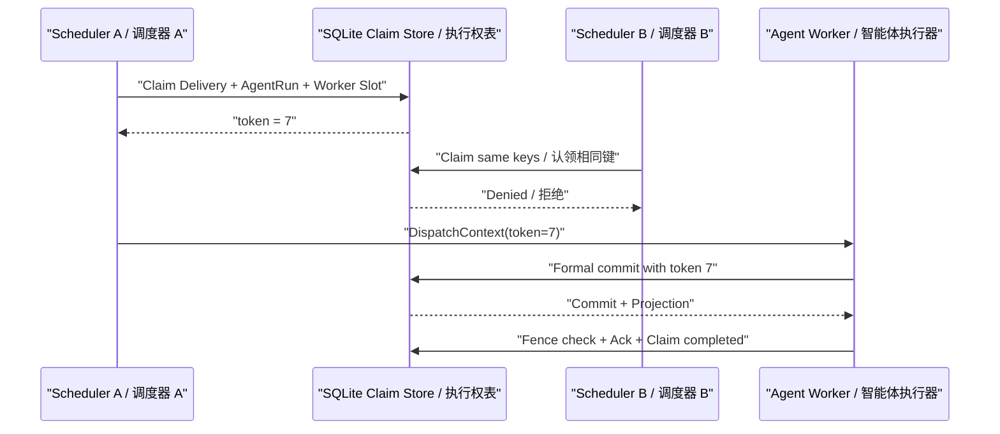
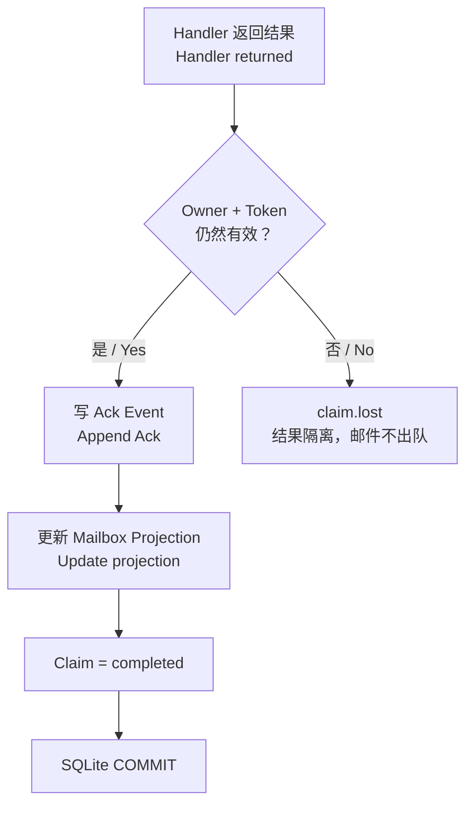
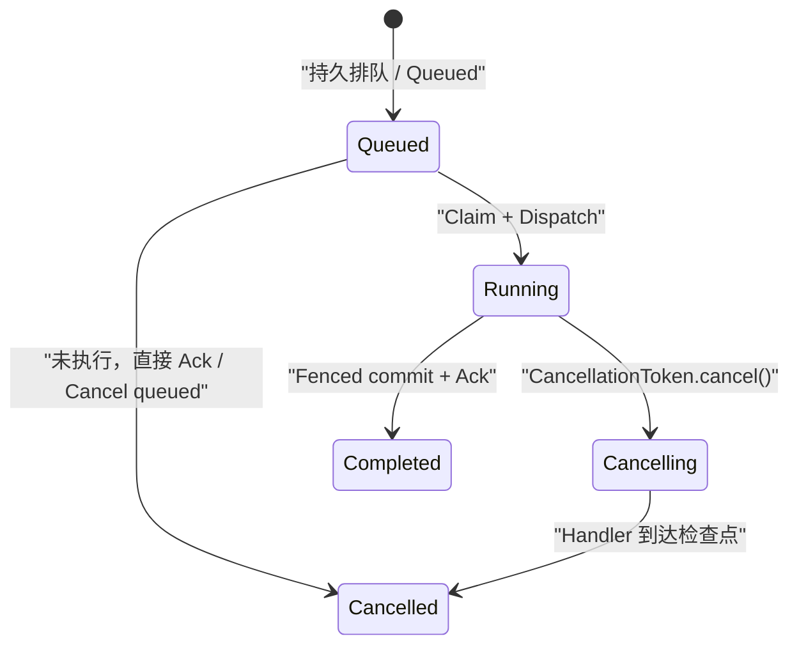

# Controlled Concurrency v0.6：受控并发与 Fencing

> 一句话结论：真正可靠的 Agent 并发不是“多开几个线程”，而是让容量、排队、执行权、取消和提交权都成为 Harness 可验证的事实。

当前实现版本为 `v0.6.0-dev`。本章只解释已经落到源码和测试里的机制；跨进程远程 Worker、在线 DeepSeek Team 和分布式公平调度仍属于后续版本。

## 1. 为什么 v0.5 不能直接删锁

v0.5 的 Durable Mailbox、EventStore、Supervisor 和 AgentLoop 都能真实运行，但 Scheduler 每次只同步处理一个 Delivery。直接把 Handler 丢进线程池会产生四类错误：

1. 两个 Runtime 同时执行同一 Delivery。
2. 同一个 AgentRun 同时进入两个 Turn。
3. 旧 Worker 超时后仍然提交结果或 Ack 邮件。
4. 热门 Mailbox 持续占槽，其他 Agent 长期得不到执行机会。

因此 v0.6 的目标不是“提高线程数”，而是建立下面这条受控路径。



| 名词 | 简短含义 |
|---|---|
| Durable Mailbox / 持久邮箱 | 未 Ack 的 Delivery 保留在 SQLite EventLog，进程退出后仍能恢复。 |
| Admission / 准入 | 决定哪个 Worker 可以占用有限执行槽。 |
| Work Claim / 执行权 | 指定 Delivery、AgentRun 和 Worker 容量槽当前归哪个 Scheduler。 |
| Fencing Token / 隔离令牌 | 单调递增的世代号；旧世代即使还活着，也不能提交或 Ack。 |
| DispatchContext / 执行上下文 | 把 owner、claim tokens 和 CancellationToken 传入本次 Handler。 |
| Backpressure / 背压 | 满载后不继续向内存线程池灌任务，工作继续留在持久邮箱。 |

## 2. 三个容易混淆的概念

| 概念 | 回答的问题 | 当前实现 |
|---|---|---|
| Capacity / 容量 | 最多同时跑多少工作？ | 每个 Scheduler 进程总容量默认 `2`；单 Agent 持久容量默认 `1`。尚无跨进程总容量槽，均为初始配置值。 |
| Backpressure / 背压 | 没有槽位时新工作去哪？ | 留在 Durable Mailbox；记录 `runtime.scheduler.backpressure`。 |
| Lease + Fence / 租约与隔离 | 当前是谁的工作，旧主人还能不能交作业？ | Claim TTL 默认 180 秒，每约 60 秒续期；正式 Kernel 提交和 Ack 都复检 token。 |

Assignment Lease 与 Work Claim 不是同一件事：

- **Assignment Lease** 管业务委派：哪个 Agent 负责哪项 Assignment。
- **Work Claim** 管一次实际消费：哪个 Scheduler 正在处理哪条 Delivery 和 AgentRun。

一个 Agent 可以仍然拥有 Assignment，但当前没有线程在执行；也可以某个 Delivery 已被认领，但 Kernel 最终发现 Assignment Lease 已失效而拒绝结果。

## 3. 三个 Claim 为什么必须一起拿

每次 Dispatch 原子认领三个 key：

```text
delivery:<mailbox>:<delivery_id>
agent-run:<agent_run_id>
worker-slot:<worker_id>:<slot_index>
```

第一把锁防止同一邮件被两个 Runtime 重复消费；第二把锁防止不同 Wake 同时重入同一个 AgentRun；第三把锁让单 Agent 的 `max_concurrency` 在两个 Scheduler 之间也不会超卖。三把锁必须在一个 `BEGIN IMMEDIATE` 事务中“全拿到或全失败”。

Coordinator 更严格：同一 Run 的所有 Supervisor 触发都竞争 `agent-run:supervisor:<run_id>`。因为它们修改的是同一份 Plan Revision，不能按 Assignment 分开并行。



## 4. 为什么 TTL 还需要 Renewer

固定 180 秒 Claim 并不等于一次 LLM、浏览器或工具调用一定会在 180 秒内结束。Scheduler 因此运行独立 Renewer：

1. 每 `TTL / 3` 扫描当前 in-flight reservations。
2. 在一个短 SQLite 事务中复检 owner、token、state 和原过期时间。
3. 全部匹配才延长整个 claim bundle。
4. 任何一个 key 明确失权，立即取消该 DispatchContext。
5. 一次瞬时 Store 异常先重试；若下一次重试将越过安全期限，则协作停止、释放 Claim 且不 Ack，让 Delivery 留在邮箱重投。

续期不能发生在模型或工具事务里；SQLite 写事务必须保持短小，网络 I/O 永远在事务之外。

## 5. Fencing 到底防住了什么

只记录 `claim.lost` 不叫 Fencing，那只是事后发现。v0.6 在三个权威写入点复检 token：

### 5.1 普通可信 Event

Handler 的 `tool.completed`、`operation.completed`、Agent 进度等 Event 在 `store.append()` 的同一个 SQLite 写事务中检查 DispatchContext 的 owner、全部 tokens、active 状态、过期时间，以及 Run 是否已经进入 `cancelling/cancelled`。旧 Worker 连普通证据和异常终态也写不进去；`claim.lost` 等诊断由 Scheduler 在 DispatchContext 外记录。

### 5.2 正式 Command 提交

`ControlKernel.commit_command()` 在同一个 SQLite 事务中完成：

```text
复检 owner + token + active + 未过期
-> 复检 Run 未进入 cancelling/cancelled
-> 复检动态业务前置条件
-> 写 candidate.accepted/rejected 与正式业务 Events
-> 更新 Projection
-> 终结 Command Ledger
-> COMMIT
```

旧 Worker 可以保留已产生的调试轨迹，但不能再产生 `evidence.recorded`、`artifact.recorded`、`review.recorded` 或新的 Assignment 等正式事实。

### 5.3 Mailbox Ack

Ack 与 Claim `completed` 也在同一个事务中。公开 `mailbox.ack()` 遇到 active claim 会被 Store 拒绝，避免旁路绕开 Scheduler。



Fencing 不能撤回已经发出的 HTTP 请求或支付操作。外部副作用仍必须使用 OperationLedger、业务幂等键或事后对账；Fence 只能阻止迟到结果晋升为平台事实。

## 6. 取消为什么是协作式的

Python 线程不能安全强杀。v0.6 使用两阶段取消：



ToolPipeline 在工具开始前检查 token；并发只读工具会复制 ContextVar，使取消信号进入子线程。若外部调用已经发出，则等待其返回并由 Ledger 记录真实结果，不能假装它没有发生。

Run 取消顺序是：

1. 持久化 `run.cancel.requested`。
2. Scheduler 停止该 Run 的新准入。
3. 未认领 Delivery 直接取消并 Ack。
4. 在途 Dispatch 收到 CancellationToken。
5. Assignment 进入 `cancelled`，活动 Lease 释放。
6. 所有 Delivery 都终结后写 `run.cancelled`。

`run.cancel.requested` 本身也是数据库里的提交屏障：另一个 Runtime 即使还没等到 1 秒兜底唤醒，其 Dispatch append 与普通 Ack 也会在 SQLite 事务中看到 `cancelling` 并失败。过期 Claim 不再阻止取消方 Ack；若进程恰好在请求落盘后崩溃，重启会用确定性 Event ID 补齐 Assignment 取消、Lease 释放、排队 Delivery 终结和 Run 终态。重复取消不会产生第二套事实。

## 7. 公平性与背压

当前策略是 **Agent 间 Round-Robin，Agent 内 FIFO**：每成功选中一个 Worker，cursor 移到下一个 Worker。即使第一个 Mailbox 永远有任务，安静 Worker 也会在有界轮次内获得槽位。

Round-Robin 公平目前只覆盖单个 Scheduler 进程。SQLite 三层 Claim 能防止共享数据库上的跨 Runtime 重复执行、AgentRun 重入和 Worker 容量超卖；ResidentRuntime 每 1 秒进行一次有界外部写入检查，并把最近 Lease/Claim Deadline 纳入唤醒。它能支持本地共享 SQLite 的接管活性，但不是远程数据库通知或消息代理，也不保证多实例严格公平。

## 8. 终态为什么必须吸收后续事件

EventLog 可以保留冲突事实，Projection 不能倒退：

| 实体 | 吸收终态 |
|---|---|
| Run | `succeeded / failed / cancelled` |
| Assignment | `succeeded / completed / failed / expired / cancelled` |
| Lease | `released / expired` |

例如 `assignment.succeeded` 之后迟到的 `assignment.running` 仍留在 EventLog 供审计，但 Projection 继续显示 `succeeded`；清空 Projection 后重放，结果也必须相同。

Agent 健康状态同样不能被普通 `idle` 自动洗白。`degraded/offline` 只能由显式 `runtime.agent.recovered` 恢复。

## 9. 当前真实准出测试

| 不变量 | 对应测试 |
|---|---|
| 不同 Worker 真正重叠 | `test_scheduler_runs_distinct_workers_at_the_same_time` |
| 同一 Delivery 只有一个 owner | `test_two_schedulers_cannot_claim_the_same_durable_delivery` |
| Worker 容量跨 Scheduler 不超卖 | `test_worker_capacity_is_enforced_across_schedulers` |
| AgentRun 与 Supervisor 单飞 | `test_distinct_deliveries_for_one_agent_run_are_single_flight_across_schedulers`、`test_coordinator_is_single_flight_per_run_across_schedulers` |
| 单 Scheduler 总容量与 Agent 容量不越界 | `test_scheduler_never_reenters_a_worker_past_its_capacity` |
| 满载不丢任务 | `test_pool_backpressure_keeps_excess_delivery_durable` |
| TTL 自动续期 | `test_scheduler_renews_active_claim_before_ttl_expires` |
| 续租瞬时失败可恢复，未知时不 Ack | `test_claim_renewer_survives_a_transient_store_error`、`test_unconfirmed_claim_renewal_releases_without_acking_delivery` |
| 旧 owner 不能写可信 Event、异常终态、Ack 或正式提交 | `test_dispatch_event_fencing.py`、`test_stale_worker_exception_cannot_record_failure_after_takeover`、`test_stale_worker_cannot_ack_after_claim_is_taken_over`、`test_stale_worker_cannot_commit_a_formal_command_after_takeover` |
| 热邮箱不饿死其他 Worker | `test_round_robin_prevents_a_hot_mailbox_from_starving_another_worker` |
| 协作式取消阻止新工具副作用并可崩溃恢复 | `test_run_cancellation_propagates_to_inflight_handler_and_acks_delivery`、`test_durable_run_cancellation_invalidates_a_remote_dispatch_owner`、`test_run_cancellation_reclaims_an_expired_delivery_claim`、`test_cancellation_recovery_closes_assignments_and_leases`、`test_cancelled_dispatch_cannot_start_a_new_tool_effect` |
| 跨进程写入有界发现 | `test_resident_runtime_periodically_checks_for_cross_process_work` |
| 非阻塞关闭继续续租 | `test_nonblocking_shutdown_keeps_renewing_inflight_claims` |
| 终态重放不倒退 | `test_terminal_projections_are_absorbing_before_and_after_rebuild` |

## 10. 借鉴来源与没有照搬的部分

| 来源 | 吸收的冠军机制 | Crazy 的改造 |
|---|---|---|
| [OpenClaw command queue](https://github.com/openclaw/openclaw/blob/9d97e10efe08c3b5e3043da19b80883e933e26be/src/process/command-queue.ts) | Lane 容量与有槽才 drain | 队列事实落入 Durable Mailbox，不以进程内数组作为唯一 backlog。 |
| [Hermes kanban](https://github.com/NousResearch/hermes-agent/blob/569b912d7d0931c7256e9f5fb326609e9deda377/hermes_cli/kanban_db.py) | 持久 ready backlog 与多层容量 | 第一版实现进程总容量 + 跨 Scheduler Worker 容量；跨进程总容量仍待实现。 |
| [OpenHands conversation lease](https://github.com/OpenHands/software-agent-sdk/blob/4fe565663af2b4f1130a6e0dac7566b002bfe9b4/openhands-agent-server/openhands/agent_server/conversation_lease.py) | Generation guard 与协作取消 | 用 SQLite fencing token 同时守住正式 Command 和 Ack。 |
| [Hindsight poller](https://github.com/vectorize-io/hindsight/blob/395823f7b6611a08a777d3c03414a3270ec54d18/hindsight-api-slim/hindsight_api/worker/poller.py) | 轮转起点与防饥饿 | 采用进程内 Worker Round-Robin；暂不声称分布式强公平。 |

## 11. 面试背诵版

> 我们没有把 ThreadPool 当成并发正确性。Mailbox 是唯一持久 backlog，Scheduler 用 Round-Robin 做准入，再在 SQLite 中原子认领 Delivery、AgentRun 和 Worker Slot 三个 key。每次认领带单调 fencing token，并由 Renewer 延长 TTL；失权就通过 CancellationToken 停止新工具副作用。普通可信 Event、Kernel 正式提交和 Mailbox Ack 都在各自事务里复检 token，所以旧 Worker 即使还在运行，也不能写证据、交作业或把邮件出队。终态 Projection 是吸收态，重放也不会倒退。当前共享 SQLite 多 Runtime 的安全和有界接管已成立，但公平性仍是进程内，外部 HTTP 副作用仍依赖 Ledger 和业务幂等。

记忆公式：

> **Mailbox 管不丢，Capacity 管上限，Worker Slot 管跨实例容量，Backpressure 管满载，Claim 管归属，Fence 管迟到，Cancellation 管停止，Kernel 管正式事实。**

## 12. 局限与下一步

1. SQLite WAL 仍只有一个 Writer；并发模型调用可以重叠，高频 Event 写入吞吐待压测。
2. Round-Robin cursor 尚未持久化；1 秒外部写入检查是本地 SQLite 兜底，不替代远程 Broker 或数据库通知。
3. 多 Runtime 必须使用同一份 AgentCard / `max_concurrency` 配置；配置版本的集中仲裁尚未实现。
4. `max_workers` 是单 Scheduler 进程上限；不同 Worker 分散到多个 Scheduler 时，尚无共享 Global Slot 限制总并发。
5. 取消是协作式，阻塞且不响应 token 的第三方库只能等待 timeout。
6. JSONL EventLog 不提供跨实例 append-once；Control Plane 的并发保证以 SQLite Store 为准。
7. 在线 DeepSeek Team 与浏览器并发的 Token、限流和成本数据尚未实测。
