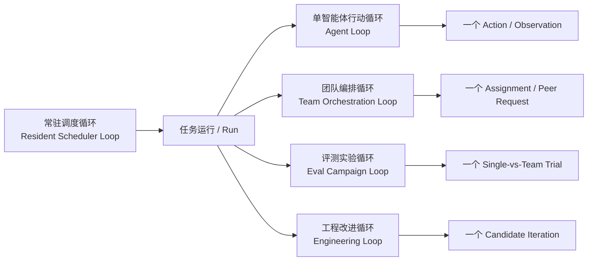
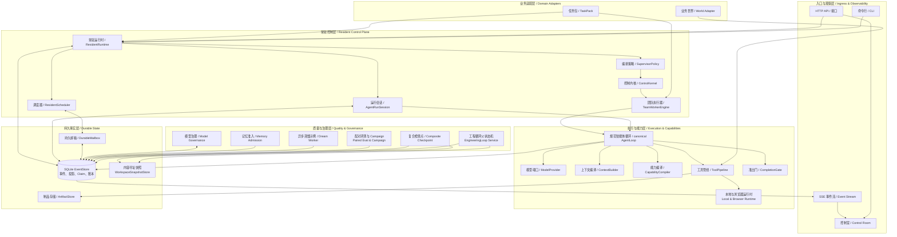
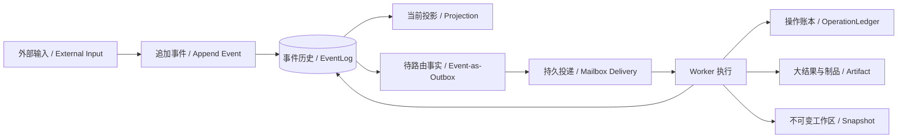
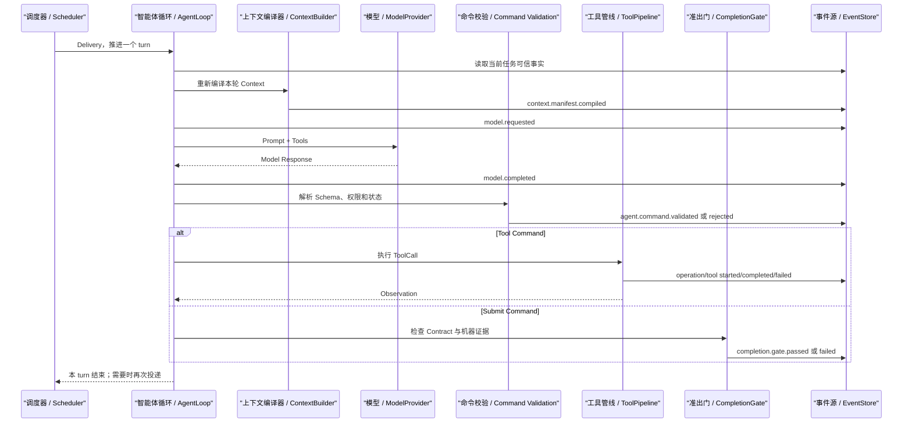
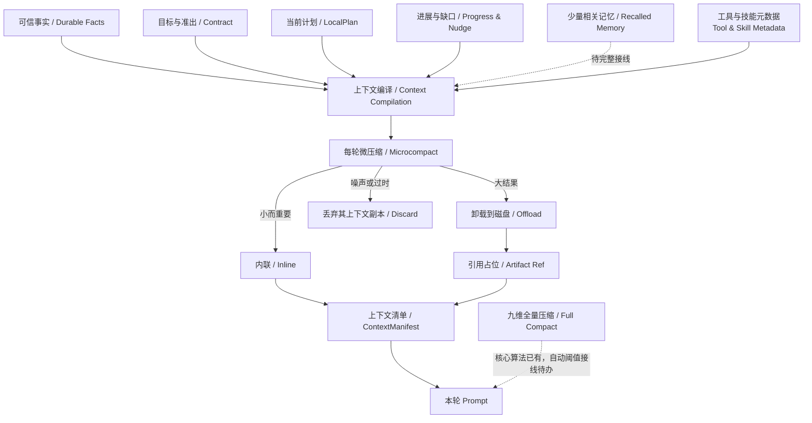
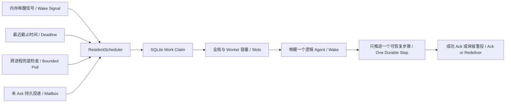
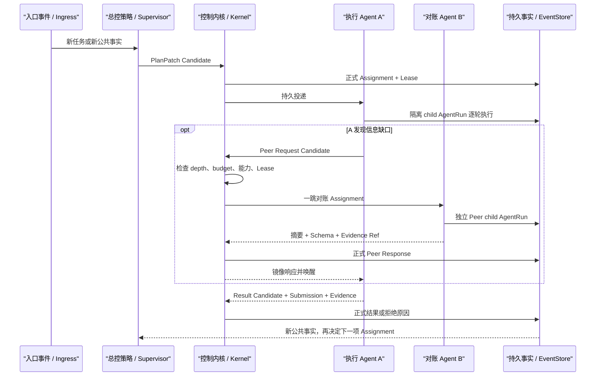
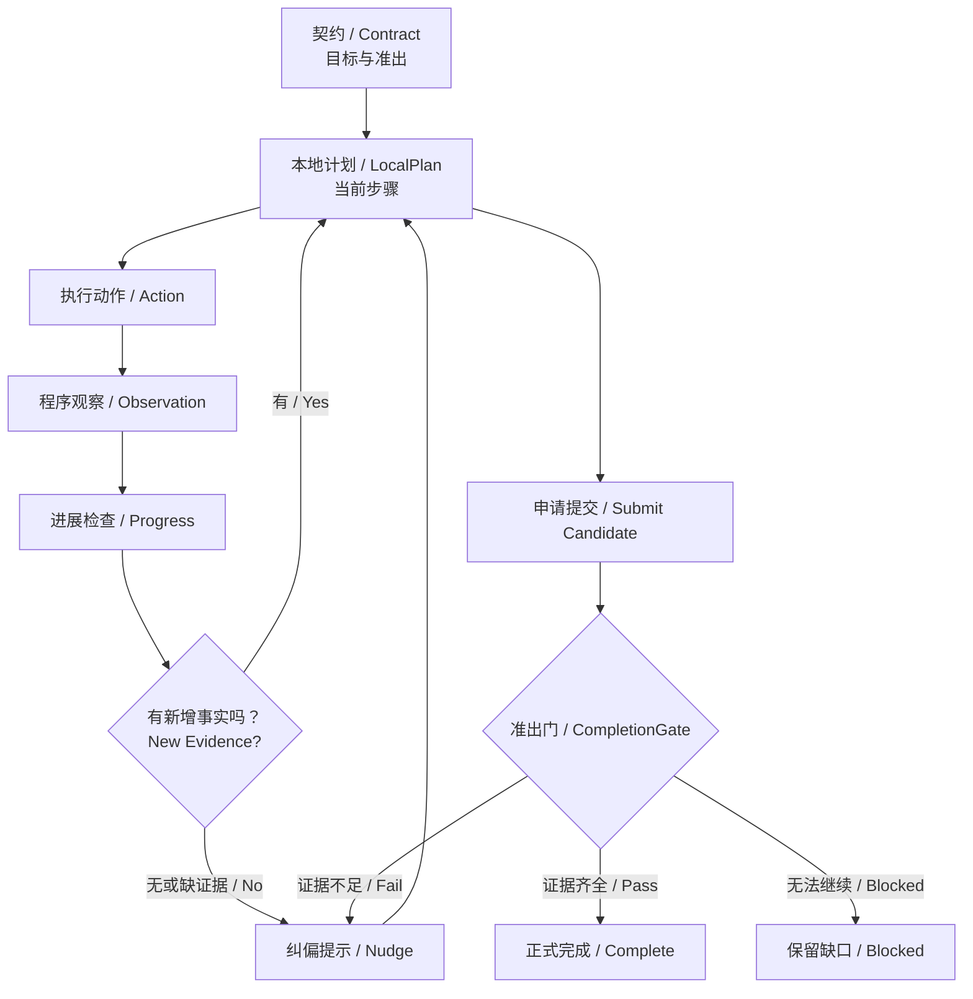
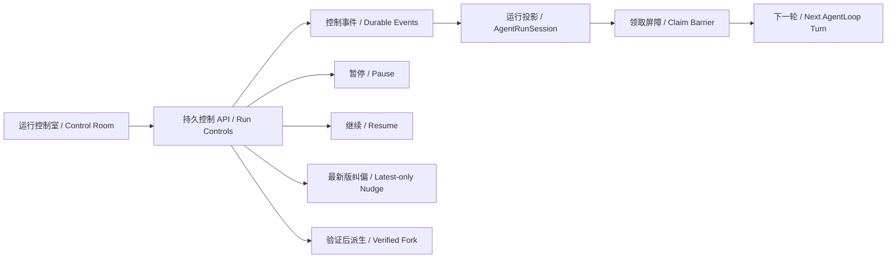
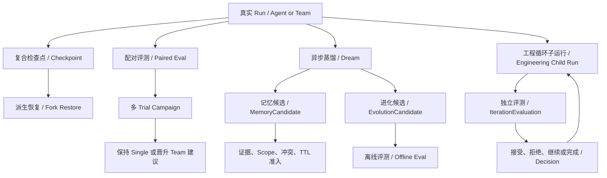

# Crazy Harness 当前平台架构学习指南

> 文档类型：As-Built Architecture / 基于当前源码的已建成架构  
> 核对日期：2026-07-31  
> 核对基线：`feat/durable-engineering-loop-v10` 当前工作树（v0.10 发布候选）  
> 阅读目标：先建立全局心智模型，再沿一条真实事件链读源码；不要把“已实现接口”误记成“已完成端到端能力”。

## 0. 先记住这一句话

**Crazy Harness 是一个以持久事件为事实源、由 Harness 掌握执行权、能够随时唤醒单 Agent 或 Agent Team 的常驻控制平台；模型负责提出下一步，Kernel、Tool Pipeline、CompletionGate 和 Evaluator 负责把建议变成可信事实。**

把它类比成一个小型操作系统：

| 操作系统概念 | Crazy 中的对应物 |
|---|---|
| 进程 | `Run` / `AgentRun` |
| 进程调度 | `ResidentScheduler` |
| 可执行程序 | `TaskPack` |
| 系统调用 | `Tool Call` |
| 权限检查 | `ToolPolicy` / `ControlKernel` |
| 消息队列 | `DurableMailbox` |
| 日志与状态恢复 | `EventStore` / `Projection` |
| 文件系统制品 | `ArtifactStore` / `WorkspaceSnapshotStore` |
| 进程退出码 | `CompletionGate` / `Run terminal event` |

## 1. 先分清五种“循环”

**当前架构最容易混淆的地方，不是模块太多，而是五种不同粒度的循环同时存在。**



| 图中名词 | 循环单位 | 回答的问题 | 当前状态 |
|---|---|---|---|
| Resident Scheduler Loop / 常驻调度循环 | 一次 Delivery | 现在应该唤醒谁？ | 已真实运行 |
| Agent Loop / 单智能体行动循环 | 一次模型动作 | Agent 下一步做什么？ | 已真实运行 |
| Team Orchestration Loop / 团队编排循环 | 一次正式委派 | 根据最新公共事实，下一项工作交给谁？ | 已真实运行 |
| Eval Campaign Loop / 评测实验循环 | 一组配对 Trial | Single 与 Team 哪个更好，结论是否稳定？ | 已真实运行，Scripted Golden 已验证 |
| Engineering Loop / 工程改进循环 | 一版候选 | 上一版产物如何成为下一轮起点，是否应该晋升？ | EL0/EL1/EL2 已运行；父级 HTTP/UI 尚未接入 |

关键区分：`AgentLoop` 的多轮是为了完成一次 Assignment；`EngineeringLoop` 的多轮是为了比较和晋升多个版本。后者不能偷换成无限增加前者的 turn。

## 2. 当前静态架构全景

**平台分成入口与观察、常驻控制、执行能力、持久事实、质量治理和业务适配六层。**



| 图中名词 | 它负责什么 | 它不负责什么 |
|---|---|---|
| ResidentRuntime / 常驻运行时 | 组装 Store、Scheduler、Kernel、Mailbox、TaskPack 和后台 Worker | 不替模型思考具体任务内容 |
| ResidentScheduler / 调度器 | 从持久邮箱选择 Delivery，做容量、Claim、续租、取消和故障处理 | 不决定业务目标和结果是否正确 |
| AgentRunSession / 运行会话 | 组合一次 single-Agent Run 的持久身份、投影视图和单步入口 | 不把内存对象当事实，也不替 AgentLoop 执行动作 |
| SupervisorPolicy / 编排策略 | 根据公共 Team 状态提出 `PlanPatch Candidate` | 不能直接创建正式 Assignment |
| ControlKernel / 控制内核 | 校验身份、Schema、权限、Lease、证据和因果链，晋升正式事实 | 不生成自然语言答案 |
| TeamWorkerEngine / 团队执行器 | 把 Assignment/Peer Delivery 变成隔离 child AgentRun，并逐轮推进 | 不绕过 canonical AgentLoop 直接交作业 |
| canonical AgentLoop / 规范循环 | 编译 Context、调用模型、验证 Command、执行工具、记录 Observation、检查准出 | 不负责跨候选版本的工程晋升 |
| TaskPack / 任务包 | 声明 Contract、Prompt、Tool、Skill、Workspace 和 Golden Script | 不进入通用 Core，不应把业务规则写死在 Runtime |
| World Adapter / 业务世界适配器 | 把 Git、CI/CD、浏览器、云平台等外部世界包装成受控能力 | 不改变 Harness 的信任边界 |
| Model Governance / 模型治理 | 预约 Token/费用/并发，记录 Attempt、Usage、Retry 和 Unknown | 不能保证第三方 API exactly-once 计费 |
| Composite Checkpoint / 复合检查点 | 冻结 Workspace、事件前缀和状态引用，并以 Fork 方式恢复 | 不能自动撤销外部系统副作用 |
| EngineeringLoop Service / 工程循环服务 | 持久管理 Candidate、真实 child Run、Evaluation、Decision 和 Active 谱系 | 当前尚未接入父级 HTTP/SSE 与 Control Room |

## 3. 哪些东西才是“事实”

**内存中的 Python 对象只是缓存；可恢复事实必须落在 Event、Ledger、Artifact 或 Snapshot 中。**



| 持久对象 | 保存什么 | 为什么不能互相替代 |
|---|---|---|
| EventLog / 事件历史 | “发生过什么”的不可变业务事实 | 适合审计和重放，不适合直接高效回答所有当前状态问题 |
| Projection / 投影 | 从 Event 推导出的当前状态，例如 Run 状态、Agent 负载、Lease | 可以删掉重建，因此不是独立真相源 |
| DurableMailbox / 持久邮箱 | 某逻辑 Agent 仍待处理或尚未 Ack 的 Delivery | 它回答“下一步要做什么”，EventLog 回答“过去发生过什么” |
| Command Ledger / 命令账本 | 同一幂等键的 Candidate 最终被接受还是拒绝 | 防止崩溃后把同一逻辑命令执行两遍 |
| OperationLedger / 操作账本 | Tool 副作用 started/completed/failed/unknown | 解决“工具可能已执行，但 Event 尚未写完”的恢复问题 |
| ArtifactStore / 制品存储 | 大型 Tool Result、报告、结构化产物 | Event 只保存引用，避免把所有正文塞进上下文和 SQLite |
| WorkspaceSnapshotStore / 工作区快照 | 内容寻址、不可变的文件树 | 用于 Checkpoint 和候选谱系，不等于外部世界回滚 |

### EventLog 与持久邮箱的最短区分

```text
EventLog：全局历史账本，告诉我们发生过什么。
Mailbox：面向某个 Agent 的持久待办箱，告诉调度器下一步唤醒谁。
Projection：从历史账本算出的当前视图，告诉 UI 现在是什么状态。
```

Mailbox 采用至少一次投递和显式 Ack。任务做完后不是删除历史 Event，而是把 Delivery 标成已消费；因此进程崩溃后，未 Ack 的工作仍能被重新发现。

## 4. 单 Agent 的真实执行路径

**模型只产生 `Response`；通过 Harness 校验后才形成 `Command`，工具返回的 `Observation` 才是物理事实。**



| 控制点 | 模型的权力 | Harness 的权力 |
|---|---|---|
| Context | 无法直接决定全量历史都进入 Prompt | 按分类、预算和策略重新组装 |
| Response | 建议调用工具、等待、发消息或提交 | 持久化原始响应，不能把它直接当事实 |
| Command | 提供候选字段 | 校验 Schema、权限、预算、当前状态和幂等性 |
| Tool | 建议工具名和参数 | 决定工具是否可见、可用、需审批、串行或并行，并真正执行 |
| Observation | 可以解释结果 | 只有程序执行产生的结果能进入事实链 |
| Stop/Submit | 可以申请停止或交作业 | CompletionGate 根据 Contract 和证据决定是否允许 |

最值得背的一句：**模型建议动作，Harness 产生事实。**

## 5. Context 与 Capability 怎样进入每一轮

**每轮 Context 不是对旧 Prompt 做 `+=`，而是读取分类事实后重新编译。**



| 图中名词 | 当前实现含义 |
|---|---|
| Contract / 契约 | 目标、准出条件、证据要求、权限和预算；每轮固定提醒，不靠模型自己记住 |
| LocalPlan / 本地计划 | Agent 对 Assignment 的当前步骤分解；属于该 AgentRun 私有状态 |
| Progress / 进展 | 新增有效事实、剩余缺口和无进展计数 |
| Nudge / 纠偏提示 | Harness 根据缺证据、Schema 错误、悬空 Operation 或无进展生成的结构化提醒 |
| Microcompact / 微压缩 | 每轮机械清理旧噪声、去除可重建冗余，并把超阈值 Tool Result 变为 Artifact 引用 |
| Offload / 卸载 | 正文落磁盘，Context 保留摘要和引用；必要时模型可用读工具再次取回 |
| ContextManifest / 上下文清单 | 记录本轮包括、排除和卸载了哪些引用，以及 Prompt Hash 和估算 Token |
| Full Compact / 全量压缩 | 把安全历史前缀压成九维摘要；校验模型和核心函数已存在，但 canonical Runtime 尚未按预算自动触发 |
| CapabilityCompiler / 能力编译 | 根据当前 Scope 披露内联工具或 Tool Search 入口，避免工具目录无限占据 Context |
| Skill / 技能 | 元数据先披露，正文显式激活；可描述工作方法和允许工具，但最终权限仍归 ToolPolicy |
| MCP / 模型上下文协议 | 已有延迟发现和 SDK 适配原语；尚不是大规模远程 MCP 生产目录 |

## 6. 常驻并不等于每个 Agent 永久占一个线程

**常驻的是 Runtime、Scheduler、Mailbox 和状态；Agent 是持久身份，需要工作时才被唤醒。**



| 唤醒来源 | 作用 |
|---|---|
| Wake Signal / 内存信号 | 本进程刚产生新 Delivery 时立即唤醒，减少延迟 |
| Deadline / 截止时间 | Lease、Retry 或定时任务到期时唤醒，检查失联和超时 |
| Bounded Poll / 有界兜底检查 | 其他进程写 SQLite 不会触发本进程 Condition，因此最多约 1 秒后主动再看一次；这是初始值，待调优 |
| Durable Mailbox / 持久邮箱 | 即使没有任何内存信号，未完成 Delivery 仍不会消失 |
| Work Claim / 工作认领 | 多个 Scheduler 竞争同一 Delivery 时只允许一个当前持有者 |
| Fencing / 写屏障 | 旧 Worker、过期 Lease 或已取消 Run 的迟到写入不能晋升为正式事实 |

## 7. Agent Team 与受控 A2A

**总控负责编排后续工作；子 Agent 只能在受控预算内发起一跳对账，不能自行扩张成无限调用链。**



| 名词 | 含义 |
|---|---|
| TeamContract / 团队契约 | 声明阶段 DAG、目标、依赖、能力、预算和准出，不写死 A-B-C 调用链 |
| PlanPatch Candidate / 计划补丁候选 | Supervisor 根据当前事实提出的下一步；先校验，后生效 |
| Assignment / 正式委派 | Kernel 接受后形成的目标、准出、能力与证据合同 |
| Lease / 执行租约 | 某 Agent 在限定时间内提交该 Assignment 的授权 |
| Assignment child AgentRun / 委派子运行 | 保存该 Agent 的私有 Context、LocalPlan、模型和工具轨迹 |
| Peer Request / 同伴请求 | 子 Agent 针对当前缺口发起的一跳对账；默认 depth 与次数均有界 |
| Result Promotion / 结果晋升 | `agent.submitted` 只是交作业申请；Kernel 核验 provenance 和 evidence 后才写根任务正式事实 |

### Team 共享与不共享什么

| 推荐共享 | 默认不共享 |
|---|---|
| 根任务目标与准出条件 | 对方完整 Prompt 和系统提示词 |
| Kernel 接受的公共事件 | 对方全部消息历史 |
| 结构化 Assignment、状态与 Correlation ID | 对方 LocalPlan 与隐藏推理 |
| Artifact、Snapshot 和 Evidence Ref | 对方原始大 Tool Result |
| 受限摘要、Schema 化 Peer Response | 整个 AgentRun Context |

“公共事件”指已经经过 Kernel/Tool/Gate 验证、对团队决策有意义的事实，例如正式 Evidence、Assignment 终态、Lease 状态和 Peer Response；不是每个 Agent 的所有内部事件。

## 8. Contract、Plan、Progress、Nudge、Gate 怎样协作

**这五个对象共同解决长程任务的遵循度：目标不漂、步骤可改、进展可量、偏航可纠、提交可验。**



| 模块 | 管什么 | 实际生效方式 |
|---|---|---|
| Contract | 目标、准出、权限、预算 | 作为持久对象固化，并在每轮 Context 中替换式注入 |
| LocalPlan | 当前准备怎么做 | AgentRun 自己维护，可按新 Observation 修订，不改变 Contract |
| Progress | 是否真的向前 | Harness 比较新增事实、证据和重复动作，不信模型自述 |
| Nudge | 为什么必须纠偏 | Harness 根据错误类型选择模板和缺口数据，下一轮替换当前 Nudge 槽位 |
| CompletionGate | 是否允许交作业 | 检查 Contract、Tool 终态、Evidence 和 Artifact Schema；不通过就拒绝停止 |

### 8.1 AgentRunSession 与持久运行控制

**AgentLoop 管“一轮怎样做事”，AgentRunSession 管“这一次运行是谁、现在在哪、如何被安全控制”。**



| 控制 | 实际怎样生效 | 不能做什么 |
|---|---|---|
| Pause / 暂停 | 先持久化请求并阻止领取下一 Turn；在途 Turn 收尾后写入 Paused | 不强杀正在进行的模型、工具或外部请求 |
| Resume / 继续 | 写入恢复事实，让原 Mailbox Delivery 重新具备领取资格 | 不新建一份隐藏上下文，也不重采样已完成 Response |
| Nudge / 纠偏 | 新事件替换旧 Nudge 保护槽；下一轮 Context 只编入最新版 | 不修改 Contract，不把旧提醒不断 `+=` 到 Context |
| Fork / 派生 | 从 verified Checkpoint 恢复 Workspace 与可信引用，创建有父子谱系的新 Run | 不改写父 Run，不复制模型隐藏推理，不撤销外部副作用 |
| Query / 查询 | `AgentRunSession.project_view()` 只读重放已有事件 | 不能为了显示页面而追加 Skill、Phase 或其他运行事件 |

页面证据：[`agent-run-controls-desktop.png`](assets/agent-run-controls-desktop.png) 与 [`agent-run-controls-mobile.png`](assets/agent-run-controls-mobile.png)。

## 9. 质量治理的四条独立路径

**Checkpoint、Eval、Memory/Evolution 和 Engineering Loop 都使用事件与制品，但解决的是四类不同问题。**



| 路径 | 核心问题 | 当前真实程度 |
|---|---|---|
| Composite Checkpoint / 复合检查点 | 如何冻结一个可验证边界并安全派生恢复？ | Repo Maintainer 单 Agent 已真实创建、验证和 Fork Restore |
| Paired Eval / 配对评测 | 同题、同模型、同预算下 Single 与 Team 谁更好？ | Pair、Campaign、独立 Scorer、恢复与前端已完成；当前 Golden 为 Scripted |
| Dream + Memory / 异步蒸馏与记忆 | 哪些运行经验值得成为长期知识？ | Candidate、证据、Scope、准入 Event 已实现；当前 Dream 内容是确定性教学示例，真实异步 LLM 蒸馏与 Recall 尚未完成 |
| Controlled Evolution / 受控进化 | 一项 Harness 改动是否值得晋升？ | Candidate 与离线指标示例已实现；Shadow、Canary、统计置信度和自动版本晋升尚未完成 |
| Engineering Loop / 工程循环 | 上轮被接受的状态如何成为下轮起点并逐步达到目标？ | 两个真实 canonical child Run、快照继承、独立 Evaluator 与父级恢复已完成；HTTP/UI 正在开发 |

### Checkpoint 为什么默认 Fork，而不是改写旧 Run

旧 Run 和旧 Event 是审计历史，原地回退会篡改“过去发生过什么”。当前恢复创建新 Run，复用经过验证的 Workspace Snapshot、Assignment/Plan/Context 引用，并明确记录来源；模型隐藏推理不会被复制。

### 自进化为什么不能让 Agent 直接修改自己

正确链路是：

```text
Agent 或 Dream 只提交 Candidate
-> 冻结 Diff、版本和证据
-> 独立 Eval 比较基线
-> 版本门决定是否晋升
-> 出现退化可以 Rollback
```

最值得背的一句：**自进化不是自由改自己，而是提交候选改动；Eval 掌握方向，版本门控制晋升，Rollback 保证可撤回。**

## 10. 崩溃恢复的统一思路

**恢复不是“重新跑一遍”，而是先问最后一个可信持久边界在哪里，再决定复用、对账还是重试。**

| 最后可信边界 | 恢复动作 | 原因 |
|---|---|---|
| `model.requested`，无 Attempt/Response | 可以按预算重新调用模型 | 没有证据证明物理请求已发出 |
| Provider Attempt 已开始，结果未知 | 标记 `unknown`，禁止盲目重采样 | 第三方可能已执行或计费 |
| `model.completed` 已落盘 | 复用 Response，继续 Command Validation | 模型结果已经完整，重复采样会改变轨迹并增加费用 |
| `agent.command.validated` 已落盘 | 复用 Command | 不能让同一 Response 在重启后变成另一条命令 |
| `operation.started`，无工具终态 | 查 OperationLedger、产物或外部状态 | 工具可能已经产生副作用 |
| `tool.completed`，无 `operation.completed` | 核验结果与 Ledger 后补终态 | 更可能是记录边界中断，不应直接重做副作用 |
| 正式 Event 已提交，Mailbox 未投递 | Event-as-Outbox 补投确定性 Delivery | 业务事实已成立，缺的是通知 |
| Delivery 未 Ack | 重新投递，同一幂等身份继续 | Mailbox 使用至少一次语义 |
| Lease 已过期 | 旧 Worker 写入被 Fencing 拒绝，Supervisor 可重新委派 | 防止两个执行者同时提交正式结果 |
| Checkpoint 含外部 Unknown Effect | 阻止自动恢复，要求对账或补偿 | 文件恢复不能冒充外部世界回滚 |

这套机制的工程味很重，但它仍属于 Harness：它决定模型工作在失败、重启、重试和副作用存在时，是否仍能产生可信结果。

## 11. 三条真实业务故事

### 11.1 Single：修复一个仓库

```text
POST Run(repo-maintainer, single)
-> generalist Mailbox
-> AgentLoop 读取源码
-> AgentLoop 修改 calculator.py
-> 真实 unittest
-> 真实 repo.diff
-> CompletionGate
-> run.succeeded
```

这里 Scripted Model 只让动作序列可重复；文件修改、测试、Diff、Context、Gate、事件和恢复都走真实实现。

### 11.2 Team：证据、风险、制品、审查

```text
外部任务
-> Supervisor 发现 evidence 与 risk 两个根阶段均 Ready
-> Scout 与 Reviewer/相关 Agent 可并发执行
-> 两份正式 Evidence 完成
-> Builder 获得 artifact Assignment
-> Builder 必要时发起一次 Peer 对账并等待
-> Peer Response 唤醒 Builder
-> Reviewer 检查 Artifact 与 Evidence
-> Kernel 晋升 review.recorded
-> 根 Run 完成
```

它不是固定的“Coordinator-A-B-C”。Supervisor 每次根据 TeamContract DAG 和最新公共事实提出下一步，Kernel 再决定是否正式生效。

### 11.3 Eval：Single-vs-Team 多 Trial 对照

```text
Campaign Contract
-> 预注册 Trial 身份与总预算
-> 每个 Trial 创建同输入的 Single Arm 与 Team Arm
-> 两臂独立 Workspace、同 Scorer
-> 收集质量、调用数、Token、费用和延迟
-> 确定性聚合与恢复
-> 形成 keep_single / promote_team / insufficient_evidence 建议
```

当前 Scripted Golden 的结论只能证明治理流程可运行，不能证明 Team 在真实 DeepSeek 上更强。

## 12. 当前成熟度地图

| 模块 | 当前成熟度 | 已证明的能力 | 主要缺口 |
|---|---|---|---|
| canonical AgentLoop | 可运行 MVP+ | Response 复用、Command 校验、Tool/Gate、故障恢复 | 更广泛真实任务与长期在线数据 |
| Context Engineering | 可运行 MVP | 每轮重编译、Manifest、Microcompact、Offload | Full Compact 自动触发、真实 Recall 策略 |
| Capability Harness | 可运行 MVP | Tool/Skill、延迟披露、Tool Search、Policy | 大规模 MCP/Skill 目录与检索质量评测 |
| Local/Browser Runtime | 可运行 MVP | 受限本地命令、真实 Chromium 证据 | Docker Engine 当前不可用，不是强隔离沙箱 |
| Resident Scheduler | 较强本地实现 | Mailbox、Claim、容量、续租、取消、Dead Letter、跨进程兜底 | 跨机器 Broker、生产 SLO、分布式时钟 |
| Agent Team / A2A | 可运行 MVP+ | 动态 DAG、Lease、child AgentRun、一跳 Peer、Promotion | Remote A2A、开放任务泛化、真实在线收益 |
| Model Governance | 可运行 MVP | 预算预约、Attempt、Retry、Unknown、Usage 与费用估算 | 本机无 DeepSeek Key，尚无付费 Live 证据 |
| Memory | 机制原型 | Candidate、Scope、Evidence、Conflict/TTL 模型与准入事件 | 自动 Recall、真实蒸馏质量和负提升评估 |
| Eval Campaign | 可运行 MVP+ | Pair、Campaign、独立 Scorer、恢复、前端 | 真实模型多样本、统计置信度与 Shadow 数据 |
| Composite Checkpoint | 可运行 MVP | 内容寻址快照、Event 前缀、Effect Boundary、Fork Restore | Team 多 Workspace、外部 Effect 补偿 |
| Engineering Loop | EL2 可运行 Golden | Domain、Policy、持久父状态机、两个真实 child Run、快照继承、独立 Evaluator | 父级 API/UI、Live 模型、人工晋升与并行候选 |
| Control Room | 可运行 MVP+ | HTTP/SSE、双语时间线、Eval、Checkpoint、模型治理、single-Agent 运行控制 | Engineering Loop 页面和 Team/Remote 控制 |

## 13. 源码地图：按什么顺序读

**不要按目录从头读；先跟一条真实任务，再扩展到 Team 和治理。**

| 顺序 | 文件 | 读完应回答的问题 |
|---:|---|---|
| 1 | `crazy_harness/control_plane/runtime.py` | 平台如何组装、提交任务、唤醒 Agent、推进和恢复？ |
| 2 | `crazy_harness/core/agents/loop.py` | 一轮 AgentLoop 中 Context、Model、Command、Tool、Observation、Gate 谁控制？ |
| 2a | `crazy_harness/core/agents/session.py`、`crazy_harness/control_plane/run_controls.py` | 一次 AgentRun 如何从事件恢复身份与状态，Pause/Nudge/Fork 如何成为持久控制？ |
| 3 | `crazy_harness/taskpacks/repo_maintainer.py` | 一个业务如何声明 Contract、Prompt、Tool、Skill、Workspace 和 Script？ |
| 4 | `crazy_harness/core/tools/pipeline.py` | 工具副作用如何经过 Policy、Ledger 和终态记录？ |
| 5 | `crazy_harness/core/context/builder.py` | 每轮 Context 怎样重新编译、Microcompact 和 Offload？ |
| 6 | `crazy_harness/control_plane/team_workers.py` | Assignment/Peer 如何各自创建隔离 child AgentRun？ |
| 7 | `crazy_harness/control_plane/kernel.py` | Candidate 在什么条件下才成为正式事实？ |
| 8 | `crazy_harness/core/a2a/orchestration.py` | TeamContract DAG、SupervisorContext 和 PlanPatch 是什么？ |
| 9 | `crazy_harness/control_plane/model_governance.py` | 模型请求如何预约预算、记录 Attempt 和处理 Unknown？ |
| 10 | `crazy_harness/control_plane/paired_evals.py` | 同题两臂如何公平创建、运行和独立评分？ |
| 11 | `crazy_harness/control_plane/eval_campaigns.py` | 多 Trial 如何预算、恢复、聚合和给出建议？ |
| 12 | `crazy_harness/control_plane/checkpoints.py` | Checkpoint 冻结了哪些边界，为什么 Restore 要 Fork？ |
| 13 | `crazy_harness/control_plane/engineering_loops.py` | Candidate、child Run、Evaluation、Decision 如何形成持久父状态机？ |
| 14 | `tests/control_plane/` | 哪些架构承诺已经是可执行断言，而不是文档愿望？ |

推荐配套专项文档：

| 专题 | 文档 |
|---|---|
| Team、Lease、Peer、Promotion | [`DURABLE_SUPERVISOR_WALKTHROUGH.md`](DURABLE_SUPERVISOR_WALKTHROUGH.md) |
| 并发、Claim、Fencing | [`CONTROLLED_CONCURRENCY_WALKTHROUGH.md`](CONTROLLED_CONCURRENCY_WALKTHROUGH.md) |
| 模型预算与 Unknown | [`ONLINE_TEAM_MODEL_GOVERNANCE_WALKTHROUGH.md`](ONLINE_TEAM_MODEL_GOVERNANCE_WALKTHROUGH.md) |
| Single-vs-Team | [`SINGLE_VS_TEAM_EVAL_DESIGN.md`](SINGLE_VS_TEAM_EVAL_DESIGN.md) |
| 多 Trial Campaign | [`PAIRED_EVAL_CAMPAIGN_DESIGN.md`](PAIRED_EVAL_CAMPAIGN_DESIGN.md) |
| Checkpoint | [`COMPOSITE_CHECKPOINT_DESIGN.md`](COMPOSITE_CHECKPOINT_DESIGN.md) |
| 外层工程循环 | [`DURABLE_ENGINEERING_LOOP_DESIGN.md`](DURABLE_ENGINEERING_LOOP_DESIGN.md) |
| Harness 核心背诵 | [`HARNESS_CORE_ESSENTIALS.md`](HARNESS_CORE_ESSENTIALS.md) |

## 14. 建议你这样学习这一版架构

### 第一遍：20 分钟，只建立地图

1. 记住六层架构图。
2. 分清五种 Loop。
3. 分清 EventLog、Mailbox、Projection、Ledger、Artifact、Snapshot。
4. 背下“模型建议动作，Harness 产生事实”。

### 第二遍：40 分钟，只追一条 Single Run

1. 从 `TaskRequest` 找到 `_prepare_single_task()`。
2. 看 `assignment.created` 如何进入 `generalist` Mailbox。
3. 单步进入 `_single_agent_step()` 和 `_single_session_for()`。
4. 在 `AgentLoop.run_once()` 观察 Context、Model、Command、Tool、Gate。
5. 对照 EventLog 验证每个持久边界。

### 第三遍：60 分钟，把 Single 扩成 Team

1. 看 `TeamContract` 声明 DAG。
2. 看 Supervisor 为什么只能提 `PlanPatch Candidate`。
3. 看 Kernel 如何产生 Assignment 与 Lease。
4. 看 TeamWorker 如何创建 child AgentRun。
5. 看 Peer Wait/Resume 和 Result Promotion。

### 第四遍：45 分钟，理解平台为什么可信

1. 手动制造一次 `after_model_persisted` 崩溃，确认 Response 被复用。
2. 手动制造一次 Tool Effect 后崩溃，确认先查 Ledger，不盲目重做。
3. 创建 Checkpoint，再 Fork Restore，观察旧 Run 未被改写。
4. 跑一次 Eval Campaign，区分 Run 成功与独立 Scorer 评分。

### 你的准出标准

你能不用源码画出下面四张图，就说明已经掌握当前骨架：

1. `Gateway -> Runtime -> Mailbox -> AgentLoop -> Tool/Gate -> EventStore`。
2. `Supervisor Candidate -> Kernel -> Assignment + Lease -> child AgentRun -> Promotion`。
3. `EventLog / Mailbox / Projection / Ledger / Artifact / Snapshot` 的区别。
4. `AgentLoop / Team Loop / Eval Campaign / EngineeringLoop` 的层级关系。

## 15. 最终背诵版

1. Crazy 的常驻实体是 Runtime、Scheduler、Mailbox 和持久状态，Agent 是可随时唤醒的逻辑身份。
2. EventLog 记录发生过什么，Mailbox 记录谁还有待办，Projection 展示现在是什么状态。
3. Model Response 只是建议，通过 Schema、Policy 和状态校验后才成为 Command。
4. 工具结果必须由程序执行，并通过 OperationLedger 和 Event 因果链成为 Observation。
5. Contract 管目标，Plan 管步骤，Progress 管前进，Nudge 管纠偏，Gate 管完成。
6. Context 每轮重新编译；大结果 Offload，每轮 Microcompact，接近预算再 Full Compact。
7. Supervisor 负责动态编排，子 Agent 只能做有界一跳 A2A；双方共享摘要、Schema 和证据引用，不共享完整 Context。
8. child AgentRun 的提交仍是 Candidate，只有 Kernel 能把它晋升为根任务正式事实。
9. Checkpoint 恢复文件与状态引用，不承诺撤销外部副作用；默认 Fork，不篡改旧历史。
10. Eval 独立于 Maker；自进化只提交候选，版本晋升必须经过评测门和可回滚边界。
11. AgentLoop 完成一次任务，EngineeringLoop 迭代多个候选版本，两者不能混为一谈。
12. 当前最强的是本地可恢复控制链；Remote A2A、真实 DeepSeek 收益、强沙箱和自动 Evolution 仍需实测。

## 16. 当前开发断点

EL0/EL1/EL2 已完成：

- `core/engineering_loops/` 已有 Contract、Candidate、Evaluation、Decision 与确定性 Policy。
- `control_plane/engineering_loops.py` 已有持久父状态机、Claim、Projection 和恢复边界。
- `repo-quality` 已连续驱动两个真实 canonical child AgentRun；真实 Tool/Gate、内容寻址快照、独立 Evaluator 和 `0.5 -> 1.0` Active 谱系均已形成持久证据。
- `AgentRunSession`、Pause/Resume、latest-only Nudge、verified Fork、HTTP API 与中英双语 Control Room 已完成 single-Agent 纵切，并通过 Kill-Restart 实测。

当前开发断点是 EL3：

- 为父级 Engineering Loop 增加 HTTP/SSE Projection 与 Control Room 故事视图，可下钻 Iteration、child Run、评估和快照谱系。
- 完成父级 Loop 的 Kill-Restart Golden Demo，再进入 Team Assignment/Peer Session 与持久控制。
- 当前 Scripted Golden 只证明机制可运行；DeepSeek Live、开放任务收益、外部副作用补偿与自动生产晋升仍待验证。

## 17. 设计审查

设计审查：5/5 通过。

1. 外部依赖：本文只描述当前代码，不新增依赖；DeepSeek、Docker 和 Remote A2A 的外部门槛均明确标注。
2. 性能数字：仅引用已存在的初始 1 秒外部检查等配置，并标记待调优；未承诺生产吞吐。
3. 异常路径：覆盖模型、Command、Tool、Mailbox、Lease、Checkpoint 和外部副作用恢复边界。
4. 阈值依据：重试、并发、轮次、TTL 等均视为初始可配置工程值，不写成普适最优参数。
5. 需求边界：严格区分 single-Agent 控制已运行、Engineering Loop EL2 已运行、父级 EL3 UI 待接线与 Live/Remote 能力待验证，没有把目标架构冒充当前能力。

## 18. 事实依据

- 运行组装：`crazy_harness/control_plane/runtime.py`
- 持久状态：`crazy_harness/control_plane/store.py`、`crazy_harness/core/runtime/mailbox.py`
- 单 Agent：`crazy_harness/core/agents/loop.py`、`crazy_harness/core/agents/session.py`、`crazy_harness/control_plane/run_controls.py`
- Team 与信任边界：`crazy_harness/control_plane/team_workers.py`、`crazy_harness/control_plane/kernel.py`
- Context：`crazy_harness/core/context/`、`crazy_harness/control_plane/context.py`
- Capability：`crazy_harness/core/capabilities/`、`crazy_harness/core/skills/`
- Eval：`crazy_harness/control_plane/paired_evals.py`、`crazy_harness/control_plane/eval_campaigns.py`
- Checkpoint：`crazy_harness/control_plane/checkpoints.py`、`crazy_harness/core/checkpoints/`
- Engineering Loop：`crazy_harness/control_plane/engineering_loops.py`、`crazy_harness/core/engineering_loops/`
- 可执行证据：`tests/core/`、`tests/control_plane/`
