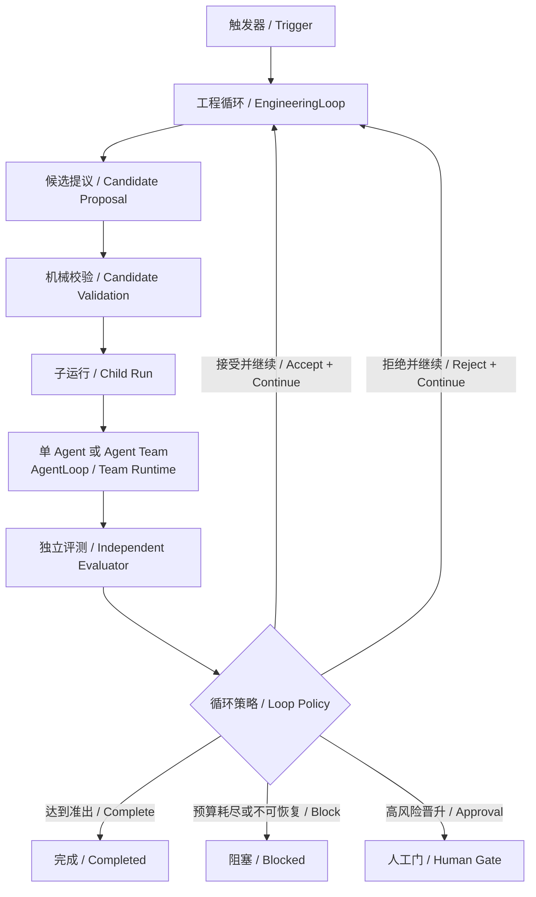

# Durable Engineering Loop v0.10 设计

> 状态：设计冻结，等待 RED/GREEN 实现  
> 日期：2026-07-28  
> 目标：让 Crazy 不仅能可靠执行一次 Agent 任务，还能承载可追溯、可恢复、逐轮改进的外层工程循环。

## 1. 一句话结论

`AgentLoop` 解决“一次任务怎样可靠地做完”，`EngineeringLoop` 解决“怎样运行多次候选实验、独立评测每次结果，并依据证据决定继续、晋升或停止”。

两者必须分层，不能把多轮实验偷换成无限增加 Agent turn。



## 2. 为什么需要独立父循环

当前 Crazy 已有两种容易与它混淆的循环：

| 机制 | 循环单位 | 负责的问题 | 不负责的问题 |
|---|---|---|---|
| `AgentLoop` | 一个模型 Action/Observation turn | 当前 Agent 下一步做什么，何时满足 Assignment | 不比较多个候选版本，不决定哪个版本晋升 |
| `EvalCampaign` | 一个 Single-vs-Team Pair Trial | 同题对照是否有统计收益 | 不生成下一版候选，不把上轮产物作为下轮起点 |
| `EngineeringLoop` | 一个 Candidate Iteration | 下一版候选是什么，是否比 Active 更好，是否继续 | 不接管子 Agent 的 Tool/Context/CompletionGate |

如果把外层循环塞进 `AgentLoop`，会出现四个问题：

1. Agent 自己既当 Maker 又当 Checker，模型自评会污染完成事实。
2. 单轮 Context 会混入所有实验历史，预算和压缩边界失控。
3. 无法单独冻结 baseline、candidate、metric 与 evaluator 版本。
4. 进程崩溃后只能知道“Agent 运行到第几轮”，不知道“哪个候选已执行、已评测、已晋升”。

## 3. 三种实现路线

| 路线 | 优点 | 主要问题 | 结论 |
|---|---|---|---|
| A. 泛化现有 `EvalCampaign` | 可复用父 Contract、Claim、聚合与取消 | Pair、Single/Team、Bootstrap 语义已经深入模型和服务，强行抽象会制造大量条件分支 | 不选；保留为专用 Evaluator |
| B. 扩大 `AgentLoop` | API 少，看起来实现最快 | 混淆 turn 与 iteration，Maker/Checker 不独立，恢复边界不清 | 不选 |
| C. 新建持久父聚合，通过 Port 调用现有 Run/Eval | 内外循环职责清晰，可同时承接 Repo、AI 管线和 CI/CD | 新增一套父状态机和 UI | **采用** |

## 4. 核心领域模型

### 4.1 EngineeringLoopContract

Contract 在任何候选执行前落盘并冻结：

| 字段 | 含义 |
|---|---|
| `loop_id` | 父循环稳定身份 |
| `objective` | 唯一工程目标 |
| `exit_criteria` | 机器可检查的准出说明 |
| `loop_pack` | 业务适配器，例如 `repo-quality` |
| `worker_profile` | 子运行使用 Single、Team、模型和 TaskPack 的冻结配置 |
| `metric_contract` | 指标名、方向、目标值和 Evaluator 版本 |
| `budget` | 最大迭代数、连续无进展上限、Token/费用/墙钟上限 |
| `permissions` | Loop 可创建的子 Run 与可产生的副作用范围 |
| `promotion_policy` | 自动接受、需要人工确认或只生成候选 |
| `initial_state_ref` | 初始 Workspace/Prompt/Pipeline 等 Active 状态引用 |

Contract 只描述目标和约束，不预注册未来候选。候选是自适应产生的，但第 N 轮的 `iteration_id` 和 `child_run_id` 必须由 `loop_id + N` 确定性派生。

### 4.2 Candidate

模型或策略只能提交 Candidate，不能直接改写 Active：

```text
Candidate = {
  candidate_id,
  iteration,
  base_state_ref,
  change_set,
  rationale,
  expected_effect,
  proposer_attestation
}
```

Harness 校验 Candidate 是否基于当前 Active、是否符合 Schema、权限与预算。校验通过后才形成可执行的 Iteration Command。

### 4.3 IterationEvaluation

Evaluator 只读取冻结的 Candidate 产物与机器事实：

```text
IterationEvaluation = {
  evaluator_version,
  evidence_refs,
  metrics,
  hard_gate_results,
  score,
  valid
}
```

Agent 的总结、Run 的 `succeeded` 状态和模型的自信度都不能替代独立 Evaluation。

### 4.4 LoopDecision

第一版支持五种正式决策：

| Decision | Active 是否变化 | 是否再迭代 |
|---|---:|---:|
| `accept_continue` | 是 | 是 |
| `reject_continue` | 否 | 是 |
| `complete` | 是或保持 | 否 |
| `awaiting_approval` | 否 | 否，等待人工事件 |
| `blocked` | 否 | 否，保存缺口与恢复入口 |

## 5. 稳定端口

Core 只定义协议，不认识 Repo、CI/CD 或 Prompt 优化：

```python
class CandidateProposer: ...
class CandidateValidator: ...
class IterationExecutor: ...
class IterationEvaluator: ...
class LoopDecisionPolicy: ...
```

第一版的 `LoopPack` 负责把这五个 Port 组装起来。后续适配器：

| LoopPack | Candidate | Executor | Evaluator |
|---|---|---|---|
| `repo-quality` | 代码变更提议 | disposable Workspace 中的 Agent Run | 测试 + 静态质量检查 |
| `prompt-eval` | Prompt/Skill Diff | 固定 Dataset 批量运行 | 质量、成本、延迟、回归 |
| `cicd-repair` | 修复或流水线配置 Diff | worktree + CI shadow run | 构建、测试、安全扫描 |

## 6. 持久事件协议

每个事件都是恢复边界，不是 UI 日志：

```text
engineering.loop.requested
engineering.loop.created
engineering.loop_pack.authorized

engineering.iteration.planned
engineering.candidate.proposed
engineering.candidate.validated | engineering.candidate.rejected
engineering.iteration.started
engineering.iteration.completed | engineering.iteration.failed
engineering.evaluation.completed
engineering.decision.recorded

engineering.loop.completed
engineering.loop.blocked
engineering.loop.cancelled
```

关键不变量：

1. 同一 Loop 只能有一个不可变 Contract 和一个终态。
2. 每个 iteration 只能绑定一个 base state、Candidate、child Run 和 Evaluation。
3. `base_state_ref` 必须等于创建该 iteration 时的 Active；迟到 Candidate 不得覆盖新版本。
4. Candidate 先持久化再执行；Evaluation 先持久化再决策。
5. Active 只由 `engineering.decision.recorded` 改变。
6. 子 Run 完成不等于父 Loop 完成。
7. 无有效 Evaluation，不允许 `accept_continue` 或 `complete`。
8. 达到迭代、无进展、Token、费用或墙钟上限时 fail-closed。
9. GET/Projection 只读取事实，不触发执行或评测。
10. 所有父推进由 Claim + deterministic event id 保证并发重放收敛。
11. `succeeded` child 必须绑定可验证 Candidate Snapshot；`failed/cancelled` 不得伪造成成功快照，直接进入失败收口。
12. LoopPack 的身份、实现版本/源码哈希、TaskPack 与权限集在创建时冻结，每次父推进重新核验，漂移时 fail-closed。

## 7. 恢复矩阵

| 最后可信事实 | 可能发生了什么 | 恢复动作 |
|---|---|---|
| `iteration.planned` | 尚未获得 Candidate | 以同一 iteration identity 重新请求 Candidate |
| `candidate.proposed` | Candidate 已生成但未校验 | 复用原 Candidate，禁止再次调用模型 |
| `candidate.validated` | 尚未创建或启动子 Run | 用确定性 child identity 幂等 Prepare/Release |
| `iteration.started`，子 Run 非终态 | Worker 仍在运行或进程崩溃 | 查询子 Run；未终态则由既有 Scheduler 恢复，不新建第二个 Run |
| 子 Run `succeeded`，缺 `iteration.completed` | 子 Run 已结束但父级漏记 | 验证 Candidate Snapshot 与 terminal event，补父完成事实 |
| 子 Run `failed/cancelled` | 没有可晋升候选，且通常没有 Candidate Snapshot | 保存终态 ID 与失败原因，写 `iteration.failed`，父 Loop 收口为 `blocked` |
| `iteration.completed`，缺 Evaluation | 候选效果已产生 | 使用冻结 Evaluator 重跑只读评测 |
| `evaluation.completed`，缺 Decision | 评测已完成 | 复用原 Evaluation，机械重算 Policy |
| `decision.recorded`，非终态 | Active 已更新 | 规划下一确定性 iteration |

外部副作用边界：第一版只允许 disposable Workspace。调用云部署、支付、消息发送等外部写操作时，重复执行风险不能靠 EventLog 消除，必须由业务幂等键、OperationLedger、对账或补偿适配器处理。

## 8. 首个 Golden Loop：Repo Quality Climb

### 8.1 业务故事

初始仓库包含一个功能错误。目标不是“一次修好就结束”，而是让候选逐步达到两项独立门槛：

1. 单元测试通过。
2. 质量规则通过，源码不保留临时实现标记。

确定性 Quickstart 使用两轮 Scripted Candidate，真实 DeepSeek/Agent Team 使用同一父协议但由模型提出变更：

| Iteration | 起点 | 候选 | 独立评分 | 决策 |
|---:|---|---|---|---|
| 1 | 初始快照 | 修复功能，但保留临时质量标记 | `1/2` | `accept_continue` |
| 2 | Iteration 1 已接受快照 | 清理实现并保持测试通过 | `2/2` | `complete` |

每轮必须真的：

1. 从上一 Active 快照创建独立 Workspace。
2. 创建并运行一个 canonical child Agent Run。
3. 记录 Agent 工具轨迹和提交制品。
4. 由父 Loop 之外的 Evaluator 重跑机器检查。
5. 保存 Candidate Snapshot、测试证据、分数和 Decision。

### 8.2 为什么不是造一个假迭代计数器

首个 Golden Loop 的验收必须证明：

- 至少两个不同 child Run ID。
- 第二轮 `base_state_ref` 等于第一轮被接受的 `candidate_state_ref`。
- 两轮都存在真实 `tool.completed(test.run)` 与独立 evaluator evidence。
- 杀进程后重启不会重复调用已经落盘的模型响应，也不会生成第二个同序号 Run。
- 最终 Workspace 通过全部目标检查，且可从 Snapshot Hash 复现。

## 9. HTTP 与 Control Room

第一版 API：

```text
POST /api/engineering-loops
GET  /api/engineering-loops
GET  /api/engineering-loops/{loop_id}
POST /api/engineering-loops/{loop_id}/drain
POST /api/engineering-loops/{loop_id}/cancel
```

Control Room 不直接展示上百条底层事件，而是先给一条可读故事：

```text
目标 -> Iteration 1 候选 -> 子 Run -> 机器评分 1/2 -> 接受
     -> Iteration 2 候选 -> 子 Run -> 机器评分 2/2 -> 完成
```

每个 Iteration 可下钻查看：Candidate Diff、子 Run Timeline、工具证据、Evaluator 版本、指标变化、预算消耗、快照谱系和恢复事件。

## 10. 分阶段交付

| Checkpoint | 内容 | 回归 Stage |
|---|---|---|
| EL0 | Domain Schema、Projection、Decision Policy | Changed |
| EL1 | 持久 Service、Claim、故障恢复、两轮纯端口测试 | Changed + Smoke |
| EL2 | `repo-quality` LoopPack + 两个真实 child Agent Run | Core |
| EL3 | HTTP/SSE + 中英双语 Control Room + 桌面/移动截图 | Core + Frontend |
| EL4 | Kill-Restart Demo、文档、公开 PR | Release + GitHub CI |

### 10.1 当前实现状态（2026-07-31）

| 阶段 | 状态 | 可执行证据 |
|---|---|---|
| EL0 | 完成 | Domain Schema、Projection 与 Promotion Policy 单测 |
| EL1 | 完成 | SQLite 父状态机、Work Claim、恢复与两轮纯 Port 谱系 |
| EL2 | 完成 | `repo-quality` 连续运行两个 canonical child AgentRun；真实 Tool/Gate、Snapshot、独立 Evaluator 与 `0.5 -> 1.0` 晋升 |
| EL3 | 进行中 | single-Agent 的持久控制 HTTP/UI 已完成；父级 Engineering Loop API/SSE/UI 尚未接入 |
| EL4 | 部分完成 | single-Agent Pause/Fork 已通过 PID `32120 -> 34028` Kill-Restart；父级 Loop Golden、完整 Release 与 GitHub CI 尚待执行 |

这里有一个必须分清的边界：**AgentRun Control Room 控制的是某一个 child Run；Engineering Loop Control Room 观察和控制的是多个 Candidate Iteration 组成的父循环。** 前者已经可操作，不能据此宣称后者页面已经完成。

## 11. 成本与诚实边界

- Scripted Quickstart 不证明真实模型质量，只证明控制协议、真实工具、评测和恢复可以运行。
- DeepSeek 在线两轮会增加至少两次完整 child Run 的 Token/费用；真实成本待配置 Key 后实测。
- 第一版只支持串行 iteration。候选并行搜索属于后续 Population/Pareto 扩展，不在 v0.10 偷加。
- 第一版自动晋升只发生在 disposable Workspace；PR 合并、部署和外部写入默认需要人工门。
- `repo-quality` 是第一个业务落点，不进入 Core；CI/CD 与 AI 管线通过新增 LoopPack 扩展。
- single-Agent Pause/Resume/Nudge/Fork 已经是持久能力，但父 Engineering Loop 的暂停、人工晋升、取消和并行候选尚未设计为正式控制协议。

## 12. 设计审查

设计审查：5/5 通过。

1. 外部依赖：复用现有 SQLite、Scheduler、AgentLoop、WorkspaceSnapshotStore 和 Python unittest；无新增运行时依赖。
2. 性能数字：未承诺吞吐或延迟；两轮调用成本标记待 DeepSeek 实测。
3. 异常路径：覆盖 Candidate、child Run、Evaluation、Decision 四个崩溃窗口，以及失败/取消 child、LoopPack 授权漂移、取消、预算和外部副作用边界。
4. 阈值依据：最大 iteration、无进展次数与 Claim TTL 都作为初始可配置值，等待 Golden/Live 数据调优。
5. 需求边界：v0.10 只做串行 disposable Repo Golden Loop，不宣称已经完成并行搜索、火山云部署或自动生产晋升。

## 13. 依据

- 当前代码事实：`crazy_harness/core/agents/loop.py`、`crazy_harness/core/agents/session.py`、`crazy_harness/control_plane/engineering_loops.py`、`crazy_harness/control_plane/run_controls.py`、`crazy_harness/loop_packs/`、`crazy_harness/core/checkpoints/`。
- 本地研究：Obsidian 报告 `R142_LoopEngineering循环工程调研.md`（研究源不进入公开仓库）。
- 既有架构决策：`docs/GENERAL_AGENT_TEAM_MASTER_PLAN.md`、`docs/COMPOSITE_CHECKPOINT_DESIGN.md`。
