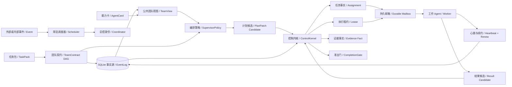
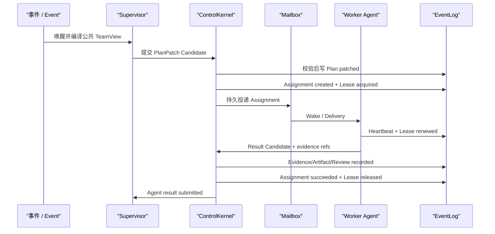
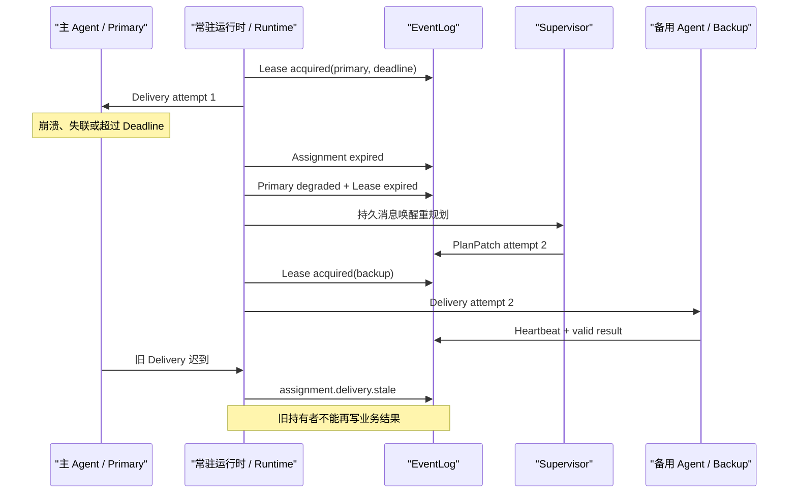

# Durable Supervisor 与 Lease 走读

**一句话结论：Supervisor 只提出下一步计划，ControlKernel 把持久契约和运行事实变成不可绕过的边界；Lease 则回答“当前谁有权执行、这份权力何时失效、失效后如何接管”。**

当前实现版本为 `v0.4.0-dev`，业务仍是可替换的 Resident Demo，重点是动态编排与恢复机制。

## 1. 静态架构



| 名词 | 简短含义 |
|---|---|
| TeamContract | TaskPack 提供的版本化 DAG，定义阶段、依赖、目标、能力、准出条件和 Lease 时长。 |
| TeamView | Supervisor 可见的公共事实，包含 AgentCard、状态、负载、完成阶段和活跃 Lease，不包含 Worker 私有 Context。 |
| SupervisorPolicy | 可替换的编排决策接口；当前基线按 DAG readiness、能力、状态和负载确定性选人。 |
| PlanPatch | Supervisor 的不可信候选输出，描述计划 Revision、阶段状态和拟创建 Assignment。 |
| ControlKernel | 唯一正式授权边界；校验候选后才写入 Assignment、Lease、Evidence 和 Completion 事实。 |
| Assignment | 一次有目标、准出条件、能力要求和 Attempt 的正式委派。 |
| Lease | 某 Agent 在限定时间内执行某 Assignment 的权利，不等同于永久任务归属。 |
| Durable Mailbox | 将 Assignment 或事件持久投递给逻辑 Agent；进程崩溃后未 Ack 投递仍可发现。 |
| Fencing | 旧 Worker 即使收到重投，也必须因 Lease holder 不匹配而停止产生业务事实。 |

## 2. 为什么 PlanPatch 不是正式计划

模型或策略输出可能格式正确但语义越权。例如，它可以把“收集证据”的目标偷偷改成“修改仓库”，也可以降低 required capabilities，让不具备能力的 Agent 获得任务。

因此 `ControlKernel._validate_plan_patch()` 会机械检查：

1. `revision` 必须严格递增。
2. `contract_id/version` 必须与 `run.created` 中的持久 TeamContract 一致。
3. 阶段集合和 `depends_on` 不能被候选改写，下游阶段只能在持久依赖确实完成后派发。
4. Assignment 的 goal、capabilities、exit criteria、result kind、contract version 和 lease seconds 必须逐字段匹配契约。
5. Attempt 必须递增，同一阶段不能重复派发；Team 总并发与 Agent `max_concurrency` 都不能超限。
6. 目标 Agent 必须存在、可用且能力满足；结果提交者还必须持有当前未过期 Lease。
7. 阶段状态与持久 Assignment/Lease 事实必须一致，不能在 PlanView 中伪造完成。
8. Completion Patch 不能一边声称完成，一边创建新 Assignment，也不能跳过尚未完成的阶段。

这对应项目最重要的原则：**模型或策略提出动作，Harness 产生事实。**

## 3. 正常运行



Resident Demo 的 DAG 是：

```text
evidence -> artifact -> review
```

Builder 在 artifact 阶段可以向 Evidence Producer 发起一次受控一跳对账，但不能继续自主规划新的 Agent 链路。结果仍返回 Supervisor，由 Supervisor 根据最新事实决定下一阶段。

## 4. Lease 到期与备用 Agent 接管



Lease 提供的是 **at-least-once 恢复 + fencing**，不是分布式 exactly-once。副作用工具仍需 OperationLedger、幂等键或业务对账；支付、发版等不可逆操作不能仅凭 Lease 直接重试。

## 5. 每轮谁看见什么

Supervisor 看到：任务 Brief、持久 TeamContract、AgentCard、AgentStatus、活跃负载、完成阶段、Attempt 和 Lease。

Worker 看到：自己的 Assignment、局部 Context、可用工具、必要的公共证据与一跳响应。

双方不共享：Worker 的完整消息历史、LocalPlan、系统提示词、其他 Worker 私有 Context。A2A 只传结构化 Brief、Schema、Evidence Ref 和 Artifact Ref。

## 6. 源码入口

| 关注点 | 文件 |
|---|---|
| TeamContract、PlanPatch、SupervisorPolicy | `crazy_harness/core/a2a/orchestration.py` |
| 可替换 Resident Demo DAG | `crazy_harness/taskpacks/resident_team.py` |
| 唤醒、Deadline、TeamView、Worker fencing | `crazy_harness/control_plane/runtime.py` |
| 候选校验与正式事实生成 | `crazy_harness/control_plane/kernel.py` |
| Lease/Agent/Assignment Projection | `crazy_harness/control_plane/store.py` |
| Control Room Lease 展示 | `frontend/src/components/AgentRail.tsx`、`frontend/src/lib/leases.ts` |
| 策略与 DAG 单测 | `tests/core/test_supervisor_policy.py` |
| Lease、恢复与故障转移集成测试 | `tests/control_plane/test_durable_supervisor.py` |

## 7. 已验证证据

- 三个 Spike：能力选人、DAG readiness、Lease Event rebuild 全部通过。
- `tests/control_plane` 加 SupervisorPolicy：`63 passed`。
- 全项目非 LLM：`176 passed, 2 deselected`。
- 前端：`23 passed`，production build 通过。
- HTTP Golden Run `run_f6a684e9f769`：167 条事件，三个动态 Assignment，三份 Lease 均完成 acquire/renew/release，CompletionGate、Dream、Memory 与 Offline Evolution Replay 通过。
- UI：1440x900 与 390x844 验收，控制台 0 warning/0 error。

## 8. 当前边界与下一步

1. 当前 Supervisor 是确定性策略，Worker 是 Scripted；下一步让 Worker 进入各自 canonical AgentLoop。
2. 当前 Scheduler 单消费者；Assignment 可以同时 active，但尚未证明真正并行执行。
3. 当前是同进程 EventLog + Mailbox A2A；Remote A2A Server/Client Adapter 尚未接入。
4. 当前 Resident Demo `max_parallel_assignments=1`、Lease 30 秒均为初始值，待真实任务 Eval 调优。
5. 还没有完成 Single vs Team 在同任务、同模型、同预算下的收益/成本对照，因此不能宣称 Team 一定更好。

## 9. 设计审查

设计审查：5/5 通过。

1. 外部依赖：未新增 Runtime 依赖；A2A Task/AgentCard 与 Kubernetes Lease 只作为语义参考。
2. 性能数字：只记录本机测试与真实 Run 数据，不宣称生产吞吐。
3. 异常路径：Schema 错误、Contract/DAG 篡改、重复或超量派发、伪造完成、无 Lease 结果、Agent 不可用、Lease 过期、旧投递、Projection rebuild 和崩溃恢复均有测试。
4. 阈值依据：30 秒 Lease、并发 1 标注为初始演示值，待 Eval 调优。
5. 需求边界：本纵切只完成 Durable Supervisor，不冒充远程 A2A、真实并行或在线模型 Team。
