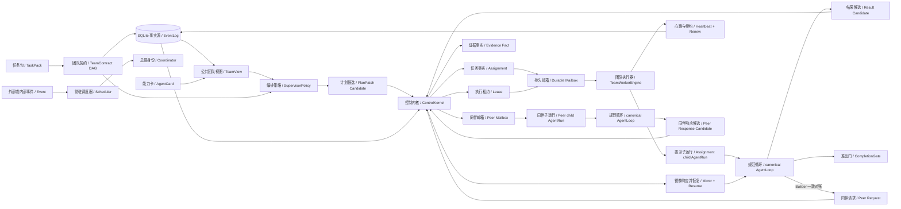
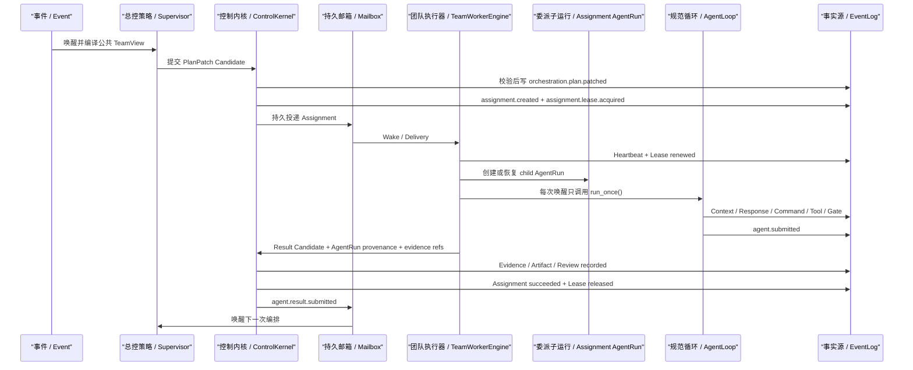
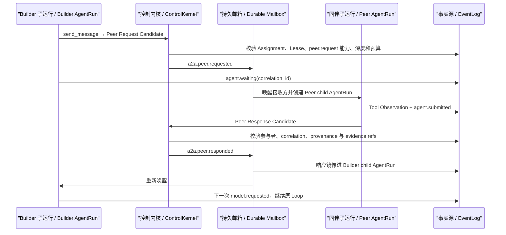
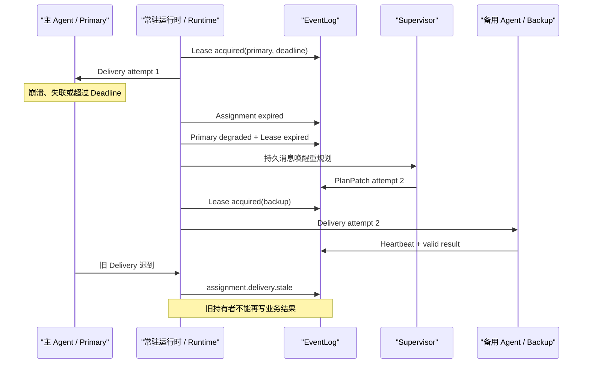
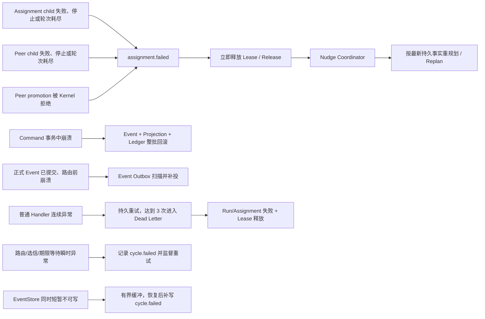

# Durable Supervisor 与 Lease 走读

**一句话结论：Supervisor 只提出下一步计划，ControlKernel 把持久契约和运行事实变成不可绕过的边界；Lease 则回答“当前谁有权执行、这份权力何时失效、失效后如何接管”。**

当前实现版本为 `v0.5.0-dev`，业务仍是可替换的 Resident Demo。Supervisor/Lease 负责动态编排与恢复，Team Worker 则用 Scripted Model 驱动真实 canonical AgentLoop；这里的 Scripted 指模型动作可复现，不代表 Worker 绕过 AgentLoop。

## 1. 静态架构



| 名词 | 简短含义 |
|---|---|
| TeamContract | TaskPack 提供的版本化 DAG，定义阶段、依赖、目标、能力、准出条件、每阶段 AssignmentContract、Peer Contract 和 Lease 时长。 |
| TeamView | Supervisor 可见的公共事实，包含 AgentCard、状态、负载、完成阶段和活跃 Lease，不包含 Worker 私有 Context。 |
| SupervisorPolicy | 可替换的编排决策接口；当前基线按 DAG readiness、能力、状态和负载确定性选人。 |
| PlanPatch | Supervisor 的不可信候选输出，描述计划 Revision、阶段状态和拟创建 Assignment。 |
| ControlKernel | 唯一正式授权边界；校验候选后才写入 Assignment、Lease、Evidence 和 Completion 事实。 |
| Assignment | 一次有目标、准出条件、能力要求和 Attempt 的正式委派。 |
| Lease | 某 Agent 在限定时间内执行某 Assignment 的权利，不等同于永久任务归属。 |
| Durable Mailbox | 将 Assignment 或事件持久投递给逻辑 Agent；进程崩溃后未 Ack 投递仍可发现。 |
| TeamWorkerEngine | 把 Mailbox Delivery 转换为“一次 AgentLoop 推进”的运行时适配层；不替模型产出正式业务事实。 |
| Assignment child AgentRun | 某次 Assignment 的隔离执行轨迹，拥有自己的 Contract、LocalPlan、Context、模型轮次、工具证据和 submission。 |
| Peer child AgentRun | 接收方处理一次受控一跳对账的独立 AgentLoop；它不是原 Builder Loop 的共享 Context 或同步子函数。 |
| Promotion / 晋升 | child submission 经 Kernel 校验后成为根任务的 Evidence、Artifact、Review 或 Peer Response 正式事实。 |
| Fencing | 旧 Worker 即使收到重投，也必须因 Lease holder 不匹配而停止产生业务事实。 |
| Atomic Command / 原子命令 | accepted/rejected Event、全部正式 Event、Projection 与 Command Ledger 终态在一个 SQLite 事务中提交；失败时整批回滚。 |
| Event-as-Outbox / 事件即发件箱 | Kernel 正式 Event 同时代表待路由事实；缺少对应 Mailbox Delivery 时由 Runtime 按 cursor 补投。 |
| Dead Letter / 死信 | Delivery 或调度周期异常经治理后仍永久失败时保留的事实；同一 Delivery 达到 3 次会终结仍在运行的 Run/Assignment/Lease，并让其他 Agent 继续工作。 |

## 2. 为什么 PlanPatch 不是正式计划

模型或策略输出可能格式正确但语义越权。例如，它可以把“收集证据”的目标偷偷改成“修改仓库”，也可以降低 required capabilities，让不具备能力的 Agent 获得任务。

因此 `ControlKernel._validate_plan_patch()` 会机械检查：

1. `revision` 必须严格递增。
2. `contract_id/version` 必须与 `run.created` 中的持久 TeamContract 一致。
3. 阶段集合和 `depends_on` 不能被候选改写，下游阶段只能在持久依赖确实完成后派发。
4. Assignment 的 goal、capabilities、exit criteria、result kind、AssignmentContract、contract version 和 lease seconds 必须逐字段匹配契约。
5. Attempt 必须递增，同一阶段不能重复派发；Team 总并发与 Agent `max_concurrency` 都不能超限。
6. 目标 Agent 必须存在、可用且能力满足；结果提交者还必须持有当前未过期 Lease。
7. 阶段状态与持久 Assignment/Lease 事实必须一致，不能在 PlanView 中伪造完成。
8. Completion Patch 不能一边声称完成，一边创建新 Assignment，也不能跳过尚未完成的阶段。

这对应项目最重要的原则：**模型或策略提出动作，Harness 产生事实。**

## 3. 正常运行



Resident Demo 的 DAG 是：

```text
evidence -> artifact -> review
```

Builder 在 artifact 阶段可以向 Evidence Producer 发起一次受控一跳对账，但不能继续自主规划新的 Agent 链路。结果仍返回 Supervisor，由 Supervisor 根据最新事实决定下一阶段。

### 3.1 Builder 的持久 Wait/Resume



等待不是把 Python 调用栈挂住。`agent.waiting`、correlation id、Peer Request、Peer Response 和模型游标都已落盘；进程在 Wait 期间退出后，新 Runtime 可以从这些事实重建两个 child AgentRun。响应只携带 Brief、Schema 约束和 Evidence Ref，不携带接收方的 LocalPlan、系统提示词或完整 Context。

### 3.2 child submission 为什么还不是正式结果

`agent.submitted` 只证明某个 child AgentRun 申请交作业。Adapter 会将它转换为 `CommandCandidate`，Kernel 至少检查：

1. Candidate 的 root task 与正式 Assignment 一致。
2. actor 是 Assignment 当前持有者，且 Lease 仍活跃。
3. `agent_run_id` 指向同 Run、同 Assignment、同 actor 的 `agent.run.created`，且 seed 内 Contract 必须与根 Assignment 或持久 Peer Contract 完全一致。
4. `submission_event_id` 指向该 child AgentRun 中由同一 actor 写入的 `agent.submitted`。
5. `evidence_refs` 存在于同 Run，类型在当前结果种类的白名单内；Tool Evidence 必须 `status=ok`，并属于该 child AgentRun。
6. Peer Response 还要匹配原请求的 sender、receiver、assignment 和 correlation id。
7. Seed 必须由正式 Assignment 或 Peer Request 触发；每个 Model Request 必须回溯到 Seed，或回溯到逐字段核对的 A2A Bridge Observation。
8. submission 必须位于 `model.requested -> model.completed -> submit_output Command -> completion.gate.passed -> agent.submitted` 的同一持久因果链。
9. 每条 Tool Evidence 必须还原 `Model -> Command -> operation.started -> tool.requested -> tool.completed -> operation.completed`，成功工具名还必须覆盖 Contract 的 `evidence_requirements`。
10. Candidate 的 summary/title/content/decision/brief 必须与 submission artifact 逐字段一致，Adapter 不能在晋升时换内容。
11. Peer Request 双向校验请求方 `peer.request` 与接收方 `peer.respond`，拒绝自对账；Peer Response 到达时不仅 Projection 要 active，Lease 墙钟也不能过期。
12. 动态 Lease 与 Peer 唯一响应必须在 SQLite 写事务内重检，避免校验与提交之间的竞态。

只有这些条件通过，Kernel 才会生成根任务上的 `evidence.recorded`、`artifact.recorded`、`review.recorded` 或 `a2a.peer.responded`。这让“模型说完成”和“系统拥有可追溯事实”保持为两个不同概念。

## 4. Lease、故障与即时传播



Lease 提供的是 **at-least-once 恢复 + fencing**，不是分布式 exactly-once。副作用工具仍需 OperationLedger、幂等键或业务对账；支付、发版等不可逆操作不能仅凭 Lease 直接重试。

Deadline 不是所有故障的唯一发现方式。当前 Team Worker 对以下已知失败会立即传播：



| 路径 | 处理方式 |
|---|---|
| 已知 child terminal failure | 不等待 Lease Deadline，立即失败 Assignment、释放 Lease、唤醒 Coordinator。 |
| Peer 结果缺少 Schema/provenance/evidence | 先持久化 `agent.result.rejected`，再立即失败请求方 Assignment。 |
| Worker 无响应或进程失联 | 没有明确失败事实时仍由 Deadline Expire、Agent Degrade 和备用 Agent 重派兜底。 |
| Mailbox Ack 前崩溃 | Delivery 至少一次重投；确定性 Event ID、命令幂等键和 Ledger 防止重复确认。 |
| Kernel 事务中崩溃 | 正式 Event、Projection 和 Ledger 终态全部回滚；重试从 processing Command 恢复。 |
| Kernel 已提交但路由前崩溃 | 正式 Event 作为 Outbox，由 Runtime 重启扫描补出确定性 Mailbox Delivery。 |
| Handler 持续抛异常 | 同一 Delivery 最多 3 次持久重试后 Dead Letter；根 `task_id` 上的 Run/Assignment 被标记失败、Lease 被释放，Scheduler 继续处理其他 Mailbox。 |
| 路由、Mailbox 选择、Lease 扫描或等待异常 | 常驻 Runtime 记录 `runtime.scheduler.cycle.failed`，短暂退避后从持久事实重试；EventStore 同时不可写时先进入最多 100 条的内存诊断缓冲，恢复后补写；故障注入异常保留原始崩溃语义。 |

## 5. 每轮谁看见什么

Supervisor 看到：任务 Brief、持久 TeamContract、AgentCard、AgentStatus、活跃负载、完成阶段、Attempt 和 Lease。

Worker 看到：自己的 Assignment、局部 Context、可用工具、必要的公共证据与一跳响应。

双方不共享：Worker 的完整消息历史、LocalPlan、系统提示词、其他 Worker 私有 Context。A2A 只传结构化 Brief、Schema、Evidence Ref 和 Artifact Ref。

这里的“公共事实”是 Kernel 接受的业务事实或 Runtime 写入的权威运行事实，例如正式 Assignment、`evidence.recorded`、`artifact.recorded`、`review.recorded`、Lease 状态和 Peer Response；它不等于把任意 Agent 的 EventLog 全量塞给其他 Agent。每个 child AgentRun 的私有轨迹按独立 `task_id` 隔离，按需只暴露引用与摘要。

## 6. 源码入口

| 关注点 | 文件 |
|---|---|
| TeamContract、PlanPatch、SupervisorPolicy | `crazy_harness/core/a2a/orchestration.py` |
| 可替换 Resident Demo DAG | `crazy_harness/taskpacks/resident_team.py` |
| 唤醒、Deadline、TeamView、Worker fencing | `crazy_harness/control_plane/runtime.py` |
| 候选校验与正式事实生成 | `crazy_harness/control_plane/kernel.py` |
| Assignment/Peer child AgentRun、Wait/Resume、promotion 与即时失败传播 | `crazy_harness/control_plane/team_workers.py` |
| Lease/Agent/Assignment Projection | `crazy_harness/control_plane/store.py` |
| Control Room Lease 展示 | `frontend/src/components/AgentRail.tsx`、`frontend/src/lib/leases.ts` |
| 策略与 DAG 单测 | `tests/core/test_supervisor_policy.py` |
| Lease、恢复与故障转移集成测试 | `tests/control_plane/test_durable_supervisor.py` |
| Team Worker AgentLoop、A2A 恢复、provenance 与失败传播测试 | `tests/control_plane/test_team_worker_agent_loop.py` |

## 7. 已验证证据

当前源码与回归测试可直接证明以下事实，不依赖模型自述：

- evidence、artifact、review 三个 Assignment 均出现唯一 `agent.run.created`，并经过 Context、Model、Command、Tool、CompletionGate 和 `agent.submitted`。
- Builder 的 `agent.waiting` 早于对应 Peer Response，响应镜像后才出现下一次 `model.requested`。
- Peer responder 拥有独立 child AgentRun；A2A payload 不包含 `full_context` 或 `local_plan`。
- Runtime 在 Builder Wait 期间重建后只存在一次 Peer Request，每个 Assignment 只提交一次。
- Kernel 拒绝 actor 冒充、过期 Lease、未授权 peer capability、模型抬高 peer budget、畸形 Schema、无关 Evidence Ref、错误 root task 和错误 Peer participants。
- Peer child failure 与 Peer promotion rejection 会立即写 Assignment failure、释放 Lease 并 Nudge Coordinator。
- Command 事务中注入崩溃后没有残留 accepted/formal Event 或 Projection；重试后只产生一套正式事实。
- Team Result 在 Kernel finalized、Mailbox route 前注入崩溃后，Event Outbox 会补投，Run 仍完成且不产生重复 Assignment。
- 意外 Handler 异常可 redeliver；永久毒消息在第 3 次失败后 Dead Letter，同时终结 Run/Assignment/Lease，不会悬空或饿死其他 Worker。
- AgentRun 负向测试覆盖 Contract 替换、模型链跳过、错误工具冒充合同证据，以及 Projection 仍 active 但墙钟已过期的 Peer Response。
- stale Delivery 只保留审计事实，不会把已 succeeded 的 Assignment Projection 倒退为 stale。

对应证据集中在 `tests/control_plane/test_team_worker_agent_loop.py` 与 `tests/control_plane/test_durable_supervisor.py`。文档不固化易过期的全仓测试数量或吞吐数字；提交前应以 CI 与当前本机测试输出为准。

## 8. 当前边界与下一步

1. Worker 已进入各自 canonical AgentLoop，但 Team Model Provider 仍是 Scripted Model；`execution_mode=team` 会拒绝在线 DeepSeek，线上模型 Team 尚未完成。
2. 当前 Scheduler 单消费者；Assignment 可以表达并发约束，但 Resident Demo 的 `max_parallel_assignments=1`，尚未证明真正并行执行或吞吐收益。
3. 当前是同进程 EventStore + Durable Mailbox A2A；Remote A2A Server/Client Adapter、跨进程身份和远端 attestation 尚未接入。
4. 当前 Peer policy 固定为只读、一跳、每 Assignment 一次；这些是 Harness-owned 初始安全阈值，待真实任务 Eval 调优。
5. Lease 30 秒是初始演示值；已知失败可即时传播，未知失联仍靠 Deadline 兜底。
6. 还没有完成 Single vs Team 在同任务、同模型、同预算下的收益/成本对照，因此不能宣称 Team 一定更好。

普通 Delivery 失败 3 次进入 Dead Letter 同样是初始工程阈值，必须根据真实故障分布和 Eval 调优；它不是生产 SLO。

## 9. 设计审查

设计审查：5/5 通过。

1. 外部依赖：未新增 Runtime 依赖；A2A Task/AgentCard 与 Kubernetes Lease 只作为语义参考。
2. 性能数字：只记录本机测试与真实 Run 数据，不宣称生产吞吐。
3. 异常路径：Schema 错误、Contract/DAG 篡改、重复或超量派发、伪造完成、错误 provenance、错误 Tool 链、无 Lease 结果、A2A 越权、Peer 失败、Lease 墙钟过期、旧投递、调度周期异常、Dead Letter、Projection rebuild 和 Wait/Resume 崩溃恢复均有对应测试。
4. 阈值依据：30 秒 Lease、并发 1、Peer depth 1、Peer budget 1 和 Delivery 失败 3 次均是初始演示值，待 Eval 调优。
5. 需求边界：本纵切完成本地 Durable Supervisor 与 canonical Team Worker，不冒充 Remote A2A、真实并行或在线模型 Team。

本轮新增的失败重试 3 次也按初始值管理；Command 事务回滚、Outbox 补投、Dead Letter、制品替换与过期 Peer Response 均已有负向测试。
