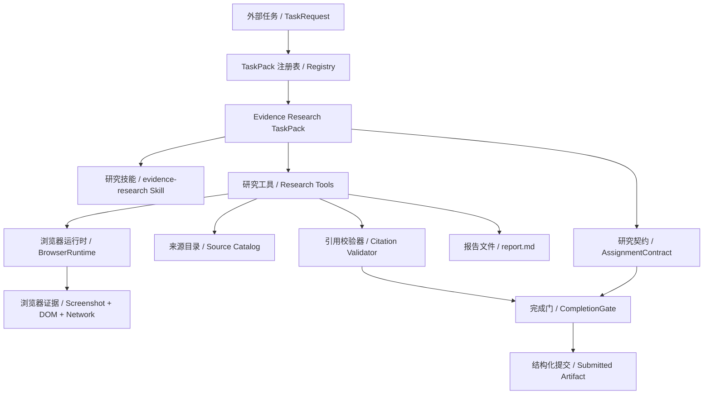
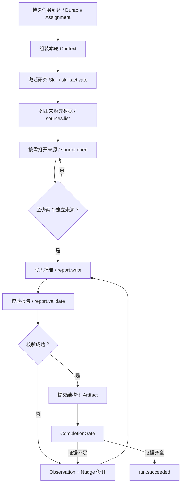

# Evidence Research TaskPack v1

> 结论：第二个 Golden TaskPack 使用同一 Resident Runtime 完成“来源发现 -> 真实浏览器取证 -> 报告写入 -> 引用校验 -> 机器准出”，以证明 Crazy Harness 的 Core 不依赖代码修复业务。

## 1. 范围

v1 处理一个可离线复现的研究任务：综合多份网页证据，为一次部署策略选择生成有引用的报告。

包含：

- 三份只读 HTML 来源 Fixture，带稳定 `source_id` 和 `evidence_id`。
- 真实 Playwright Chromium 访问本地临时 HTTP 页面，保存 screenshot、DOM、console 和 network 证据。
- 来源目录只披露标题、摘要和标签；正文仅在 `research.source.open` 后进入 Observation。
- 报告只允许写入 `report.md`，引用格式为 `[source:<source_id>#<evidence_id>]`。
- 确定性校验器检查报告结构、引用目标、多源覆盖和文件 Hash。
- Scripted Provider 用于 CI 可复现准出；DeepSeek 复用同一 Tool 与 Gate，待 Key 可用后实测。

不包含：

- 开放互联网搜索、任意 URL 浏览、登录态或付费数据源。
- 自动证明自然语言结论被来源语义蕴含。
- Research Team 动态分工；v1 先证明同一 canonical single-Agent Runtime 可承接第二类任务。

## 2. 静态架构



关键边界：TaskPack 组装业务能力；AgentLoop、Mailbox、Scheduler、CapabilityCompiler、ToolPipeline、Ledger、Context 与 CompletionGate 不认识“研究”概念。

## 3. 数据契约

每个来源包含：

| 字段 | 含义 |
|---|---|
| `source_id` | 稳定来源标识，只允许小写字母、数字和连字符 |
| `title` | 模型在目录阶段可见的标题 |
| `summary` | 目录阶段可见的短摘要，不替代正文证据 |
| `tags` | 用于来源筛选的短标签 |
| `evidence` | 正文中的稳定证据项，每项有 `evidence_id` 和文本 |

规范引用：

```text
[source:requirements#rto]
[source:experiment#canary-result]
```

提交 Artifact：

```json
{
  "recommendation": "string",
  "report_path": "report.md",
  "report_sha256": "64-character SHA-256",
  "citations": ["source:requirements#rto"]
}
```

## 4. 工具与权限

| Tool | 行为 | 副作用 | Gate 角色 |
|---|---|---|---|
| `research.sources.list` | 返回来源 metadata，不返回正文 | 无 | 发现来源 |
| `research.source.open` | 用 Chromium 打开一个 allowlisted 来源并返回证据胶囊 | 写浏览器证据目录，可重复 | 产生来源事实 |
| `research.report.write` | 原子写入唯一允许的 `report.md` | Workspace write，需批准 | 生成候选报告 |
| `research.report.validate` | 核验结构、引用、多源覆盖和 Hash | 无 | 唯一正向准出证据 |

`research.source.open` 不接受 URL，只接受目录中的 `source_id`；因此模型不能通过参数绕过 Host allowlist。`research.report.write` 不能修改来源、Skill、Policy 或其他路径。

## 5. 运行流程



## 6. 校验语义

`research.report.validate` 成功必须同时满足：

1. `report.md` 存在且为 UTF-8，大小不超过初始防御上限。
2. 包含 Recommendation、Findings、Risks、Sources 四个章节。
3. 至少三个唯一引用，覆盖至少两个来源。
4. 每个引用的 `source_id` 与 `evidence_id` 都存在于不可变 Source Catalog。
5. 返回报告 SHA-256、引用列表和来源列表，形成持久 `tool.completed`。

局限：该 Gate 防止不存在的引用和单源伪综合，但不判断每句话是否被引用语义支持。语义一致性需要 Reviewer、LLM-as-judge 加人工抽检，并通过 Eval 集验证净收益。

## 7. 恢复与幂等

- `source.open` 的 OperationLedger 键由 Task、Turn 和 Tool Call 决定；效果后崩溃时从 Ledger 复用 BrowserEvidence，不重复打开。
- 浏览器证据路径由 `run_id/source_id` 确定，重复执行采用同一受控目录。
- `report.write` 使用同目录临时文件加原子替换；恢复时只相信 Ledger 和磁盘 Hash。
- `report.validate` 是确定性只读操作；失败返回 `ToolResult(status=error)`，不会形成 `tool.completed`，因此不能满足 CompletionGate。
- Runtime 从 `run.created.task_pack` 恢复 Pack；不能回退到当前默认 Pack。

## 8. Runtime 通用化

`ResidentRuntime` 保存 `task_packs: dict[str, TaskPack]`。提交时按请求 ID 选择，`run.created` 持久化 `task_pack`、`brief` 和 workspace；恢复时再次按持久 ID 选择。

兼容约束：

- `task_pack=None` 的 single 请求继续默认 `repo-maintainer`。
- 既有 `repo_maintainer_pack` 属性保留，现有注入测试不失效。
- 自定义 `model_factory(mode)` 继续可用；默认 Scripted Provider 改为读取当前 Pack 的响应序列。
- 未注册 ID 在任何 Workspace 或 Event 创建前拒绝。

## 9. 可观察性

Control Room 新建运行窗口在 single 模式下提供“仓库维护”和“证据研究”两个 TaskPack 选项。Timeline 至少能看到：

- `skill.catalog.compiled` 与 `skill.activate`
- `research.sources.list`
- 每个 `research.source.open` 的 Tool Observation
- `research.report.write`
- 失败或成功的 `research.report.validate`
- `completion.gate.failed/passed` 与最终 Run 状态

前端不直接读取隐藏 Skill body；来源正文只来自已持久化 Tool Observation。

## 10. MVP 准出

- Research Tool 单测覆盖 metadata-first 目录、未知来源、真实浏览器证据、报告写入、未知引用、合法报告和提交 Hash 防伪。
- Runtime 端到端 Scripted Research Run 成功，且真实产生 BrowserEvidence 和报告。
- 伪造 Artifact 但未执行成功校验时，CompletionGate 必须拒绝。
- 进程重建后按持久 `task_pack_id` 恢复 Research Loop。
- 同一版本中 Repo Maintainer 与 Evidence Research 两条 Golden Task 均通过。
- Ruff、后端全量测试、前端测试、production build、Windows/Linux GitHub CI 全绿。

本地封板证据（2026-07-17）：Ruff 全量通过；后端 `156 passed, 2 deselected`；前端 `16 passed` 且 production build 通过；Control Room run `run_d1b2f622fe00` 以 170 条持久事件完成。GitHub Windows/Linux CI 需在本分支 PR 推送后确认，当前不提前写成通过。

## 11. 设计审查

设计审查：5/5 通过。

1. 外部依赖：复用本机与 CI 已验证的 Playwright/Chromium、Pydantic 和现有 Runtime，不新增运行依赖。
2. 性能数字：没有吞吐或延迟承诺；来源数、引用数和文件上限都是初始防御值，待 Eval 调优。
3. 异常路径：覆盖未知来源、Host 绕过、浏览器失败、无效 UTF-8、写入失败、未知引用、单源报告、效果后崩溃和恢复选错 Pack。
4. 阈值依据：v1 的三引用、两来源用于证明多源机制，不宣称是通用研究质量标准。
5. 范围：只完成离线可复现的 Evidence Research single-Agent 纵切，不把开放互联网、Research Team 或语义事实核验写成完成。
