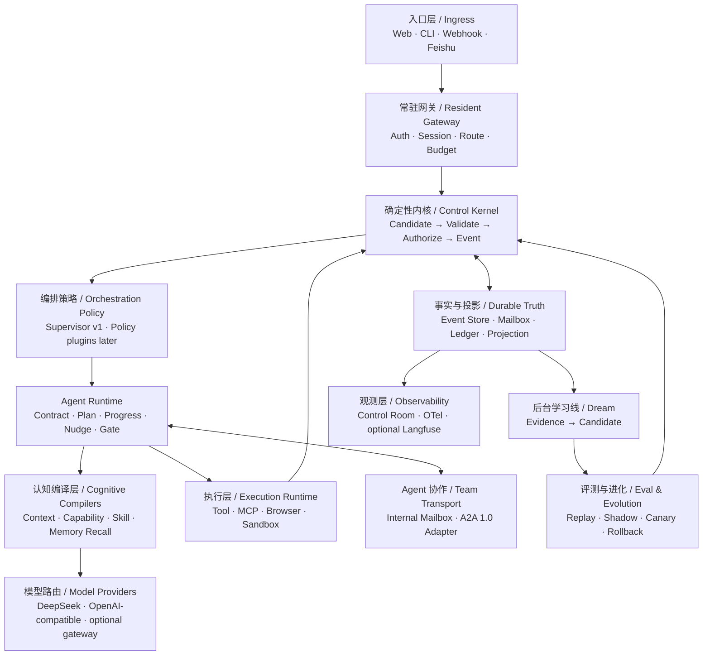

# Crazy A2A 通用 Agent Team 平台主计划

> 版本：v1.0
> 日期：2026-07-16
> 状态：北极星已冻结，进入分阶段实施
> 长期目标：在不让现有 Agent 框架接管主循环的前提下，构建一个可真实处理代码、网页、研究、数据和受控运维任务的常驻 Agent Team Runtime，并以高质量开源项目发布。

## 0. 一句话结论

Crazy A2A 不做“十个框架拼在一起”的大杂烩，而做 **自研确定性内核 + 标准协议 + 可替换王牌后端**：Kernel 掌握事实、权限、恢复与完成判定，上游项目通过 Pattern、Adapter 或 Protocol 三种方式被吸收。

## 1. 产品定义

### 1.1 对外定位

> A transparent, durable Agent Team runtime where model proposals become validated commands, team work survives crashes, and every behavior change is evaluated before promotion.

中文版本：

> 一个透明、持久、可恢复的 Agent Team Runtime。模型只能提出建议，Harness 验证后才执行；团队任务在崩溃后继续；记忆和行为变更经过评测后才能生效。

### 1.2 真实能力范围

第一版“通用”指覆盖以下工具型知识工作，而不是声称解决世界上的任意任务：

| 任务族 | 典型任务 | 真实执行边界 |
|---|---|---|
| 代码与仓库 | 定位 Bug、修改代码、运行测试、生成 Patch | 只在 disposable workspace 或 sandbox 内写入 |
| 网页与研究 | 搜索、浏览、交叉验证、生成带引用报告 | 浏览器与网络域名策略约束 |
| 文档与数据 | 读取文件、转换结构、统计、生成制品 | 文件 Scope、Schema 和输出目录约束 |
| 运维与发布 | 分析日志、生成变更计划、执行 dry-run | 默认只读或审批后执行，不直连生产环境 |
| 外部系统协作 | 通过 MCP、HTTP、A2A 调工具或远端 Agent | 明确身份、权限、预算、超时和审计 |

### 1.3 明确不承诺

- 不承诺没有工具支持的“任意任务”。
- 不允许模型直接写 EventLog、Memory 或生产配置。
- 不允许未经审批的生产副作用、付款、删库或凭据操作。
- 不以 Agent 数量作为能力指标；单 Agent 足够时不强制组队。
- 不承诺 GitHub Star 数量。Star 是产品价值、传播和社区共同作用的结果，只能提高概率，不能作为工程验收条件。

## 2. 三种建设路线

### 2.1 方案对比

| 方案 | 做法 | 优点 | 主要问题 |
|---|---|---|---|
| A. 框架拼装 | OpenHands、Hermes、Letta、LangGraph 等直接互相嵌套 | 上手快、功能多 | 多套 Loop、状态和权限互相争夺控制权，难以解释与恢复 |
| B. 全部自研 | 模型、协议、沙箱、浏览器、Memory、Eval 全部自己写 | 学习最完整、控制最强 | 周期过长，重复造轮子，难以达到成熟组件的纵深 |
| C. Kernel + Adapters | 自研 Loop、Kernel、Event、Policy；外围通过 Adapter/Protocol 接入 | 保留核心控制权，又能使用成熟后端 | 需要认真设计接口和兼容测试 |

**决定：采用 C。**

### 2.2 三种吸收方式

| 方式 | 含义 | 示例 |
|---|---|---|
| Pattern | 学习不变量并自主实现，不引入运行时依赖 | OpenClaw Gateway-first、Letta Commit-gated Memory |
| Adapter | 通过自己的接口接入，可随时替换 | Hindsight、Daytona、Browser Use、Langfuse |
| Protocol | 在边界遵循公开规范 | MCP、A2A 1.0、OpenTelemetry GenAI |

原则：**不复制未知许可证源码；任何代码级借鉴先进入 License Matrix 和 THIRD_PARTY_NOTICES。**

## 3. 目标架构



### 3.1 九个稳定端口

```python
class ModelProvider: ...
class OrchestrationPolicy: ...
class ToolProvider: ...
class SandboxRuntime: ...
class BrowserRuntime: ...
class MemoryProvider: ...
class EvalProvider: ...
class AgentTransport: ...
class TraceExporter: ...
```

这些是我们自己的 Port。外部项目只能实现 Port，不能越过 Kernel 写正式事实。

### 3.2 不可破坏的不变量

1. Model Response 只是 Proposal，校验后才成为 Command。
2. 只有 Kernel 可以写正式领域事实；UI、Agent、Adapter 都不可以。
3. 外部副作用必须经过 Policy、OperationLedger 与幂等键。
4. Mailbox 至少一次投递，Handler 必须幂等，崩溃后可以继续。
5. Context 每轮重编译，不使用不可控的 `history += everything`。
6. A2A 传 Contract、Brief、Schema、Evidence Ref 和 Result，不共享完整私有 Context。
7. Memory 先成为有证据的 Candidate；冲突、过期和 Scope 检查后才可 Active。
8. Evolution 只能提交版本候选，不能直接修改生产行为。
9. 默认执行环境是 disposable，危险权限 fail-closed。
10. 任何新增 Harness 机制必须与关闭该机制的基线做同任务对照。

## 4. 王牌机制地图

| 领域 | 标杆项目或规范 | 吸收的王牌 | 集成方式 | 默认策略 |
|---|---|---|---|---|
| 常驻控制面 | OpenClaw | Gateway-first、Session/Agent 隔离、渠道路由、Daemon | Pattern | 原生 FastAPI Gateway，后续渠道 Adapter |
| 类型化运行时 | OpenHands SDK | 不可变 Event、Action/Observation、远程 Workspace | Pattern + 对照测试 | 强类型领域事件，不引入其 Agent Loop |
| 最小 Loop 基线 | mini-SWE-agent | 极薄 Loop、线性轨迹、公开任务评测 | Baseline | 每次复杂化都和 Thin Loop 对照 |
| 长程任务控制 | Hermes + Claude Code 思路 | Completion Contract、Evidence、Nudge、Compaction | Pattern | 原生 Contract/Plan/Progress/Gate |
| Skill | Anthropic Agent Skills | `SKILL.md` 规范、Progressive Disclosure | Protocol compatibility | 兼容 Skill 目录，按描述发现后加载 |
| Tool 协议 | MCP 官方规范与 SDK | 工具/资源发现、标准 Transport | Protocol | MCP Adapter，不把全部 Tool Schema 常驻 Context |
| Agent 协议 | A2A 1.0 | AgentCard、跨框架任务、流式消息、多 Binding | Protocol | 仅用于外部 Agent 边界，内部事件更丰富 |
| 连接治理 | agentgateway | LLM/MCP/A2A 统一代理、Auth、RBAC、OTel | Optional sidecar | 本地不强依赖，生产部署可启用 |
| 本地沙箱 | Docker/Podman 思路 | 可复现、资源与文件隔离 | Native adapter | Docker 为第一个真实 SandboxRuntime |
| 云沙箱 | Daytona / E2B | 快速 disposable computer、快照、远程执行 | Optional adapter | 不成为本地 Quickstart 门槛 |
| 浏览器 | Playwright + Browser Use | 前者确定性控制，后者开放式网页 Agent | Native + optional worker | 先 Playwright Tool，Browser Use 作为隔离 Worker |
| Memory 主骨架 | Native Authority + Hindsight | Retain/Recall/Reflect、分层 Memory、可恢复 Consolidation | Native + adapter | SQLite 原生为真相，Hindsight 做 A/B 后端 |
| 记忆审计 | Letta Code | Git HEAD 生效、隔离 Worktree、Diff/Revert | Pattern | Candidate 通过后形成版本化 Context Commit |
| 时序知识 | Graphiti | Episode provenance、valid/invalid time | Optional adapter | 有真实时序需求后再启用，不作为 MVP 依赖 |
| Dream | Hindsight/Honcho/Hermes | 前后台分流、来源 DAG、只读 Reflect | Pattern | Durable DreamJob + frozen evidence |
| 可观测性 | OpenTelemetry GenAI | invoke_agent、execute_tool、usage、eval event | Protocol | OTel 是公共 Trace 语义，EventLog 仍是业务真相 |
| 观测产品 | Langfuse | Trace、Dataset、Prompt/Eval UI | Optional exporter | 可插拔，不作为正确性依赖 |
| 评测 | Inspect AI | Sandbox Eval、任务集、Scorer、可重放日志 | Adapter | Native EvalCase + Inspect Bridge |
| 自进化 | DSPy/GEPA + Hermes Self-Evolution | Trace-guided mutation、Pareto 选择、PR Gate | Offline adapter | 只产生 Candidate/PR，不直接部署 |

### 4.1 为什么不是“每家都装上”

- OpenClaw、Hermes、OpenHands、Browser Use 都有自己的 Agent Loop。直接嵌套会产生多重控制循环。
- Hindsight、Graphiti、Letta 同时作为 Memory 真相源会产生冲突。Crazy 的 Memory Authority 必须唯一。
- agentgateway 和 Langfuse 是部署增强，不应让本地 Quickstart 变复杂。
- 云沙箱有 API 成本与网络依赖，必须保留 Docker/Local fallback。

## 5. 通用任务模型

### 5.1 TaskPack

通用性由 TaskPack 提供，而不是把业务逻辑写进 Core：

```text
TaskPack
├── task schema
├── allowed worlds
├── required capabilities
├── default team template
├── completion contract
├── policy profile
└── eval cases
```

### 5.2 World Adapter

World Adapter 只负责把外部世界翻译成 Tool、Artifact 和 Evidence：

```text
Core 不知道 GitHub、火山云、飞书或浏览器。
World Adapter 不决定任务是否完成。
CompletionGate 不相信 Agent 自述，只读取 Evidence。
```

### 5.3 初始三个 Golden TaskPack

| TaskPack | 用途 | 为什么适合作为开源 Demo |
|---|---|---|
| Repo Maintainer | 修复 toy repo Bug，运行测试，生成 Patch 和审查 | 可机器判分、可复现、能展示沙箱与 Team |
| Evidence Research | 浏览多源网页，生成带证据引用的报告 | 展示 Browser、Context、引用和 Reviewer |
| Incident Triage | 分析模拟日志，定位故障，生成 dry-run 修复计划 | 展示长期任务、权限和 CompletionGate |

## 6. 分阶段实施路线

> 时间为单人全职预估，实际值需根据 DeepSeek、Docker 和外部 API 环境实测校准。业余时间推进通常需要 4 到 6 个月。

### Phase 0：公开工程地基，3-5 天

目标：把教学仓与未来公开产品边界分清。

- 冻结 `v0.1-learning` 标签或快照。
- 建立新包结构、ADR、License Matrix 和依赖边界。
- 增加 `.gitignore`，排除 `runs/`、本地研究源、凭据和大制品。
- 选择公开许可证。建议 Apache-2.0，原因是宽松且带专利授权；最终由维护者确认。
- 建立 CI：Python、TypeScript、Windows/Linux、lint、unit、security smoke。

准出：干净 clone 后，不依赖本机私有文件即可完成测试与启动。

### Phase 1：真实单 Agent，1-2 周

目标：先证明一个 Agent 真能完成工作，再讨论 Team。

- 将现有 DeepSeek Provider 接入 Resident Control Plane。
- 原生 Tool Calling：Response -> CommandCandidate -> Validation -> Tool -> Observation。
- 文件、搜索、Patch、Shell、Test 五类最小工具。
- disposable repo workspace；Docker 可用时进入容器，不可用时明确 GuardedLocal 模式。
- Contract、LocalPlan、Progress、Nudge、CompletionGate 进入真实 Loop。
- Repo Maintainer Golden Task v1。

准出：DeepSeek 在 toy repo 中真实修改代码并使测试通过；每个结论有 Tool Evidence；Agent 声称完成但测试未通过时 Gate 必须拒绝。

实施状态（2026-07-17）：本地确定性纵向链路已完成并实测。Resident Scheduler 每次投递只推进一个 canonical `AgentLoop.run_once()`；完整 AssignmentContract、模型 Response、Validated Command、Operation 与 Observation 均持久化，工具预算由 Harness 在副作用前机械执行。Scripted Golden Task 已真实读写 disposable repo、运行 unittest、生成 diff 并通过 CompletionGate；伪造完成、模型落盘崩溃、Command 落盘崩溃和 Tool effect 后崩溃均有回归测试。DeepSeek 在线准出仍为未完成外部门槛，因为本机没有 `DEEPSEEK_API_KEY`；DockerSandboxRuntime 同样尚未实测，当前明确使用 GuardedLocalRuntime。

### Phase 2：真实能力层，2 周

目标：把“能做代码题”扩展为工具型通用 Agent。

- CapabilityCompiler：按 Task、AgentCard、Policy 和 Sandbox 编译本轮能力。
- MCP Client Adapter，支持延迟发现与 Tool Search。
- Agent Skills 兼容加载器，支持 project/global/agent scope。
- Playwright BrowserRuntime 与文件制品管理。
- Tool 并发分组、读写 Barrier、Timeout、Retry、OperationLedger。
- Evidence Research Golden Task v1。

准出：同一个 Agent Runtime 可在不改 Core 的情况下完成 Repo 与 Research 两类任务；危险 Tool 默认不可见或需审批。
实施状态（2026-07-17，第五纵切）：`CapabilityCompiler` 已按 ToolPolicy 权限先过滤，再在小目录完整披露、大目录检索披露之间选择；每轮 `CapabilityManifest` 持久记录 authorized/disclosed/withheld/excluded、选择原因、定义哈希、清单哈希和搜索来源事件。未披露工具即使被模型手写，也会在 AgentLoop 授权边界拒绝。

交互式大目录链路已经真实接线：`capability.search` 是普通只读 Tool，只在授权集合中返回名称、类型、短描述和标签，不返回完整 Schema；成功的 `tool.completed` 会让命中的能力在下一轮以 `explicit_recall` 进入 Manifest，再通过模型原生 Tool Calling 和统一 ToolPipeline 执行。AgentLoop 的 RuntimeManifest 与原生 Tool Schema 现在共用同一披露集合，修复了“Schema 被隐藏但系统提示词仍泄露完整工具目录”的问题。确定性演示 `run_7521d9b15a2a` 经持久 Mailbox、Scheduler 和 canonical AgentLoop 完成 5 次搜索、5 次真实工具调用、11 次模型调用和 11 份 Manifest，最终 `run.succeeded`；Control Room 可显示每个召回工具对应的来源 Event。

MCP 首个真实协议纵切也已接线：Core 只依赖自有 `MCPClientPort`，官方稳定 Python SDK 作为可替换 Adapter；`MCPToolMount` 先按本地 Grant 过滤，再以 `mcp.<server>.<tool>` 命名空间注册到 Catalog 和 ToolRegistry。完整 Schema 只有被 `capability.search` 召回后才进入下一轮 Manifest，执行继续经过原生 Command Validation、ToolPolicy、Hook、OperationLedger 和预算。演示 `run_6ead89282b80` 使用官方 FastMCP memory transport 完成真实 `tools/list`、延迟披露和 `tools/call`，3 次 Agent 调度、3 次模型调用、59 条持久事件后 `run.succeeded`；Control Room 标出“远端工具 / MCP · mcp:docs”和召回来源 Event。

Agent Skills 第四纵切已经接入 canonical AgentLoop：`FileSystemSkillLoader` 只接受显式配置且标记可信的 global/project/agent roots，同名 Skill 按 `agent > project > global`、priority、source_id 确定性决胜；未信任来源在 metadata 曝光前拒绝，重复 source_id 直接失败。目录只把 name、description、scope 和 source 放进 RuntimeManifest；模型显式调用只读 `skill.activate` 后，正文才随 `tool.completed` 持久化，并在后续轮次进入 latest-only 保护槽。发现与激活之间的文件 hash 不一致会拒绝使用；`allowed-tools` 永远只是认知提示，不改变 ToolPolicy。默认 Repo Maintainer run `run_34af94cedc50` 真实经过 7 次模型调用、149 条事件和一次 Skill 激活后成功准出；Control Room 可显示目录存根、激活状态、正文长度/Hash 和来源，但不显示正文。
Evidence Research 第五纵切证明 TaskPack 不只是代码业务的别名：`ResidentRuntime` 通过自有 `TaskPack` Port 注册 Repo 与 Research，`run.created` 持久化 Pack ID、brief 与 workspace，重启后按原 Pack 重建 Skill、工具、Contract 与专用 Gate。Research 先列出三份来源 metadata，再由真实 Playwright Chromium 按 `source_id` 打开本地 allowlisted HTML，保存 screenshot、DOM、console 与 network；`report.validate` 机械检查章节、规范引用、多源覆盖和 SHA-256，专用 CompletionGate 再把提交 Artifact 绑定到最新校验结果。通过 Control Room 提交的 run `run_d1b2f622fe00` 产生 170 条持久事件，完成三次浏览器取证、报告写入、引用校验和 `run.succeeded`。同一 Core 下 Repo/Research 两条 Scripted Golden Task 均已通过。

当前检索仍是确定性词项匹配；`inline_limit=12`、`search_limit=6` 是按工具数量计算的初始工程值，尚未用真实大目录、Token 占比和漏召回率调优。当前 MCP Adapter 每次 list/call 建立一个初始化 Session，能证明协议与边界，但延迟高于长连接，也不接收连续通知。

Skill Loader 的 `max_skills=2000`、`max_skill_bytes=1_000_000`、`max_resources=200` 与正文 500 行建议值都是防御性初始值，尚未用真实目录和 Token 成本调优。发现阶段会为校验和 Hash 有界读取 `SKILL.md`，但不会向模型披露正文；当前只列出 `scripts/references/assets` 资源名，不读取资源正文，也不执行脚本。

本地确定性 Phase 2 准出已满足：同一 canonical Runtime 无需修改 Core 即可完成 Repo 与 Research 两类任务，危险写操作仍由 ToolPolicy 审批。尚未完成：MCP stdio/Streamable HTTP 长连接、OAuth、重连与 `notifications/tools/list_changed`；Agent Skills 千级目录检索、资源正文按需读取、文件监听热更新；开放互联网 Research、语义事实核验和 Research Team；真实 DeepSeek 下的 Tool Search、Skill 触发与双任务质量评测。因此这里只证明机制与本地 Golden Task 可运行，不宣称开放研究质量或线上模型收益。

### Phase 3：真实 Agent Team，2-3 周

目标：让 Team 是动态协作，而不是固定 A-B-C 工作流。

- SupervisorPolicy 根据 Task、AgentCard、Budget 与当前事实提交 PlanPatch。
- CoordinatorKernel 校验和应用 PlanPatch。
- AgentInstance、AgentRun、Assignment、Lease、Deadline、Heartbeat 完整化。
- 并发 Assignment 与可配置的一跳 PeerTask。
- TeamView 共享事实，AgentContext 保持私有。
- A2A 1.0 Server/Client Adapter，接入一个独立进程 Remote Agent。
- Single vs Team 同任务、同模型、同预算对照。

准出：进程被 Kill 后没有丢任务和重复副作用；Team 至少在一个 Golden Task 上带来可测收益，否则默认仍用 Single 模式。

### Phase 4：Context、Memory 与 Dream，2 周

目标：支持跨轮次和跨任务学习，同时不让错误长期化。

- 完整 ContextCompiler：Offload、每轮 Microcompact、九维 Full Compact、召回引用。
- Native Memory Authority：Candidate、Scope、Evidence、Conflict、TTL、Version、Recall。
- Durable DreamJob：冻结证据、只读 Reflect、重试、成本计量。
- Git-backed Context Revision，只有已提交版本进入 Prompt。
- Hindsight Adapter 做同任务 A/B；Graphiti 只作为可选时序实验。

准出：记忆写入不等于自动召回；冲突/过期记忆不能进入正常 Context；启用 Memory 后的回归集不得出现无法解释的安全或正确率退化。

### Phase 5：Eval 与受控 Evolution，2-3 周

目标：让“自进化”成为受治理的软件发布流程。

- EvalCase、Dataset、Trajectory、Scorer、Cost/Latency/Safety 指标。
- Inspect AI Bridge 与本地批量回放。
- Candidate -> Offline Replay -> Shadow -> Canary -> Active -> Rollback。
- Skill、Prompt、Tool Description 三类可变对象版本化。
- 可选 DSPy/GEPA Optimizer，只提交 Diff/PR。
- 人工审核和自动回滚入口。

准出：任何候选都不能绕过测试、安全约束和人工门禁直接 Active；报告必须同时展示收益、回归、Token、延迟和样本量。

### Phase 6：产品化与开源 Beta，2 周

目标：让陌生开发者五分钟内看到真实价值。

- `docker compose up` 与单命令本地 Quickstart。
- Story View：把 100+ 底层事件折叠为 6-10 个可读阶段，底层 Trace 可展开。
- Auth、Secrets、Audit、Rate Limit、Tenant/Workspace Scope。
- OpenTelemetry Exporter；Langfuse、agentgateway 可选 Compose Profile。
- 英文主 README + 中文文档；架构图、90 秒 GIF、三个真实 Demo。
- CONTRIBUTING、SECURITY、CODE_OF_CONDUCT、ROADMAP、good-first-issue。

准出：全新机器按 README 成功运行；示例不需要维护者私有凭据；安全文档明确默认权限和威胁模型。

### Phase 7：v1.0 与社区演进，持续

- 发布稳定 Port 与 Plugin API。
- 维护兼容矩阵、Migration Guide 和 SemVer。
- 每个版本发布 Benchmark、成本和回归数据。
- 用社区 TaskPack 和 Adapter 扩展生态，而不是把业务写回 Core。

## 7. 评测体系

### 7.1 四层评测

| 层 | 问题 | 典型手段 |
|---|---|---|
| Deterministic | 程序事实是否正确 | 测试、Schema、文件 Hash、Exit Code、Policy Assertion |
| Task Outcome | 任务是否真正完成 | Golden Patch、引用完整性、故障根因、Artifact Validator |
| Trajectory | 过程是否健康 | 无效循环、越权、工具错误恢复、提前停止、A2A 开销 |
| Human/Judge | 开放式质量是否可接受 | 盲评、Pairwise、抽检；不得单独决定安全事实 |

### 7.2 核心指标

- Task success rate
- CompletionGate false positive / false negative
- 未授权副作用数，硬门禁目标为 0
- Chaos 下重复副作用数，硬门禁目标为 0
- Token、模型调用数、工具调用数、墙钟时间
- Context retained/discarded/offloaded 与 required-fact coverage
- A2A 协调开销与相对 Single Agent 收益
- Memory helpful / harmful / irrelevant recall rate
- Evolution candidate regression、rollback 和人工拒绝率

### 7.3 Evolution 晋升原则

```text
Agent 提交 Candidate
→ 静态约束
→ 单元与集成测试
→ 固定回归集
→ 对照实验
→ Shadow
→ 人工审核
→ Canary
→ Active
→ 持续监测或 Rollback
```

统计阈值在获得首批真实样本后设定；当前任何百分比都只能标注“初始值，待调优”。

## 8. GitHub 高质量开源策略

### 8.1 真正可能获得关注的差异化

1. **可看懂**：Story View 展示业务故事，Trace View 展示 Harness 细节。
2. **可证明**：每个“完成”都有 Evidence，每个版本都有 Benchmark。
3. **可恢复**：Kill-Restart 演示不丢任务、不重复副作用。
4. **可替换**：同一 Port 可切 DeepSeek、Sandbox、Memory 和 Eval 后端。
5. **可学习**：源码保留最小 Loop 与完全体对照，不把原理藏在框架 API 后。

### 8.2 公开仓必须精简

当前目录不能原样上传。公开仓建议结构：

```text
crazy-a2a/
├── src/crazy_a2a/
│   ├── kernel/
│   ├── runtime/
│   ├── cognition/
│   ├── protocols/
│   ├── adapters/
│   └── worlds/
├── web/
├── examples/
├── evals/
├── tests/
├── docs/
├── deploy/
└── README.md
```

不上传：本地 Obsidian 内容、飞书原文、`research_sources/`、真实凭据、`runs/`、个人路径和大体积调试制品。

### 8.3 发布节奏

| 版本 | 对外故事 |
|---|---|
| v0.2 | 一个真实 Agent 修复仓库问题，所有动作可验证 |
| v0.3 | Team 在崩溃后继续协作，并展示一跳 A2A |
| v0.4 | MCP、Skills、Browser 和 A2A 远端 Agent |
| v0.5 | Evidence-governed Memory/Dream |
| v0.6 | Eval、Shadow、Canary、Rollback |
| v0.9 | 一键部署、三个 Demo、公开 Benchmark |
| v1.0 | 稳定接口、迁移策略、社区 Adapter API |

### 8.4 Star 不是 KPI

维护目标应是：安装成功率、Issue 首响时间、首个成功任务耗时、贡献者数量、版本稳定性和公开 Benchmark。Star 只作为传播信号记录，不倒逼夸大能力。

## 9. 成本与风险

### 9.1 预估成本

| 成本 | 初始策略 |
|---|---|
| 人力 | 单人全职约 10-14 周到 Beta；业余推进约 4-6 个月，均为预估 |
| 模型 Token | 开发期优先小回归集与 Scripted Replay；完整多次采样按里程碑运行 |
| 沙箱 | Docker 本地免费；Daytona/E2B 按需启用并设置硬预算 |
| Memory | Native SQLite 为默认；Hindsight/Graphiti 只在实验 Profile 启用 |
| 运维 | 本地单进程优先；达到跨机需求后再引入 Postgres/Broker |

### 9.2 最大风险

| 风险 | 控制措施 |
|---|---|
| Frankenstein 架构 | Port/Adapter 边界；禁止外部 Runtime 接管 Kernel |
| 多 Agent 负提升 | Single Agent 是永久基线；Team 必须用数据证明收益 |
| 自动学习污染 | Candidate、Evidence、版本、Shadow、人工审核、Rollback |
| 高权限常驻攻击面 | Sandbox、最小能力、Secrets 隔离、Prompt Injection 测试 |
| 只做机制不做任务 | 每阶段绑定 Golden Task 和机器准出 |
| GitHub 仓库过重 | 公开仓精简，研究资料和上游源码不进入发布包 |
| 上游变化或许可证风险 | SOURCE_LOCK、License Matrix、Adapter contract test |

## 10. 最近四个 Sprint

### Sprint 0：清理与基线

- 冻结 v0.1。
- 建立公开仓目录与 ADR。
- 新增 Repo Maintainer Eval Dataset。
- 保留 Scripted Provider 作为确定性回归基线。

### Sprint 1：DeepSeek 真实 Loop

- ResidentRuntime 使用真实 `ModelProvider`。
- 实现严格 Command Schema 与 Tool Calling。
- 打通 read/search/patch/test。
- 前端 Story View 显示“接单 -> 查证 -> 修改 -> 测试 -> Gate”。

### Sprint 2：Disposable Runtime

- DockerSandboxRuntime。
- Workspace snapshot、diff、rollback。
- Crash Matrix：模型后崩溃、Tool 前后崩溃、Ack 前崩溃。

### Sprint 3：Single vs Team

- SupervisorPolicy 动态决定是否派 Scout/Builder/Reviewer。
- 同任务、同模型、同预算跑 Single/Team 对照。
- 只有数据支持时才把 Team 设为推荐模式。

## 11. 第一里程碑的唯一问题

接下来的代码工作只回答一个问题：

> DeepSeek 能否在可回收仓库中，依靠我们的真实 Loop 和工具，修复一个未知 Bug，并由机器证据而非模型自述证明完成？

在这个问题通过前，不继续增加 Graphiti、分布式 Broker、云沙箱或更多 Agent。

## 12. Sources and freshness

检索日期：2026-07-16。项目热度只用于生态信号，不用于替代技术判断。

- [OpenClaw](https://github.com/openclaw/openclaw)：Gateway-first、常驻 Daemon、多渠道、隔离与分层安全。
- [Hermes Agent](https://github.com/NousResearch/hermes-agent)：学习循环、Completion Contract、Subagent、PTC、多执行后端。
- [OpenHands Software Agent SDK](https://github.com/OpenHands/software-agent-sdk)：类型化 Agent SDK 与本地/远程 Workspace。
- [mini-SWE-agent](https://github.com/SWE-agent/mini-swe-agent)：极简 Loop 与可复现 SWE-bench 基线。
- [Anthropic Agent Skills](https://github.com/anthropics/skills)：Skill 规范、模板与 Progressive Disclosure 生态。
- [MCP Specification](https://github.com/modelcontextprotocol/modelcontextprotocol)：工具与资源标准协议。
- [A2A Specification](https://github.com/a2aproject/A2A/blob/main/docs/specification.md)：A2A 1.0 抽象语义与多协议 Binding。
- [agentgateway](https://github.com/agentgateway/agentgateway)：LLM、MCP、A2A 的代理、治理和 OpenTelemetry。
- [Browser Use](https://github.com/browser-use/browser-use)：开放式浏览器任务与公开 Browser Benchmark。
- [Daytona](https://github.com/daytonaio/daytona)：disposable computer、快照、远程执行与审计能力。
- [Hindsight](https://github.com/vectorize-io/hindsight)：Retain、Recall、Reflect 与分层长期记忆。
- [Letta Code](https://github.com/letta-ai/letta-code)：Git-backed MemFS、Dreaming、长期 Agent。
- [Graphiti](https://github.com/getzep/graphiti)：时序事实、Episode provenance 与混合检索。
- [OpenTelemetry GenAI conventions](https://github.com/open-telemetry/semantic-conventions)：Agent、Tool、Inference 与 Eval 的公共 Trace 语义。
- [Langfuse](https://github.com/langfuse/langfuse)：开源 Trace、Dataset、Prompt 与 Eval 产品面。
- [Inspect AI](https://github.com/UKGovernmentBEIS/inspect_ai)：可扩展 LLM/Agent Eval、Sandbox、Scorer 与任务集。
- [Hermes Agent Self-Evolution](https://github.com/NousResearch/hermes-agent-self-evolution)：DSPy/GEPA 候选优化、约束 Gate 和 PR Review。

一致性：官方资料普遍支持“协议化边界、隔离执行、持久状态、评测先于进化”；对于各项目的性能宣传，只视为候选证据，最终以 Crazy 自有同任务实验为准。

待验证：DeepSeek 在真实 Tool Calling 下的稳定性；Windows Docker 环境；A2A 1.0 Python SDK 兼容性；Hindsight/Graphiti 在本项目任务上的净收益和成本。

## 13. 设计审查

设计审查：5/5 通过。

1. 外部依赖：官方仓库、协议和许可证入口已核对；具体版本在集成 Sprint 锁定。
2. 性能数字：时间和成本均标记为预估；上游宣传不作为本项目性能承诺。
3. 异常路径：断连、重投、重复副作用、超时、崩溃、记忆污染和候选回滚均进入阶段准出。
4. 阈值依据：统计晋升阈值待首批真实样本后设定，不提前伪造精度。
5. 需求边界：当前只规划通用工具任务平台；生产云接入、分布式规模和高危副作用均后置。
