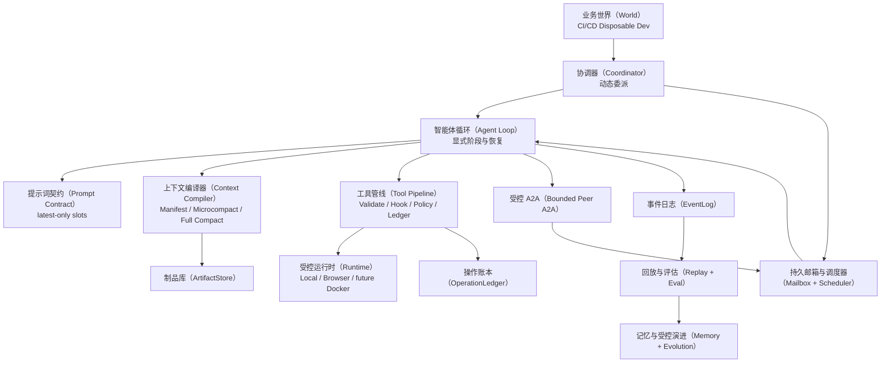
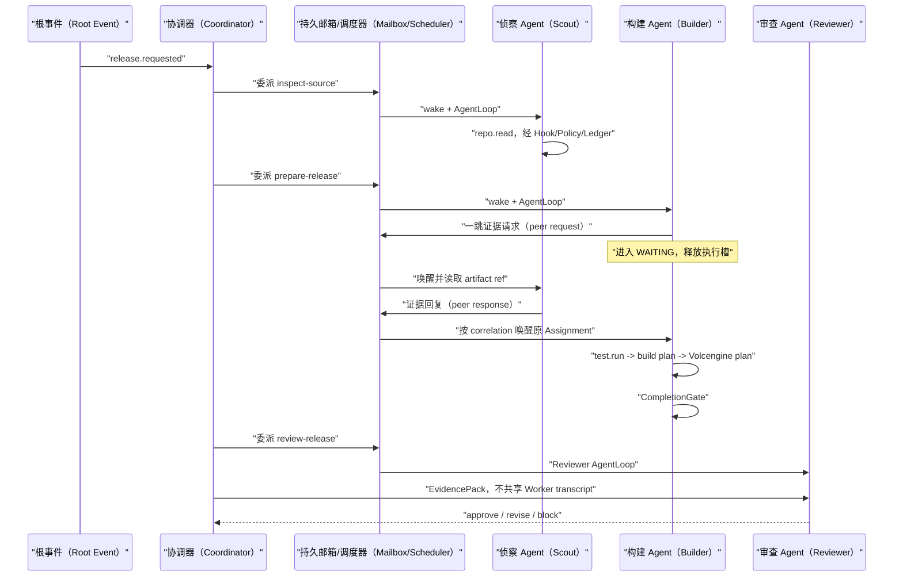
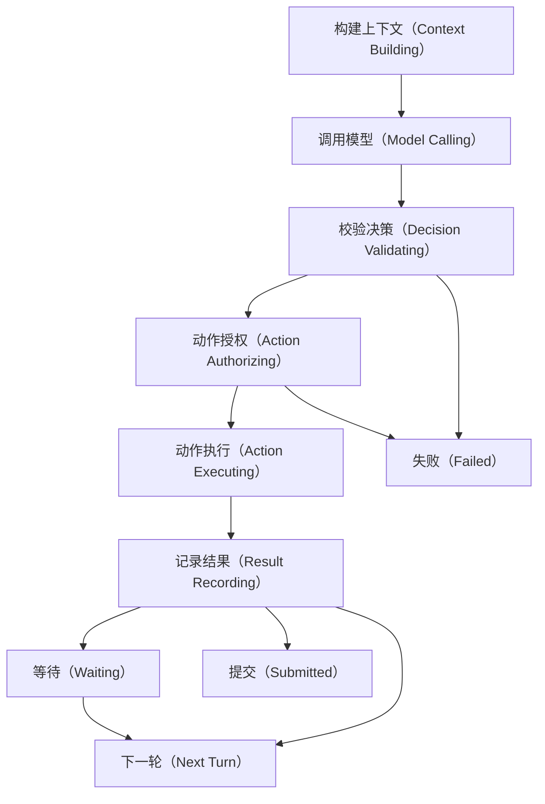
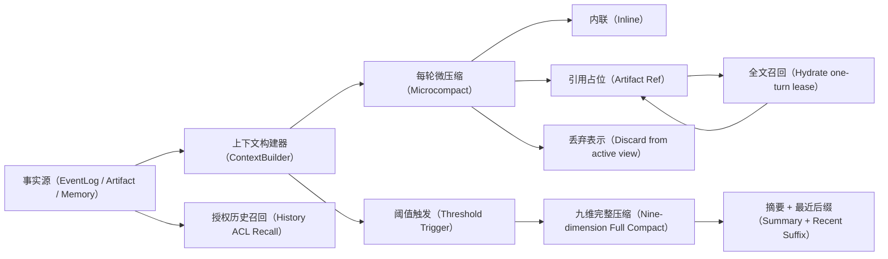

# Crazy Harness 16 小时实际代码学习手册

> 版本：v1.0
> 日期：2026-07-11
> 事实源：当前 `crazy_harness/`、`tests/`、`labs/16h_sprint/` 与 `runs/learning_evidence/20260711_163539/`
> 目标：回来后沿真实代码、测试和 EventLog 学到能讲、能画、能写伪代码、能调试

## 0. 先看结论

这个项目不是 CI/CD 产品，也不是把 Agent 名词放进目录。它是一个不依赖现有 Agent 框架、可替换业务 World 的 Harness 学习实验：模型只提出结构化动作，Harness 负责上下文编译、校验、授权、执行、持久化、恢复、团队通信和准出。

当前已验证：

- 单 Agent mock：69 个事件、5 次模型调用、4 次真实工具调用、5 次 ContextManifest 编译。
- Event-driven Team mock：156 个事件、8 次模型调用、4 次工具调用、5 次持久邮箱投递。
- Builder 的 peer request 真实经过 `send_message -> PeerPolicy -> DurableMailbox -> WAITING -> Scout response -> resume`。
- 工具真实经过 schema、Hook 后重校验、Policy、OperationLedger 和 GuardedLocalRuntime。
- 崩溃恢复场景重开 Ledger 后，外部副作用计数仍为 1。
- Context 场景执行大结果 offload、全文召回、单轮 lease、再次引用化、九维 Full Compact 和 ACL History 召回。
- Governance 场景执行 Memory 候选批准/拒绝/冲突、baseline-vs-candidate Eval 和负演进拒绝。
- Playwright Chromium 已保存 screenshot、DOM、console 和 network 证据。

当前外部边界：

| 项 | 当前事实 | 课程处理 |
|---|---|---|
| DeepSeek V4 Flash | Provider、native tool-call adapter 和 live smoke 已实现；本机没有 `DEEPSEEK_API_KEY` | 配置密钥后补跑一条 smoke；mock 学习不被阻塞 |
| DockerSandboxRuntime | 本机没有 Docker CLI/Engine，未宣称沙箱已验证 | 已验证 GuardedLocalRuntime；它是受控主机进程，不是 sandbox |
| 火山云 | `volcengine.plan` 真实执行本地 dry-run adapter，不调用云资源 | 符合 disposable dev MVP，避免平台配置吞掉 Harness 学习时间 |
| Memory 自动蒸馏 | 候选、人工门禁和冲突处理已运行 | 自动 Dream/异步蒸馏的负提升验证按约定留到后续 |

DeepSeek 当前官方模型名与项目默认值一致：`deepseek-v4-flash`，OpenAI 格式 base URL 为 `https://api.deepseek.com`。来源：[DeepSeek API Quick Start](https://api-docs.deepseek.com/)。

## 1. 怎么用

出门时先读第 2、3、4、13 节建立地图；回来后按 Block 1 到 Block 8 运行，不从空白 Python 硬憋。

每块固定做五件事：

1. 先运行 known-good，确认环境不是噪声源。
2. 沿 EventLog 找控制权、事实源和信任边界。
3. 运行 `fault_check.py`，先写故障假设，再改实验文件。
4. 闭卷补完 `PSEUDOCODE_TEMPLATE.md`。
5. 用“问题 -> 失败 -> 机制 -> 代价”口述 3 到 5 分钟。

不要背 Python。你只需认出 dataclass、Pydantic model、Enum、异常、JSONL、pytest 断言和少量集合运算。

## 2. 六条不变量

1. **模型只建议，Harness 掌握副作用。** 模型输出必须经过 normalize、validate、policy 和 ledger。
2. **EventLog 是事实源。** AgentStatus、AssignmentState、OperationState、Context 和 Trace 都是投影。
3. **Contract 不可由执行 Agent 自改。** Goal、Exit Criteria、权限和预算每轮以 latest-only slot 注入。
4. **Context 是编译，不是字符串累加。** Offloading 保存原文，Microcompact 改表示，Full Compact 生成语义摘要。
5. **外部副作用不承诺 exactly-once。** 使用 at-least-once、幂等键、OperationLedger 和 reconciliation。
6. **Agent 自主性必须有边界。** Coordinator 管全局委派；普通 Agent 只做受 intent/scope/depth/budget 控制的一跳对账。

## 3. 实际静态架构



| 图中名词 | 简短意义 | 当前入口 |
|---|---|---|
| World | 可替换业务适配层；core 不知道 CI/CD | `crazy_harness/worlds/cicd/` |
| Coordinator | 根据 Assignment 与 AgentCard 动态选择实例 | `core/a2a/coordinator.py` |
| Agent Loop | 一轮一个动作，掌握控制权与恢复语义 | `core/agents/loop.py` |
| Prompt Contract | 编译 Role、Manifest、Contract 与最新 Context | `core/prompts/contract.py` |
| Context Compiler | 每轮重建模型可见视图并生成 Manifest | `core/context/builder.py` |
| Tool Pipeline | Hook 后重校验、授权、执行、记账 | `core/tools/pipeline.py` |
| Mailbox + Scheduler | 投递、ack、wait、wake 都成为持久事实 | `core/runtime/mailbox.py`、`scheduler.py` |
| EventLog | append-only JSONL 事实源 | `core/events/log.py` |
| ArtifactStore | 大结果和摘要原文落盘，Context 留引用 | `core/artifacts/store.py` |
| OperationLedger | 幂等键、状态迁移、UNKNOWN 与重开恢复 | `core/tools/pipeline.py` |
| Replay + Eval | 回放默认不重做副作用；评估候选是否退化 | `core/replay/`、`core/evals/` |
| Memory + Evolution | 候选先门禁，再召回或晋升 | `core/memory/`、`core/evals/evolution.py` |

## 4. 一次实际 Team 运行



| 名词 | 简短意义 | 运行事实 |
|---|---|---|
| Assignment | Coordinator 发出的目标、准出、权限和预算边界 | `team.assignment.delegated` |
| wake | 把 pending delivery 交给空闲 AgentInstance | `runtime.agent.ready/busy` |
| WAITING | 等关联事件，不轮询 LLM，释放执行槽 | `agent.waiting` |
| correlation | 将 request、response 与原 Assignment 对齐 | `message_id / correlation_id` |
| EvidencePack | Reviewer 可见的候选制品与逐条证据 | `review.completed` 前的 pack |
| Worker transcript | Worker 私有运行历史，不共享 full context | 按 task_id 留在 EventLog |

实际证据：`runs/learning_evidence/20260711_163539/team/a18c094a1af24320ae87f43d98e393aa/events.jsonl`。关键数字：156 个事件、8 次模型调用、4 次工具调用、5 次持久投递、1 次等待与恢复。

## 5. Agent Loop 控制权



| 状态 | Harness 在做什么 | 可信事实 |
|---|---|---|
| Context Building | 从 EventLog、Contract、Plan、Memory 编译临时视图 | `context.manifest.compiled` |
| Model Calling | 调 provider，保存原始响应与 usage | `model.completed` |
| Decision Validating | 把模型文本变成严格 AgentAction | `agent.command.validated` |
| Action Authorizing | 检查工具与当前权限 | `agent.action.denied` 或继续 |
| Action Executing | 执行工具或发送受控 A2A | `operation.started` |
| Result Recording | 保存 ToolResult、Ledger terminal 与 Gate 结论 | `tool.completed / operation.*` |
| Waiting | 保存等待条件并释放槽位 | `agent.waiting` |
| Submitted | CompletionGate 通过后提交 | `agent.submitted` |

```text
while assignment not terminal:
    events = read durable facts for this assignment
    if unresolved external operation:
        consult ledger; recover confirmed result or mark UNKNOWN
        continue
    if active wait has no correlated event:
        release slot
        return

    response = reuse persisted response for incomplete turn
               or call model and persist response
    command = validate exactly one structured action
    if invalid or unauthorized:
        persist denial
        continue

    execute through controlled boundary
    persist observation

    if model asks to stop or submit:
        gate = check schema + evidence + pending operations
        if gate fails and nudge budget remains:
            replace latest nudge slot and continue
        if gate fails:
            report blocked
        else:
            terminal
```

## 6. Recovery 的三个问题

| 崩溃位置 | 正确动作 | 错误动作 |
|---|---|---|
| `model.completed` 前 | 可以重新调模型；没有响应事实 | 假装已有确定命令 |
| `model.completed` 后、effect 前 | 复用已落盘 response，继续校验/执行 | 再调模型导致采样漂移 |
| effect 可能发生、terminal 未落盘 | 查 Ledger/外部系统；无法确认则 UNKNOWN | 把异常等同失败并直接 retry |

证据在 `runs/learning_evidence/20260711_163539/recovery/`。effect 后注入崩溃，重开 EventLog 与 Ledger 后恢复 ToolResult，`effect_count.txt` 仍为 1。

## 7. Context 生命周期



| 名词 | 不是 | 真正含义 |
|---|---|---|
| Offloading | 删除大结果 | 原文落 ArtifactStore，active view 留 ref |
| Microcompact | LLM 摘要 | 每轮用确定性规则改表示、清噪、回收 lease |
| Hydration | 永久塞回全文 | 经 ACL 按 ref 召回，默认只租用一轮 |
| Threshold Compact | 每轮 full summary | 接近预算时选安全前缀，不截断 request/response 对 |
| Full Compact | 删除历史 | 生成九维 continuation artifact，原 EventLog 保留 |
| History Recall | 任意读磁盘路径 | 只读注册 ref，校验 principal + assignment + ACL |

九维：原始请求与意图、关键技术概念、文件与代码区域、错误与修复、问题求解、授权用户原话、待办、当前工作、可选下一步。

实际证据：`runs/learning_evidence/20260711_163539/context/evidence.json`。大结果 5439 字符，经历 `ref -> inline -> inline -> ref`；Full Compact 有 9 个维度，安全前缀 4 个事件、最近后缀 1 个事件，原事件全部保留。

## 8. Tool Pipeline


| 名词 | 意义 | 关键边界 |
|---|---|---|
| Native Tool Call | 模型按预训练格式输出工具名与参数 | 只是候选动作，不等于获权 |
| Hook | 可审计改参数或补观测 | patch 后重校验，不能改身份和权限 |
| ToolPolicy | 按 agent/assignment/mode/grant fail-closed | Skill 描述不能授予权限 |
| Consecutive Safe Segment | 只并发相邻、只读、非破坏、并发安全调用 | 不跨写屏障重排 |
| Idempotency Key | 同一业务意图的稳定身份 | 防重复执行，不代表没有 UNKNOWN |
| GuardedLocalRuntime | argv/cwd/env/timeout 受控 | 是主机进程，不是隔离沙箱 |

实际 Trace 记录 Hook 将 `{"path":"./app.py"}` 改为 `{"path":"app.py"}`，并写入 `hook_patched=true`。这证明授权作用于 patch 后再次校验的参数。

Skill 是何时、为何、按什么步骤使用能力；Function/Tool 是本进程接口；MCP 是外部能力协议；Capability Catalog 决定全量披露或 metadata search；ToolPolicy 才决定当前 Assignment 是否获权。

## 9. A2A 边界

Coordinator 不生成固定 `A -> B -> C`。它根据当前事件、Assignment 和 AgentCard 滚动委派；每次 Worker 交回证据后再决定下一 Assignment。

普通 Agent 可以：

- 在当前 Assignment 内发现证据缺失或过期。
- 发送一跳 peer request，携带 brief、artifact refs、intent、scope、permission、depth 和 budget cost。
- 收到回复后继续当前计划，或把冲突交回 Coordinator。

普通 Agent 不可以：

- 读取其他 Agent 的 full context/transcript。
- 扩大 scope、permission 或 peer budget。
- 自己规划第二跳或全局后续链路。
- 绕过 DurableMailbox 与 PeerPolicy 直接调用另一个 Agent。

Reviewer 只接 EvidencePack。Maker 与 Checker 上下文隔离，避免审查者被 Worker 的自我叙事带偏。

## 10. Memory、Eval 与 Evolution

```text
observation -> MemoryCandidate(slot + evidence + scope + expiry)
            -> conflict/authority check
            -> human approve or reject
            -> only approved memory may be recalled
            -> revoke/supersede remains auditable

typed diff -> hard-policy/permission guard
           -> offline baseline-vs-candidate eval
           -> shadow result
           -> human approval
           -> version promotion
           -> rollback on regression
```

实际证据：`runs/learning_evidence/20260711_163539/governance/evidence.json`。

- 一条 Memory 被批准并召回，一条被拒绝且不可召回，一条冲突候选 fail-closed。
- baseline success 为 0.95，坏候选降到 0.86；虽然 Token 从 900 降到 600，仍因 non-regression 失败被拒。
- Evolution active version 保持 `v1`，坏候选状态为 `rejected`。

核心洞见：成本优化只能在质量、安全和关键场景阈值通过后比较。少 Token 不等于更好的 Harness。

## 11. 八个学习块

### Block 1：Agent Loop 基线，2 小时

```powershell
python labs\16h_sprint\block_01_agent_loop\run_demo.py
```

对照 `naive_loop.py` 与 `core/agents/loop.py`，标出 model、command、tool、observation、stop 的控制权。准出：一句话说明“模型建议动作，Harness 产生事实”。

### Block 2：Phase、Validation、Crash Recovery，2 小时

```powershell
python labs\16h_sprint\block_02_state_recovery\run_demo.py
python -m pytest -q labs\16h_sprint\block_02_state_recovery\fault_check.py
```

第二条初始故意失败。先预测恢复时 provider call count，再只修 `faulty_recovery.py`。准出：区分 response reuse 与 effect reconciliation。

### Block 3：Goal、Exit Criteria、Plan、Gate、Nudge，2 小时

```powershell
python labs\16h_sprint\block_03_loop_engineering\run_demo.py
python -m pytest -q labs\16h_sprint\block_03_loop_engineering\fault_check.py
```

看提前 stop 如何被 CompletionGate 变成有预算 nudge，收集证据后才允许 terminal。准出：解释 Assignment 与 LocalPlan 的边界。

### Block 4：Resident Runtime、Wait、UNKNOWN，2 小时

```powershell
python labs\16h_sprint\block_04_resident_runtime\run_demo.py
python -m pytest -q labs\16h_sprint\block_04_resident_runtime\fault_check.py
```

看 `schedule()` 与 `wake()` 的区别，以及等待期间 LLM 调用为何为零。准出：写出 `UNKNOWN -> RECONCILING -> terminal`，不直接 retry。

### Block 5：Context Lifecycle，2 小时

```powershell
python labs\16h_sprint\block_05_context_lifecycle\run_demo.py --output runs\my_block_05
python -m pytest -q labs\16h_sprint\block_05_context_lifecycle\fault_check.py
```

打开生成的 `evidence.md` 和 Full Compact JSON。准出：解释 offload、microcompact、hydrate、full compact、history recall 的输入输出与代价。

### Block 6：Tool Calling、Policy、Hooks、Runtime，2 小时

```powershell
python labs\16h_sprint\block_06_tool_runtime\run_demo.py
python -m pytest -q labs\16h_sprint\block_06_tool_runtime\fault_check.py
```

跟踪 proposed args 与 effective args。准出：画完整 Tool Pipeline，解释 Hook 后为何重新 validation + authorization。

### Block 7：A2A Teamwork，2 小时

```powershell
python labs\16h_sprint\block_07_a2a_team\run_demo.py
python -m pytest -q labs\16h_sprint\block_07_a2a_team\fault_check.py
python -m crazy_harness.cli run dev-release --team --mode mock --runs-dir runs\my_team
```

沿 correlation 找 Builder wait、Scout response 与 Builder resume。准出：解释 Coordinator 全局编排和普通 Agent 一跳自治为何不矛盾。

### Block 8：Trace、Replay、Eval、Memory、Evolution，2 小时

```powershell
python labs\16h_sprint\block_08_eval_memory_evolution\run_demo.py --output runs\my_block_08
python -m pytest -q labs\16h_sprint\block_08_eval_memory_evolution\fault_check.py
```

最后 60 分钟做模拟面试。准出：不看资料画三张图，讲六条不变量、五类故障、真实限制和生产化方向。

## 12. 调试协议

1. 写“预期不变量”和“实际现象”。
2. 找最后一个可信持久事件。
3. 判断问题属于 response、command、effect、context、assignment 还是 peer message。
4. 提出至少两个互斥假设。
5. 用最小测试、EventLog 或 Ledger 排除一个假设。
6. 只修改 3 到 15 行实验代码。
7. 先跑目标测试，再跑 reference suite。
8. 用伪代码复述修复，不依赖 Python 细节。

五个必须会诊断的故障：response 重复采样、提前提交、UNKNOWN 错误 retry、hydration 泄漏、A2A 第二跳越权。Block 6 额外诊断 Hook 扩权；Block 8 额外诊断负演进。

## 13. 面试表达

### 30 秒

“我手搓了一个不依赖 Agent 框架的事件驱动 Harness，用 disposable CI/CD 作为可替换业务。模型只提出结构化动作，EventLog 保存事实，Context 每轮编译，工具经过 Hook、Policy、OperationLedger 和受控 Runtime；Coordinator 用持久邮箱动态委派 Scout、Builder、Reviewer，普通 Agent 只允许一跳对账。我还用崩溃注入、Full Compact、Replay/Eval 和负演进拒绝验证了关键失败语义。”

### 5 分钟顺序

1. 为什么做：框架方便，但容易遮住 loop、context、effect 和 recovery 的控制权。
2. 单 Agent：显式 phase、response 持久化、typed command、CompletionGate。
3. 长任务：Contract、LocalPlan、nudge、wait、mailbox、resume。
4. Context：offload、每轮 microcompact、九维 full compact、ACL recall。
5. 工具：native calling 只是入口，后面还有 Hook、Policy、并发屏障、Ledger、Runtime。
6. Team：Coordinator 动态委派，Worker 受控一跳，Reviewer 只读 EvidencePack。
7. 证据：79 项 reference test、真实 Chromium、effect count=1、负演进被拒。
8. 局限：单进程 JSONL MVP；DeepSeek live 缺本机密钥；Docker 与云资源没有冒充已验证。

| 高频追问 | 回答锚点 |
|---|---|
| 为什么不用框架？ | 为理解控制权和失败语义，不是否定生产框架 |
| 为什么 EventLog？ | 状态、Context、恢复、Trace 共享同一事实源 |
| 怎么避免重复调用？ | response reuse；effect 用 idempotency + ledger + reconcile |
| 为什么不共享 full context？ | 成本、污染、权限与独立审查；只传 brief + refs + schema |
| Microcompact 和 Offloading 的关系？ | Offloading 是方法；Microcompact 每轮决定 offload/discard/inline |
| Skill 与 MCP 有何不同？ | Skill 是工作方法；MCP 是能力协议；Policy 才授权 |
| 自进化怎么可控？ | typed diff、offline、shadow、人审、version、rollback |
| 最大局限？ | 单进程教学 MVP，未验证生产吞吐、跨进程锁和自动记忆收益 |

## 14. 成本与边界

| 机制 | 收益 | 代价 |
|---|---|---|
| 每轮 Context 编译 | 降污染、可审计、latest-only | CPU/磁盘 I/O，Manifest 事件增长 |
| Offloading | 降 Token，保留证据 | 多一次 read-full |
| Full Compact | 长任务可继续 | 额外 LLM 调用；摘要可能遗漏 |
| EventLog + Ledger | 可恢复、可回放、可审计 | 写放大、索引与 compact 运维 |
| DurableMailbox | 进程退出后消息不丢 | at-least-once 需要 ack 与幂等 |
| Reviewer 隔离 | 降自证偏差 | 多一次模型或规则审查 |
| Tool Search | 工具多时节省 Context | 多一次检索，存在漏选风险 |
| Eval/Evolution Gate | 防负提升 | 场景集和指标维护成本最高 |

MVP 没有证明生产规模。生产化至少要补：数据库事务/跨进程锁、分布式队列、租约和抢占、容器沙箱、secret 管理、网络 egress policy、云 API 幂等/对账、可观测性后端、数据保留策略和长期回归集。

## 15. 入口与证据

课前总验收：

```powershell
python work\check_course_ready.py
```

最终证据重建：

```powershell
python work\generate_learning_evidence.py --output runs\learning_evidence
```

关键文件：

- `runs/course_ready/readiness_report.md`：required checks 与外部门槛。
- `runs/learning_evidence/20260711_163539/EVIDENCE_INDEX.md`：稳定证据索引。
- `runs/learning_evidence/20260711_163539/single/.../events.jsonl`：单 Agent Trace。
- `runs/learning_evidence/20260711_163539/team/.../events.jsonl`：事件驱动团队 Trace。
- `runs/learning_evidence/20260711_163539/recovery/`：Ledger 重开恢复。
- `runs/learning_evidence/20260711_163539/context/evidence.md`：Context 生命周期。
- `runs/learning_evidence/20260711_163539/governance/evidence.md`：Memory/Eval/Evolution。
- `runs/learning_evidence/20260711_163539/browser/evidence/`：浏览器四类证据。

回来后的第一条命令：

```powershell
python labs\16h_sprint\block_01_agent_loop\run_demo.py
```

先沿可重复 mock Trace 看清控制权，再换真实模型。Provider 是可替换边界，Harness 不变量不随模型改变。

## 16. 设计审查

1. 外部依赖：DeepSeek 官方模型名与 base URL 已验证；浏览器实测通过；Docker 明确未验证。
2. 性能数字：69/156 个事件与调用数来自本地 Trace；未提供生产吞吐猜测。
3. 异常路径：非法 command、提前 stop、wait/resume、effect crash、UNKNOWN、Context 泄漏、A2A 越权和负演进均有测试或场景。
4. 阈值依据：课程 offload 阈值是人为调小的 lab config，用于稳定触发；生产值待实测。
5. 需求边界：业务仅为 disposable dev 落点；没有扩展到真实云部署、前端或自动记忆蒸馏。

设计审查：5/5 通过。
