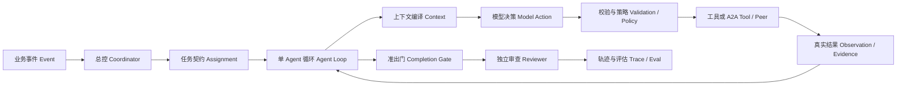
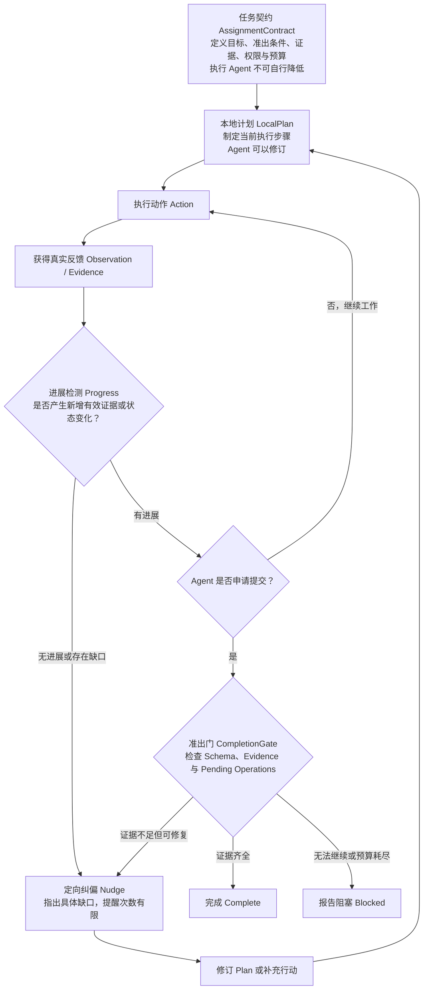

# Agent Harness 核心机制浓缩版

> 定位：偏工程、偏 Harness，但不展开普通软件工程细节。目标是能讲清 Agent 为什么需要这些机制，以及它们如何组成一个真实系统。

## 1. 一句话定义

> Agent Harness 是围绕 LLM 建立的运行与控制层：它管理每轮给模型看的 Context，校验模型建议的动作，执行真实工具，保存证据，并决定任务是否继续、等待、恢复或完成。

最重要的边界：

```text
LLM 负责建议下一步
Harness 负责决定能不能做、真实执行、记录结果、判断是否完成
```

## 2. 一条主线看懂全套 Harness



贯穿例子：收到一次 `release.requested`，要求检查仓库、运行测试、生成 disposable dev 发布计划。

## 3. 六个核心机制

### 一、Agent Loop：把模型变成可运行系统

一轮只完成一次决策：

```text
读取当前事实
-> 组装 Context
-> 调用模型
-> 得到结构化 Action
-> Harness 校验并执行
-> 保存 Observation
-> 判断继续、等待或停止
```

模型可能返回：

```text
call_tool / ask_peer / wait / submit / stop
```

但这些都只是候选动作。例如模型说“测试已经通过”，不等于测试真的运行过；只有工具产生并持久化的结果才是事实。

**记忆句：模型产生建议，Harness 产生事实。**

### 二、Loop Engineering：让长任务持续向目标前进

单纯循环会出现提前结束、重复调用、遗忘目标和空转。长任务需要五个对象：

| 对象 | 作用 |
|---|---|
| AssignmentContract | 固定 Goal、准出条件、证据要求、权限和预算 |
| LocalPlan | Agent 当前采用的执行步骤，可以修改 |
| Progress | 本轮是否增加了新证据或有效状态变化 |
| Nudge | 针对当前缺口的有限次数纠偏 |
| CompletionGate | 根据证据机械判断是否允许交作业 |

例子：Agent 的 Plan 中“运行测试”已经标记完成，但没有 `test.run` 的真实结果。

```text
Plan 完成 != Assignment 完成
```

CompletionGate 应拒绝提交，并给出具体 Nudge：

```text
缺少 test.run 的完成证据，请执行测试并引用结果。
```

而不是泛泛地提醒“请继续努力”。重复相同动作且没有新增证据，可以判定为无进展；纠偏预算耗尽后应报告 blocked，不能无限循环。



**记忆句：Contract 管目标，Plan 管步骤，Progress 管前进，Nudge 管纠偏，Gate 管完成。**

### 三、Context Engineering：每轮只给模型当前需要的信息

Context 不是把全部聊天记录不断追加，而是每轮从事实、制品、任务、计划和记忆中重新组装一个临时视图。

必须稳定保留最新版：

```text
Goal / Exit Criteria / LocalPlan / 当前 Nudge / 权限 / 预算
```

大量历史和工具结果采用三层处理：

| 机制 | 做什么 |
|---|---|
| Offloading | 大结果原文落盘，Context 留引用 |
| Microcompact | 每轮清理旧 Tool Result，并决定 inline、ref 或 discard |
| Full Compact | 接近预算时生成结构化摘要，保留最近原始内容 |

例子：测试日志有 5000 字符。

```text
原文 -> ArtifactStore
Context -> artifact ref + 必要元数据
模型明确需要全文 -> read_full(ref)
下一轮 -> 再次引用化
```

Offload 而不直接删除，是为了将来还能精确召回。Full Compact 改变的是活跃 Context 的表示，不删除原始 Event 和 Artifact。

**记忆句：Context 是每轮编译的工作集，Microcompact 管日常卫生，Full Compact 管预算危机。**

### 四、Capability Harness：管理模型能看到和能执行的能力

Skill、Function Tool、MCP 最核心的关系是：

```text
Skill 告诉模型怎么做
Tool / MCP 提供可以调用的能力
Policy 决定当前是否真的允许执行
Runtime 负责在受控环境中执行
```

工具少时可以提供完整 Schema；工具很多时采用渐进式披露：

```text
能力简介 -> Tool Search -> 少量完整 Schema -> 模型选择
```

Native Tool Calling 会让输出更结构化，但仍不能直接执行。最小可信路径是：

```text
Model Tool Call
-> Schema Validation
-> Policy
-> Runtime Execute
-> Tool Result / Evidence
```

Hook、Ledger、并发屏障和 Sandbox 是这条路径上的工程加固，知道作用即可，不必作为主叙事展开。

**记忆句：Skill 是方法，Tool 是能力，Policy 是权限，Runtime 是执行；模型只拥有申请权。**

### 五、Resident A2A：常驻、事件驱动、受控协作

这不是输入一次、输出一次的工作流，也不是固定的 `A -> B -> C`。

```text
事件到达
-> Coordinator 根据任务和 AgentCard 动态委派
-> Agent 执行自己的 Loop
-> 缺少局部信息时进行一次受控 Peer 对账
-> 等待相关事件后恢复
-> 需要改变范围、预算或全局计划时返回 Coordinator
```

普通 Agent 可以自主补齐当前任务的信息，但不能自己继续派生多跳 Agent 链。全局调用关系仍由 Coordinator 管理。

A2A 传递：

```text
intent + brief + evidence refs + expected schema + scope/budget
```

不共享完整 Transcript，因为那会带来 Token 膨胀、权限泄漏、噪声传播和责任不清。Reviewer 也只读取 Assignment 与 EvidencePack，不继承 Worker 的完整自我叙事。

**记忆句：总控管全局拓扑，Agent 只有受控的一跳自治，协作传证据而不是传整个脑子。**

### 六、Trace、Eval、Memory 与 Evolution：证明系统真的变好

Trace 至少要回答：

```text
模型看见了什么
模型建议了什么
Harness 为什么允许或拒绝
外部世界实际发生了什么
```

长期记忆不能由模型直接写入：

```text
Observation
-> MemoryCandidate
-> 证据、范围、有效期、冲突检查
-> 批准
-> 版本化 Memory
```

Harness 的 Prompt、Context 策略、工具选择或记忆蒸馏发生变化，也不能看一次 Demo 就宣布升级：

```text
Candidate
-> 固定场景 Eval
-> baseline 对比
-> 质量 / 安全 / Token / 延迟门槛
-> 晋升或拒绝
```

自进化的核心不是“模型能改自己”，而是“Eval 能拒绝负提升，并且版本可以回滚”。

**记忆句：Trace 提供证据，Eval 判断方向，Memory 和 Evolution 都只能先候选、后晋升。**

## 4. 七组最容易混淆的概念

| 容易混淆 | 正确区分 |
|---|---|
| Model Response vs Command | Response 是模型原始返回；通过校验后才成为内部 Command |
| Command vs Observation | Command 是执行请求；Observation 是真实环境结果 |
| Assignment vs LocalPlan | Assignment 是不可降低的作业要求；Plan 是 Agent 可调整的步骤 |
| Stop vs Complete | Stop 是模型建议；Complete 必须通过证据准出 |
| Context vs Transcript | Context 是本轮工作集；Transcript 是完整历史事实源之一 |
| A2A Message vs Shared Context | A2A 传摘要、引用和 Schema，不共享双方完整上下文 |
| MemoryCandidate vs Memory | Candidate 只是待审核建议；批准后才是可召回长期记忆 |

## 5. 工程底座掌握到什么程度

这些不能没有，但面试时一句话说明即可：

| 工程机制 | 一句话理解 |
|---|---|
| EventLog / State Machine | 让 Loop 状态可以持久化、恢复和回放 |
| Response Recovery | 模型结果已经持久化就复用，避免重复采样和决策漂移 |
| Ledger / Reconciliation | 外部效果不明时不能盲目重试，需要幂等或对账 |
| Mailbox / Scheduler | 让 Agent 等待事件时释放执行槽，并在条件满足后恢复 |
| Hook / Sandbox / Browser | 分别处理扩展、隔离和真实网页证据 |

这些机制保证系统“跑得住”；前面的六个机制决定 Agent “能否长期做对事”。

## 6. 90 秒面试介绍

> 我手工实现了一个不依赖现有 Agent 框架的事件驱动 Harness，CI/CD 只是可替换的验证场景。模型每轮只提出结构化候选动作，Harness 负责 Context 编译、动作校验、工具执行、证据记录和完成判定。长程任务用 AssignmentContract、LocalPlan、Progress、Nudge 和 CompletionGate 控制，避免提前提交和无效循环；大工具结果通过 Offloading、每轮 Microcompact 和阈值 Full Compact 管理。多 Agent 由 Coordinator 动态委派，普通 Agent 只允许受控一跳对账，A2A 传 brief、引用和结构化产物，不共享完整上下文。最后用 Trace、固定 Eval 和版本门槛约束 Memory 与 Harness 演进。EventLog、Ledger、Mailbox 和受控 Runtime 则保证这些机制可以真实运行和恢复。

## 7. 最终只背这八句

```text
1. 模型建议动作，Harness 产生事实。
2. Agent Loop 每轮只做一次决策，再用真实 Observation 驱动下一轮。
3. Contract 管目标，Plan 管步骤，Progress 管前进，Nudge 管纠偏，Gate 管完成。
4. Context 每轮重新编译；大结果 Offload，每轮 Microcompact，接近预算再 Full Compact。
5. Skill 是方法，Tool 是能力，Policy 是权限，Runtime 是执行。
6. Coordinator 管全局，Agent 只做受控一跳，A2A 传证据而不是完整上下文。
7. Trace 证明发生了什么，Eval 决定候选是否真的更好。
8. EventLog、Ledger、Mailbox 和 Sandbox 是底座，不是 Harness 认知主线。
```
