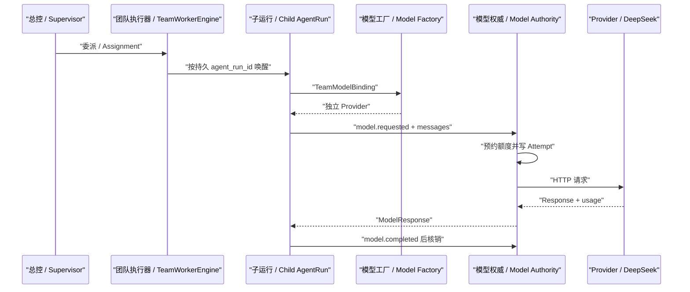
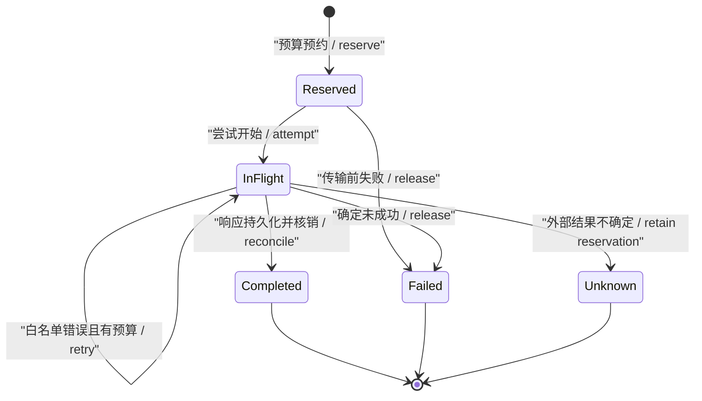
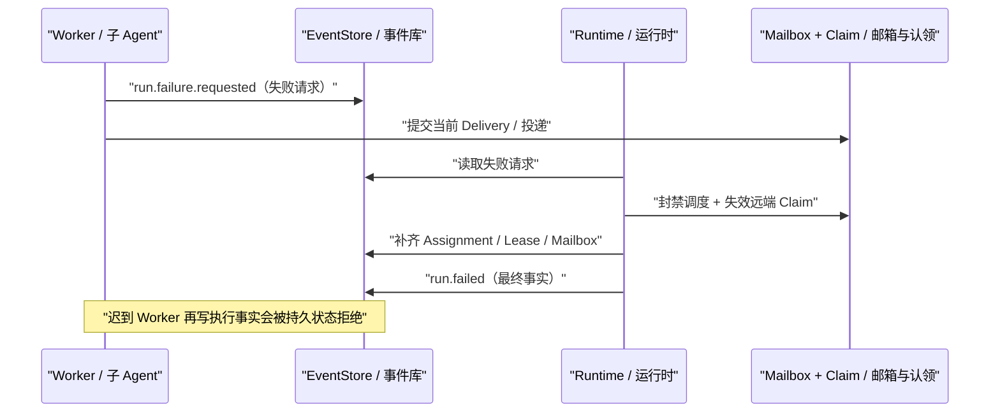

# Online Team Model Governance v0.7：在线模型与持久治理

> 一句话结论：模型调用不是 `provider.complete()` 这一行代码，而是一笔必须先预约、可重试、可恢复、可核销并可解释失败范围的持久操作。

## 1. 这一版究竟完成了什么

| 能力 | 当前事实 | 诚实边界 |
|---|---|---|
| Team 在线模型路由 | 根 Run 选择 `deepseek` 后，四类 Assignment 与受控 Peer child AgentRun 都按各自持久身份创建 Provider | Supervisor 仍采用确定性 Policy，不让模型直接控制正式编排事实 |
| 运行级模型预算 | SQLite 在发 HTTP 前原子预约 Token、估算费用和并发槽 | 输入额度是 UTF-8 字节保守近似，不等于 Provider 最终 tokenizer 账单 |
| 重试治理 | 只在 429、500、503、ConnectError、ConnectTimeout 上执行 Provider 内部有界重试 | 默认最多重试 2 次，即一次逻辑调用最多 3 次物理尝试；初始值，待 Eval 调优 |
| 成本核销 | `model.completed` 后按 usage 幂等核销，重复 Completion 不重复计费 | 费用来自版本化价卡，是 Estimate，不冒充 Provider 发票 |
| 未知结果 | ReadTimeout 等“请求可能已经到达 Provider”的窗口进入 `unknown`，释放并发槽但保留悲观额度 | 第三方 API 无法提供真正 exactly-once billing |
| 跨层止损 | Provider 重试耗尽后写 `run.failure.requested`，终结 Run；普通 Assignment 重派受 `max_stage_attempts` 限制 | 并发额度不足仍按普通 Assignment 失败处理，最多重派 3 次后 Pause；后续可细分等待型背压 |
| Response Hygiene | EventLog 只保存内容、usage、Tool Calls 与 Provider envelope，不保存原始响应和私有 reasoning | 调用方直接拿到的瞬时 `response.raw` 仍存在，但不会进入 EventLog、SSE 或下一轮 Context |

本机没有配置 `DEEPSEEK_API_KEY`，所以当前证据分成两类：

1. 官方接口契约加 `httpx.MockTransport`，验证 payload、错误分类与重试次数。
2. 确定性 Provider 注入，验证完整 Team、预算、A2A、工具、准出和前端账本。

这两类证据能证明 Harness 合同真实运行，不能替代一次付费在线 Smoke。

## 2. 静态架构

```mermaid
flowchart LR
    AL["智能体循环 / AgentLoop"] --> MR["模型请求事实 / model.requested"]
    MR --> MA["模型调用权威 / ModelCallAuthority"]
    MA --> RS["原子预算预约 / Atomic Reservation"]
    RS --> DB[("SQLite 模型账本 / Model Ledger")]
    RS --> RP["有界重试策略 / Bounded Retry Policy"]
    RP --> DS["DeepSeek Provider / HTTP Transport"]
    DS --> RESP["模型响应 / ModelResponse"]
    RESP --> MC["响应持久化 / model.completed"]
    MC --> RC["Usage 幂等核销 / Reconcile Usage"]
    RC --> DB
    DB --> UI["模型治理视图 / Model Governance UI"]
```



| 图中名词 | 意义 |
|---|---|
| AgentLoop | 每个 child AgentRun 自己的逐轮认知循环；模型只建议下一步。 |
| `model.requested` | 在任何网络传输前持久化的调用意图，也是稳定 `call_id`。 |
| ModelCallAuthority | 位于 AgentLoop 与 Provider 之间，独占预算、重试、状态和核销规则。 |
| Atomic Reservation | 在一个 `BEGIN IMMEDIATE` 事务中同时检查 Run 状态、并发、Token 和费用。 |
| Model Ledger | `model_calls` 持久表；记录预约、尝试、终态、usage 与估算费用。 |
| Bounded Retry Policy | 只重试明确白名单错误，避免 Provider 重试与 Scheduler 重投相乘。 |
| Reconcile Usage | 用唯一 `completion_event_id` 核销，重复恢复不会重复累计。 |

## 3. 为什么不是给 Team 换一个全局 Provider

每个 Assignment 或 Peer 都是独立 `AgentRun`，拥有不同的 Contract、LocalPlan、Context、预算轨迹和恢复位置。若全 Team 共用一个带游标或会话状态的 Provider，两个并发 Worker 会互相消费响应，崩溃恢复也无法判断哪个响应属于谁。

`TeamModelBinding` 因此至少绑定：

| 字段 | 控制什么 |
|---|---|
| `run_id` | 共享哪一个运行级预算与模型模式。 |
| `root_task_id` | child AgentRun 属于哪个根任务。 |
| `agent_run_id` | Provider 实例、持久响应和恢复游标的隔离键。 |
| `agent_id` | 谁在发起调用，用于审计和 UI。 |
| `agent_run_kind` | 区分 Assignment 与 Peer 对账。 |
| `stage_id` | 区分 evidence、risk、artifact、review 等业务可替换阶段。 |



| 时序关键点 | 为什么重要 |
|---|---|
| Supervisor 先委派 | 编排来自公共 TeamView，不读取 Worker 私有 Context。 |
| child AgentRun 后选 Provider | 恢复时可根据持久 Run 模式重建，不依赖进程内对象。 |
| Authority 在 Provider 前 | 没预约成功就绝不发送付费请求。 |
| Completion 后核销 | 只有持久响应事实才能把预约变为实际 usage。 |

## 4. 模型调用状态机



| 状态 | 并发槽 | Token/费用额度 | 含义 |
|---|---:|---:|---|
| `reserved` | 占用 | 预约值 | 已获准，但物理尝试尚未开始。 |
| `in_flight` | 占用 | 预约值 | HTTP 可能正在 Provider 侧执行。 |
| `completed` | 释放 | 实际 usage | `model.completed` 已持久化并幂等核销。 |
| `failed` | 释放 | 释放 | 有可信证据表明调用未成功或结果不可用。 |
| `unknown` | 释放 | 悲观保留 | 无法确认 Provider 是否已执行或计费，不能假装失败后重新免费调用。 |

`unknown` 是最容易被忽略、也最值钱的边界。若 ReadTimeout 后直接释放费用并重试，Harness 可能同时得到两份输出和两笔账单；若永远占住并发槽，Run 会死锁。当前选择是“释放并发，保留额度，等待人工或 Provider 对账”。

## 5. 三层重试为什么必须分开

| 层 | 重试对象 | 当前上限 | 允许原因 |
|---|---|---:|---|
| Provider | 同一 `model.requested` 的物理 HTTP 尝试 | 2 次重试 | 429、500、503、连接建立失败或连接超时 |
| Scheduler | 同一个 Durable Delivery | 3 次投递 | Handler 未捕获异常或进程崩溃；同一业务命令必须幂等 |
| Supervisor | 同一个 Stage 的新 Assignment | `max_stage_attempts=3` | Worker/Lease/普通任务失败后换 Agent 重新完成目标 |

错误做法是三层各自看到异常就重试。默认值相乘时，一次业务动作理论上可能放大为 `3 × 3 × 3 = 27` 次物理调用。

当前规则：

- `ModelCallAuthority` 已经耗尽 Provider 重试后抛 `ModelCallFailed`。
- Team Worker 不把它冒充普通 Assignment 失败，而是提交运行级 `run.failure.requested`。
- Runtime 终结全部非终态 Assignment/Lease，清理排队 Delivery，写 `run.failed`，再向在途 Dispatch 发协作式取消。
- 若进程在 Requested 与 Failed 之间崩溃，新的 Runtime 通过 Event cursor 重放并补齐终态。
- 其他普通 Assignment 失败可以重新规划，但达到 Stage Attempt 预算后进入 `blocked`，不再派生新调用。

## 6. 预算与成本怎样计算

默认运行预算：

| 配置 | 默认值 | 依据 |
|---|---:|---|
| `max_total_tokens` | 250,000 | 初始保护值，待任务 Eval 调优 |
| `max_cost_usd` | $0.10 | 本地学习任务初始保护值 |
| `max_concurrent_calls` | 2 | 与当前 Scheduler 并发一致的初始值 |
| `max_output_tokens_per_call` | 4,096 | 当前结构化动作足够，防止单次失控 |
| `max_retries_per_call` | 2 | 网络短暂故障容忍值 |

DeepSeek V4 Flash 价卡在代码中带 `effective_date=2026-07-18`。当前采用缓存命中输入 `$0.0028/1M`、缓存未命中输入 `$0.14/1M`、输出 `$0.28/1M`，来源为 [DeepSeek 官方 Pricing](https://api-docs.deepseek.com/quick_start/pricing)。价格会变化，因此 UI 和 Event 一律标记 `Estimate`，新价格必须新增版本或显式更新日期，不能悄悄改历史成本。

预约阶段按“输入全部 cache miss + 最大输出”估算；完成后按 usage 中的 cache hit、cache miss 和 completion tokens 重新核销。若 Provider 不返回完整 usage，当前归一化会使用保守的 miss 推导，仍需在真实 Smoke 中验证字段契约。

## 7. DeepSeek 协议边界

当前请求显式发送：

- `model=deepseek-v4-flash`
- `thinking={"type":"disabled"}`
- 有界 `max_tokens`
- 可选 `user_id`
- 原生 Tool Schema 或 JSON response format

关闭 Thinking 不是认为推理无价值，而是当前 `ModelMessage` 只保存 `role + content`，尚不能正确重放 `reasoning_content` 与后续 Tool Call 的协议顺序。先禁用并记录边界，比“接口能返回但下一轮协议错误”更可靠。后续要启用 Thinking，必须先扩展消息模型、持久化 envelope、Context 编译和恢复测试。

Provider 原始响应不会进入 EventLog。`model.completed` 只保存：

- 模型可见 content
- usage
- Tool Calls
- response id、model、finish reason、system fingerprint

这样既减少 Context/SSE 体积，也避免把私有 Chain-of-Thought 当成业务事实传播。

## 8. 最小真实演示

不花 API 费用的完整合同演示：

```powershell
python work\run_model_governance_demo.py --data-dir runs\control_plane_v07_governance
python -m crazy_harness.control_plane --port 8768 --data-dir runs\control_plane_v07_governance
```

打开输出的 Run，选择“模型 / Model Governance”。该脚本只替代付费 HTTP Transport，以下路径都是真实实现：

- Supervisor PlanPatch
- Assignment 与 Peer child AgentRun
- AgentLoop、Tool、Wait/Resume 与 CompletionGate
- SQLite 预算预约、Attempt、usage 核销和成本估算
- EventLog、Mailbox、Lease、A2A 与前端 Snapshot

真实 DeepSeek Smoke 必须显式提供 Key：

```powershell
$env:DEEPSEEK_API_KEY="..."
$env:CRAZY_RUN_LLM_TESTS="1"
python -m pytest -q -m llm tests\e2e\test_resident_repo_maintainer_llm.py tests\e2e\test_resident_team_llm.py
```

Team 专用 opt-in live 用例已经存在并会验证 A2A、Gate 与全部模型账本终态；本机因无 Key 明确跳过。在它实际通过前，仍不把确定性演示称为在线成功。

## 9. 该怎么验证

按“探索快、回归分层”执行：

| Stage | 内容 | 何时运行 |
|---|---|---|
| Exact | 预算并发、重试分类、unknown、终态失败、恢复、UI 纯函数 | 每次相关改动立即运行 |
| Smoke | Loop、Context、Kernel、API/SSE、Team 主路径 | 每个纵向切片结束 |
| Core | 模型、Team Worker、Supervisor、Runtime 邻接组 | PR 前 |
| Release | 非 LLM 全量、前端全测与生产构建 | PR CI 与发布前 |
| Live/Nightly | 付费 DeepSeek、多采样、压力与长程任务 | 显式 opt-in，不能成为本地 Quickstart 门槛 |

关键回归事实：

- 两个并发 Runtime 争用一个模型槽时，只有一个 Provider 真正开始。
- 401 只发生一次物理传输，Run 进入 Failed，不被 Scheduler 或 Supervisor 放大。
- ReadTimeout 进入 Unknown，额度保留。
- `model.completed` 后崩溃，恢复复用响应且 usage 只核销一次。
- `run.failure.requested` 后崩溃，新 Runtime 能补齐 Run、Assignment、Lease 与 Mailbox 终态。
- Failed Run 会拒绝仍持有旧 Fencing Token 的迟到 Worker 写入；远端 Claim bundle 被失效后，Mailbox 可以被恢复进程确定性清空。
- 两个 Agent 并发提交终态模型失败时，每个失败请求有独立身份，Runtime 串行决定第一个终态，后续请求只做幂等收尾。
- Usage 账本先提交、`model.usage.recorded` 后写入的窗口允许重放补审计，不会重复核销费用。

失败协议为什么分两阶段：



如果 Worker 在自己的 Dispatch 内直接写 `run.failed` 并同时清理邮箱，它可能先废掉自己的 Fencing Token，导致后续收尾也被拒绝；多个 Worker 还会争用同一个确定性 Event ID。两阶段协议把“报告失败”和“宣布整个 Run 失败”分开：前者允许并发，后者由 Runtime 串行完成。

当前仍有两条明确边界：

- 并发槽耗尽和 Token/费用永久耗尽尚未拆成不同控制流；当前由 `max_stage_attempts` 有界止损，下一版应把并发不足改成 Deadline 驱动的等待型背压。
- retryable HTTP 错误已经落下 `model.call.retry.scheduled`、但进程在退避期间退出时，恢复仍会按 Unknown 处理；这是保守但可能浪费额度的选择，后续需要持久 `next_attempt_at` 与原请求可重建性才能安全续跑。

## 10. 面试时怎么讲

可以用下面这段话：

> 我没有把 LLM 调用当成普通函数，而是把它做成了持久受治理操作。AgentLoop 先写 `model.requested`，Runtime 在 SQLite 事务里预约共享预算和并发槽，只有预约成功才发 HTTP。Provider 内部只对白名单错误有界重试；响应持久化后按 Completion ID 幂等核销 usage。ReadTimeout 这类不确定窗口不会假装失败，而是进入 Unknown 并悲观保留额度。最关键的是我隔离了 Provider、Scheduler、Supervisor 三层重试：模型重试耗尽会终结 Run，普通 Assignment 重派也受 Attempt Budget 限制，所以不会把一次 401 放大成几十次调用。

最值得记住的式子：

> AgentLoop 管“下一步做什么”；Model Authority 管“这次调用能不能发生、发生几次、花了多少、崩溃后怎么算”。

## 11. 官方契约来源

- [DeepSeek Pricing](https://api-docs.deepseek.com/quick_start/pricing)：本版价卡与缓存命中/未命中计费字段。
- [DeepSeek Error Codes](https://api-docs.deepseek.com/quick_start/error_codes/)：401、429、500、503 的语义边界。
- [Create Chat Completion](https://api-docs.deepseek.com/api/create-chat-completion)：`max_tokens`、`user_id`、usage 与响应结构。
- [Thinking Mode](https://api-docs.deepseek.com/guides/thinking_mode/)：显式关闭 Thinking 的协议参数与后续兼容边界。
- [Tool Calls](https://api-docs.deepseek.com/guides/tool_calls/)：原生 Function Calling 请求与响应契约。
- [Rate Limit](https://api-docs.deepseek.com/quick_start/rate_limit/)：平台限流行为；本地并发预算仍由 Harness 独立控制。
