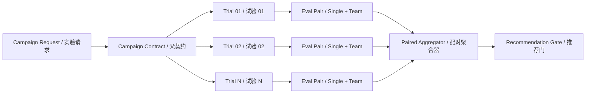
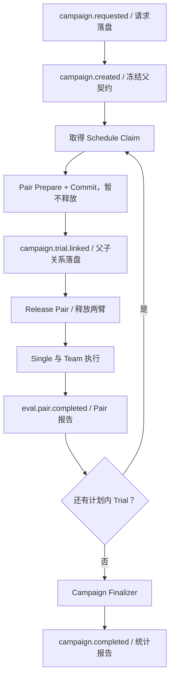
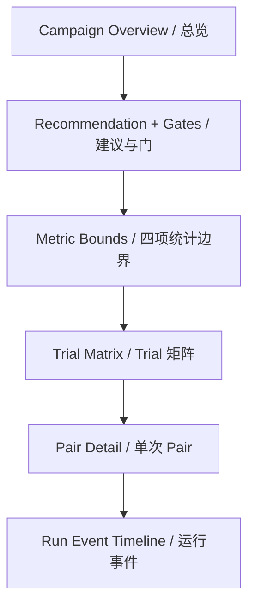
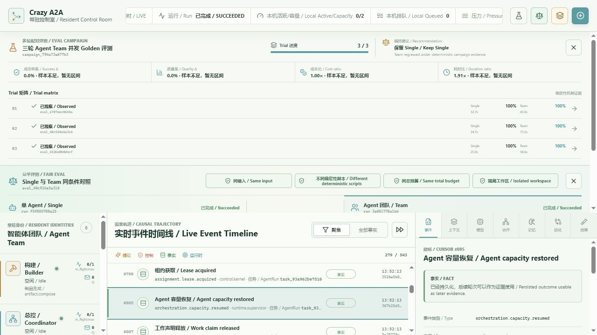
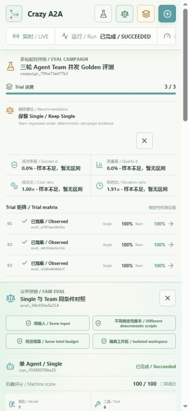

# Eval Campaign 多 Trial 配对评测设计

> 结论：Campaign 不是多个 Pair 的前端求和，而是预注册 Trial、限制总预算、控制释放、保存失败样本并用可重放配对统计做路由建议的持久实验实体。

## 1. Goal Contract

| 项 | 定义 |
|---|---|
| 使用者 | Harness 开发者、评测负责人和正在学习 Agent Team 的工程师 |
| 当前状态 | v0.8 能可靠运行并恢复一个 Single-vs-Team Pair，但单个样本永远不能证明 Team 收益 |
| 目标状态 | 一次请求创建 N 个预注册 Pair，在总预算和并发窗口内分批运行，最终生成可重放统计报告 |
| 非协商边界 | 不丢弃失败 Trial；GET 纯读；Scripted 不晋升；模型输出和 Agent 自述不作为质量事实 |
| 成功标准 | 三 Trial Scripted Golden Campaign 真实运行；重启不重复 Pair；统计字节级重放；UI 可下钻到 Pair/Run |
| 外部门槛 | 本机无 `DEEPSEEK_API_KEY`，因此不能宣称真实模型收益 |
| 回滚条件 | 预算可超卖、父子关系晚于子 Run 执行、无效样本可被静默排除、统计不可重放时停止发布 |

本纵切仍只覆盖 `repo-maintainer` 单 Case。重复同一个 Case 估计的是模型采样波动，不代表跨任务普遍收益；所有建议必须绑定 `scope_fingerprint`。

## 2. 可证伪假设

| 假设 | 支持证据 | 反驳证据 | Validator |
|---|---|---|---|
| H1：父契约先落盘且子身份确定性派生，可让崩溃恢复不产生额外付费 Pair | 重启后 Trial、Eval、Run ID 完全相同 | 出现计划外 Pair 或重复 Run | Crash Matrix + Event 身份断言 |
| H2：父 Link 早于 Pair Release，可避免孤立子 Run 先执行 | 每个子 Pair 的 `trial.linked` 早于两臂首个 Delivery | 任一 Delivery 先于 Link | Event 因果顺序测试 |
| H3：同步重采样 Pair 可保留同题相关性并稳定重放 | 相同 Contract/Report 生成同一 Samples Hash、区间与建议 | 输入乱序或重启改变结果 | Domain replay test |
| H4：总预算门可在创建前阻止 N 倍调用放大 | `2 × N × per_arm` 超限请求被拒绝且无子 Pair | 超限后仍出现模型预约 | Schema/API test |
| H5：单 Campaign 订阅加 Trial 摘要可以避免 N 条前端轮询 | 页面只有一条 Campaign 轮询，Pair 仅下钻时读取 | N 个 Trial 产生 N 条持续请求 | Hook test + 浏览器网络观察 |

## 3. 领域模型



### 3.1 Campaign Contract

父契约在任何子 Pair 创建前冻结：

- `campaign_id`、Schema/聚合器/策略版本；
- 原始任务与规范化请求 Hash；
- `evidence_tier`、Trial 数和有序 Trial 身份；
- 每臂 Run 预算、Campaign 总 Token/费用上限；
- `max_parallel_pairs`；
- 统计置信度、重采样次数和所有推荐阈值。

每个 Trial 的 Pair `request_id` 由 `campaign_id + trial_index` 确定性派生。失败 Trial 占据原槽位，不自动补样。

### 3.2 Campaign Scope

第一个子 Pair Commit 后绑定实验作用域，后续 Pair 必须完全一致：

- TaskPack、Case、Fixture、Input Hash；
- Evidence Tier、Model Profile、每臂预算；
- Scorer Version；
- Single/Team Behavior Version、Supervisor Policy 和 Team Contract。

作用域规范化后计算 `scope_fingerprint`。混合模型、Fixture、Scorer 或 Harness 行为版本时，Campaign 失败关闭。

### 3.3 Trial Sample

每个已完成 Pair 生成一条不可拆开的样本：

- `effective_success = run.succeeded AND machine_score.passed`；
- 质量分与质量差；
- committed Token/费用和运行耗时；
- Unknown、Dead Letter、Operation 终态与硬可靠性退化；
- Pair Report Hash、Run ID 和可信 Terminal Event ID。

统计值用 `ppm = 1_000_000` 整数刻度持久化，避免浮点序列化漂移。费用与耗时继续使用整数原单位。

## 4. 持久运行协议



### 4.1 Crash Recovery

| 崩溃点 | 恢复动作 |
|---|---|
| 父请求后、Contract 前 | 同请求 ID 重建同一父 Contract |
| Pair Commit 后、Link 前 | 用确定性子请求找到原 Pair，补 Link |
| Link 后、Release 前 | 幂等释放原 Pair，不创建替代 Trial |
| Arm 已 Prepare、Pair Contract 前取消父 Campaign | 从确定性 Arm 身份与 `run.created` 定位孤立 Run，逐一持久取消 |
| Pair Prepare 暂时超时 | 不写永久 `eval.pair.failed`；保留同一请求、Eval 与 Run 身份并有界重试 |
| Pair Prepare 超过 Create Claim TTL | 后台续租原 Fencing Token；续租不可确认时停止提交 Contract，保持可恢复 |
| 单臂 Release 后 | 只补另一臂；已投递 Delivery 不重复 |
| 子 Run 已写 `run.failure.requested`、scoped drain 尚未领取消息 | 先重放控制路由并建立失败写屏障，再允许目标 Run 调度 |
| Pair 完成后、Campaign 观察前 | 从持久 Pair Report 重新生成同一 Sample |
| Runtime 升级后 Scorer 版本与 Pair Contract 不同 | Pair 生成 `evidence_valid=false` 的终态报告，Campaign 继续失败关闭而非永久 Running |
| Aggregate 后、最终 Event 前 | 用固定 Seed/Samples Hash 重算并由 Fencing Token 提交 |
| Agent 容量暂时耗尽 | 记录持久 `orchestration.capacity.waiting`；Lease 释放后发确定性 Nudge 并重规划 |
| 容量拒绝已落盘、Nudge 前崩溃 | 启动时重放路由，补同一个确定性 Nudge，不重复创建 Assignment |

GET/list 只读取已持久事实，不创建 Pair、不运行 Scorer、不补 Link。恢复和推进只能由常驻后台阶段或显式 Drain 发起。

### 4.2 并发与预算

- `max_parallel_pairs` 控制同时活跃的 Pair 数，不等于单 Run 模型并发；
- Pair 自身继续使用现有 Model Ledger 原子限制 Token、费用和调用并发；
- 父预算要求 `2 × trial_count × per_arm_budget <= campaign_cap`；
- Schedule 与 Finalize 分别使用带 Fencing Token 的 SQLite Work Claim；
- Pair Create Claim 在同步 Prepare 期间按 TTL 的三分之一周期续租，避免慢文件准备被第二 Runtime 并发接管；
- Campaign Cancel 停止创建新 Trial，并取消已链接但未终态的 Run。
- Supervisor 选择 Agent 时，阶段/尝试来自当前 Run，AgentCard 与有效 Lease 负载来自全局 Projection；不能拿当前 Run 的局部负载冒充全局容量。
- 有能力但暂时满载属于等待，不属于 Run 失败；只有不存在可用能力、策略拒绝或尝试预算耗尽才进入暂停/失败治理。

## 5. 配对统计

### 5.1 为什么必须按 Pair 重采样

同一 Trial 的 Single 与 Team 面对同一个任务，因此两者是自然配对观测。NIST 将这类数据定义为同序号观测一一对应，并建议分析每对差值；SciPy 的官方 Bootstrap 接口在 `paired=True` 时也用同一索引同步重采样所有样本。参考：[NIST Paired Observations](https://www.itl.nist.gov/div898/handbook/prc/section3/prc311.htm)、[SciPy Bootstrap](https://docs.scipy.org/doc/scipy/reference/generated/scipy.stats.bootstrap.html)。

本项目不引入 SciPy。索引由 `SHA-256(seed, round, slot) % N` 派生，避免 Python PRNG 版本差异。Seed 来自不可变 Contract、Scope 与 Aggregator Version。

### 5.2 四个指标

| 指标 | 点估计 | 晋升方向 |
|---|---|---|
| 成功率差 | `mean(team_success - single_success)` | 越高越好 |
| 质量差 | `mean(team_score - single_score)` | 越高越好 |
| 成本比 | `sum(team_committed_cost) / sum(single_committed_cost)` | 越低越好 |
| 延迟比 | `sum(team_duration) / sum(single_duration)` | 越低越好 |

成本和延迟禁止使用“每 Trial Ratio 的平均值”。分母为零时显式标记 `unbounded/unavailable`，不能伪装成普通大数。

### 5.3 置信边界

默认生成 10,000 组确定性同步重采样。四个单侧推荐门使用 Bonferroni 分配：总 `alpha=5%`，每门 `1.25%`。

```text
success_lower_1.25% >= 0.00
quality_lower_1.25% >= 0.01
cost_upper_98.75% <= 1.50
duration_upper_98.75% <= 1.50
```

百分位 Bootstrap 是工程上的一阶不确定性估计，不包装成普遍统计定律。NIST 也明确指出样本有限时区间会变宽，Bootstrap 方法存在覆盖率限制：[NIST Confidence Intervals](https://www.itl.nist.gov/div898/handbook/prc/section1/prc14.htm)、[NIST Bootstrap Plot](https://www.itl.nist.gov/div898/handbook/eda/section3/bootplot.htm)。

### 5.4 决策规则

| 条件 | 决策 |
|---|---|
| 任意无效、缺失、重复或跨版本 Trial | `insufficient_live_evidence` |
| 有效 Scripted 出现硬退化或点估计失败 | `keep_single` |
| Scripted 没有退化 | `insufficient_live_evidence` |
| Live 点估计失败 | `keep_single` |
| `5 <= N < 10` | 可展示诊断区间，但固定证据不足 |
| Live 点估计通过、置信边界未过 | `insufficient_live_evidence` |
| Live `N >= 10` 且四个置信门全部通过 | `recommend_team` |

`minimum_live_trials=10`、质量差 `0.01`、成本/延迟 `1.5×` 都是初始可配置值，必须用真实数据调优。

## 6. Public API

| API | 语义 |
|---|---|
| `POST /api/evals/campaigns` | 幂等创建父 Contract，快速返回 Campaign ID |
| `GET /api/evals/campaigns` | 纯读报告列表 |
| `GET /api/evals/campaigns/{id}` | 纯读总览、统计和 Trial 摘要 |
| `POST /api/evals/campaigns/{id}/drain` | 本地/测试显式推进 |
| `POST /api/evals/campaigns/{id}/cancel` | 停止新增并取消非终态子 Run |

Trial 摘要不嵌入完整测试输出和事件轨迹。用户下钻时继续复用 `/api/evals/pairs/{eval_id}` 与现有 Run Timeline。

## 7. Control Room



页面首先回答三件事：完成多少 Trial、预算用了多少、为什么推荐或不推荐。点击异常 Trial 后才加载一个 Pair 详情，Campaign 始终只有一条轮询链。

中文为主、英文为辅；区间不能只用颜色表达。桌面使用四指标横带和 Trial 表格，移动端改为两行式 Trial 摘要。

显式分享 URL 永远是前台选择。本机尚未确认的创建请求可在后台用原 `request_id` 有界重试，但不能改写当前 URL；取消意图先写浏览器持久存储，网络中断或响应丢失后继续确认，成功后才清除。





## 8. 分级验证

| Stage | 时机 | 内容 |
|---|---|---|
| Exact | 每个 RED/GREEN | 单条 Domain/Service/API/Hook 行为 |
| Changed | 一个纵向模块完成 | Campaign + Pair + Runtime 邻接测试、前端全量 |
| Release | PR 前 | 非 LLM 后端、Ruff、Production Build、三路 CI |
| Live/Nightly | 有 Key 且显式触发 | 至少 10 个 DeepSeek Pair、统计报告与费用门 |

三 Trial Scripted Golden Campaign 只验证机制、恢复、预算、统计重放与 UI。它可以在硬退化时否决 Team，但绝不能据此晋升 Team。

## 9. 已知边界

- 第一版只支持 Repo Maintainer 单 Case，尚未做跨 Case 分层抽样；
- 本机没有 DeepSeek Key，Live/Nightly 是外部门槛；
- 百分位 Bootstrap 对极小或退化样本只提供诊断，不用于晋升；
- 费用是版本化价卡估算，不是 Provider 发票；
- SQLite Claim 提供本地多 Runtime Fencing，不宣称跨数据库 exactly-once；
- Pair/Campaign 的事件扫描后续需要 Projection/索引优化，本阶段先保留 Event 为真相源。
- 唯一能力 Agent 若在 Assignment 中途随进程退出，Lease 过期后可能进入 degraded；显式探活和安全恢复属于下一可靠性纵切，Campaign 不伪造 Agent 已健康。
- Create Claim 续租只能维护 Harness 内的排他提交权；如果 Prepare 将不可撤销副作用发送到外部系统，仍必须使用幂等键、对账或补偿，Fencing 不能撤回已经发生的外部效果。

## 10. 设计审查

设计审查：5/5 通过。

1. 外部依赖：不新增 Runtime 依赖；统计语义已对照 NIST 与 SciPy 官方资料。
2. 性能数字：10,000 次重采样和 10 Trial 是初始配置，尚未宣称性能；耗时将在本机 Golden Campaign 实测。
3. 异常路径：覆盖父创建、Pair Commit、Link、Release、容量拒绝/等待/恢复、评分、无效证据、取消和 Finalize 崩溃窗口。
4. 阈值依据：样本数、置信度、成本与延迟倍率均明确标为初始值待真实数据调优。
5. 范围：限定在持久 Campaign 和单 Case 配对统计，不冒充跨任务收益、线上 SLA 或 Remote A2A。
