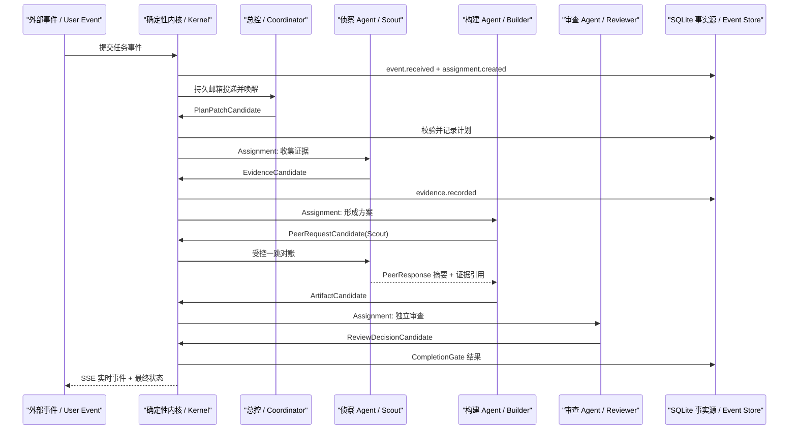

# Resident A2A v0.1 架构封板（历史快照 / Historical Checkpoint）

> 日期：2026-07-16
> 状态：已冻结的早期实现基线，不代表当前仓库能力
> 目的：停止继续扩张概念，先做出一条可运行、可观察、可恢复的纵向链路。

> **当前读者提示：** 本文保留 v0.1 当时的范围、术语和准出条件，用于回看架构如何收敛。当前 Team Worker 已进入 Scripted Model 驱动的 canonical AgentLoop，并具备 Assignment/Peer child AgentRun、Builder Wait/Resume、Kernel provenance promotion 与已知失败即时传播。请以 [当前架构走读](ARCHITECTURE_WALKTHROUGH.md) 和 [Durable Supervisor 走读](DURABLE_SUPERVISOR_WALKTHROUGH.md) 为准。

## 一句话结论

v0.1 当时定义的是一个常驻事件驱动多 Agent 控制面：SQLite 保存事实，Scheduler 唤醒逻辑 Agent，Kernel 审核所有候选动作，SSE 把因果过程实时展示给人。

## 当时只记三层

| 层 | 回答的问题 | v0.1 中看得见的东西 |
|---|---|---|
| Agent 认知层 | Agent 这一轮看什么、计划什么、建议做什么？ | Assignment、LocalPlan、ContextManifest、CandidateCommand、Nudge |
| Harness 控制层 | 建议能否执行、任务能否结束？ | Command Validation、A2A Policy、Tool Policy、CompletionGate、OperationLedger |
| Resident Runtime 层 | 谁在何时被唤醒，崩溃后如何继续？ | SQLite Event、Mailbox、Scheduler、Deadline、Projection、SSE Cursor |

复杂名词以后都必须落回这三层；无法落回的概念不进入 v0.1。

## 唯一主故事

业务内容只是可替换的 Demo Task；真正学习的是候选动作、事实写入、邮箱唤醒、受控 A2A、准出门和恢复。

## v0.1 必须真实运行

1. **SQLite 是唯一事实源**：事件拥有单调游标，进程重启后可重新投影；v0.1 使用 WAL + NORMAL，保证目标是进程崩溃恢复，不承诺主机掉电零丢失。
2. **常驻 Runtime**：一个常驻 Scheduler 循环唤醒 Agent；Agent 是持久身份，不是永久占用线程的进程。
3. **候选动作边界**：Agent 只能提交 Candidate；只有 Kernel 能写正式状态和派发副作用。
4. **持久邮箱**：至少一次投递、显式 ack、重复投递由幂等键消除。
5. **受控 A2A**：Builder 最多进行一次一跳对账；不能递归派生链路。
6. **上下文可观察**：每轮重新编译 Context，展示 included / offloaded / discarded 及 token 估算。
7. **学习链最小实现**：规则信号生成 DreamJob，再生成可审核 MemoryCandidate；未经准入不进入活跃记忆。
8. **进化链最小实现**：生成版本化 EvolutionCandidate，经过 Replay / Shadow / Canary 状态门；不假装已经做 Git 合并。
9. **Control Room**：浏览 Agent、Run、因果时间线、Context、A2A、Memory/Dream、Evolution，并可注入一次可恢复故障。
10. **Mock 与 Live 分开**：确定性模型保证本地可复现；存在 DeepSeek 接口但无密钥时明确显示未实测。

## v0.1 不做

- 不接真实火山云部署，只保留后续 World Adapter 边界。
- 不做多机器一致性、Kafka、Kubernetes 或生产级高可用。
- 不做无限自治、递归委派或 Agent 之间共享完整 Context。
- 不展示隐藏思维链，只展示结构化计划、动作、证据和判定理由。
- 当时不实现真实 Git Worktree 晋升，只保存不可变 Candidate / Release 版本。仓库现在已经使用 Git 并托管于 GitHub，但 Evolution 仍停在 Offline Replay，尚未执行真实 Git Promotion。
- 不实现 Q43 的通用信息增益与实验价值合同；待主链跑通后单独研究。

## 观察与学习顺序

| 第一次看 | 只回答 | 前端位置 |
|---|---|---|
| 1 | 一个外部事件如何变成 Agent 的工作？ | Live Timeline + Mailbox |
| 2 | Agent 建议和 Harness 事实有什么区别？ | Candidate / Decision 对照 |
| 3 | Builder 为什么能找 Scout，但不能继续扩散？ | A2A Inspector + Policy Budget |
| 4 | 为什么重启后还能继续？ | Event Cursor + Recovery 标记 |
| 5 | 每轮 Context 为什么不同？ | Context Manifest Diff |
| 6 | 经验如何进入 Memory，行为如何晋升？ | Dream / Evolution Gate |

## v0.1 准出标准

- 一条 Demo Run 从入口走到 CompletionGate，页面实时出现完整因果链。
- 在指定故障点中断后，重启 Runtime 不重复已确认工作，并继续到终态。
- 非法 Candidate 被拒绝且没有产生正式副作用。
- 超预算的一跳 A2A 被拒绝，正常一次对账成功。
- 大 Observation 被 offload，ContextManifest 可看到引用化；下一轮可按引用读取。
- Dream 只能产出 Candidate，MemoryAdmission 决定 Active / Review / Reject。
- 全部后端测试通过；前端在桌面和移动视口无重叠、关键状态非空。

## 决策深度分层

以后复习只按层次推进，不需要一次理解所有细节：

1. **必须会讲**：模型提议，Harness 决定并制造事实；事件唤醒 Agent；A2A 共享任务状态、摘要和证据，不共享私有 Context。
2. **能够画图**：Gateway → SQLite → Mailbox/Scheduler → AgentLoop → Kernel/Gate → SSE。
3. **调试时再学**：幂等键、Lease、Cursor、Projection 重建、ContextEpoch、Release Pinning。
4. **后续研究**：跨机器一致性、自动进化置信度、领域信息增益和生产云适配。

## 设计审查

| 检查项 | 结果 | 说明 |
|---|---|---|
| 外部依赖已验证 | 通过 | Python、FastAPI、Uvicorn、Node、Playwright 可用；DeepSeek 无密钥，标为外部门槛 |
| 性能数字有来源 | 通过 | 本版不承诺吞吐数字；所有阈值均为可配置初始值，待实测 |
| 异常路径覆盖 | 通过 | 覆盖重复投递、非法候选、进程中断、超时和未知外部效果的教学路径 |
| 阈值有依据 | 通过 | A2A 跳数、Context 大小和重试次数均标为 v0.1 初始值，后续由 Eval 调优 |
| 未越出需求边界 | 通过 | 只做本地纵向链路；云部署、分布式和真实 Git 晋升延期 |

设计审查：5/5 通过。
