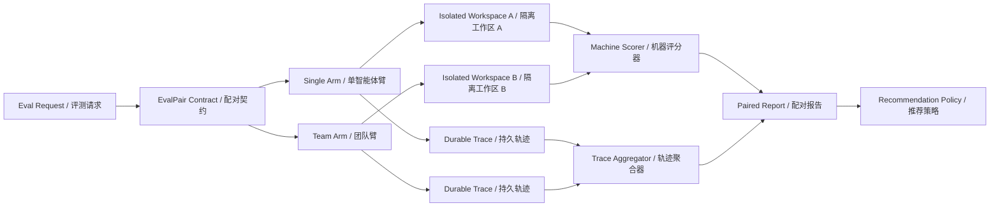
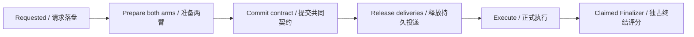

# Single vs Team 配对评测设计

> 结论：只有在同任务、同 Run 级总预算和可审计执行条件下，由同一个机器评分器检查两份隔离产物，Single 与 Team 的对照才有解释力；Live 要求同模型，Scripted 必须诚实披露不同脚本。

## 1. 要回答的问题

本纵切不预设 Team 更好，只回答：

> 对同一个 Repo Maintainer Bug，Team 相比 Single 是否带来可重复的质量或可靠性收益；如果有，额外 Token、费用、延迟和失败放大是否值得？

第一版业务只选 `repo-maintainer`。它有字节固定的初始仓库、真实测试、允许修改范围和机器准出，适合作为 Harness 对照载体。

## 2. 公平性契约

每个 `EvalPair` 固化以下不可变字段：

| 字段 | 含义 | 机械约束 |
|---|---|---|
| `case_id` / `fixture_hash` | 同一机器判分 Case 与字节固定 Fixture | 两臂 Hash 必须相同；Scorer 只信代码内置 Fixture |
| `input_hash` | `task_pack + title + brief + fixture_hash` 的规范化 Hash | 两臂完整相等，且必须与本次持久请求重新计算的值一致 |
| `model_profile` | Live：Provider、模型、端点、推理模式、采样约束、输出上限和超时；Scripted：角色脚本语义与完整脚本清单 Hash | Live 两臂完整相等且逐调用证明一致；Scripted 明示 `arm_specific_deterministic_scripts`，不冒充同模型 |
| `model_budget` | 总 Token、总费用、单次输出、重试和并发上限 | 两臂完整相等；是每臂总预算，不是每次调用预算 |
| `single_run_id` / `team_run_id` | 两次独立运行 | 工作区路径必须不同 |
| `scorer_version` | 独立机器评分规则 | 两臂使用同一版本 |
| `evidence_tier` | 证据等级 | `deterministic` 或 `live_paired` |

`Scripted Model` 没有真实采样方差，也不进入 DeepSeek 费用账本；Single、Team Assignment 与 Peer 使用不同确定性响应。共同 Profile 固化整个脚本清单 Hash，证明“比较的是哪套机制 Fixture”，而不是伪称两臂调用了同一个模型。它只能证明编排、隔离、指标重放和报告机制，不能宣称 Team 的线上质量收益。

## 3. 运行架构

配对创建本身使用可恢复的三阶段协议：

Prepare 只创建 Run、隔离工作区和触发事件，不允许进入 Mailbox；Fixture 先在同盘临时目录完整物化，再原子发布，并在契约生成前同时核对 Workspace 与 Baseline Hash。`eval.pair.committed` 是共同提交点。整个 Create 由 `eval-create:{eval_id}` Claim 串行化，只有当前 fencing token 能原子写入 `failed` 或 `committed`，因此并发请求不能形成矛盾终态。进程在任意位置退出后，确定性 Event/Run/Delivery ID 会补齐缺口而不是创建第二组 Run。GET/list 只读持久报告，只有后台 Finalizer 或显式 Drain 能持有 SQLite Claim 执行 Scorer。

`request_id` 同时区分两类失败：网络断开、提交后响应丢失等结果不确定错误继续复用原 ID，以便找回原 Pair；只有后端返回 `409 paired_eval_creation_rejected`，明确证明提交前创建已终止且原 ID 不可恢复时，前端才生成新 ID。浏览器会在 POST 前把待确认 ID 与原始 Draft 写入本地存储，刷新后仍重放原请求。不能把所有错误都换 ID，否则一次响应丢失就可能创建第二组付费 Run；也不能永远复用，否则确定失败会让重试永久卡住。

终态 Run 与有效评测是两个维度。Single/Team 失败或取消仍要生成可重放报告，保留质量、Trace 与成本证据；若 Live Pair 没有模型调用、调用 Profile 与契约不符等，则报告 `evidence_valid=false` 和具体原因，推荐固定为证据不足。失败样本不能永远停在 `running`，无效证据也不能进入 Team 晋升统计。

Repo Team 第一版使用三个阶段：

1. `inspect`：Scout 读取实现、测试与失败证据。
2. `repair`：Builder 依据公共证据修改允许文件、运行测试并记录 Diff。
3. `review`：Reviewer 独立复验测试、Diff 与允许修改范围。

Supervisor 只编排阶段和分配 Lease；每个 Worker 仍运行 canonical `AgentLoop`。阶段结果经 Kernel 晋升，最终质量仍由 Eval Scorer 独立判断。

## 4. 指标

| 维度 | 指标 | 来源 |
|---|---|---|
| 质量 | `machine_score`、测试通过、正确文件、测试未篡改 | 隔离工作区与基线 |
| 可靠性 | Run 终态、失败 Assignment、Retry、Unknown、Dead Letter | EventStore |
| 模型成本 | 实际与悲观保留 Token、估算费用、物理调用数 | Model Call Ledger |
| 工具成本 | Tool / Operation 次数 | EventStore |
| A2A 开销 | Peer Request / Response 次数 | EventStore |
| 延迟 | `run.created` 到可信终态 | Event 时间戳；仅作本机观测值 |

`spent` 与 `committed` 必须同时展示：Unknown 请求可能没有可确认的实际 Usage，但仍应悲观占用预算。

## 5. 推荐策略

评测报告与“推荐 Team”是两件事：

- 单次或 Scripted 结果：只输出 `insufficient_live_evidence`。
- 真实模型：先满足两臂契约一致、机器评分有效、无硬可靠性退化。
- 多次配对采样后，才比较成功率、质量差值及其不确定性，并检查成本/延迟上限。
- 评测缺失、重复 Trial、Schema 不匹配或 Scorer 失败时一律 fail-closed。

第一版不把经验阈值伪装成行业标准。最小 Live 门槛、可接受成本倍率和置信区间方法都作为可配置初始值，必须由真实数据调优。

## 6. 实施切片

1. `v0.8a`：共享 Repo Fixture、Repo Team TaskPack、动态 Team TaskPack 注册表。
2. `v0.8b`：EvalPair 契约、机器评分器、Trace 聚合和确定性配对报告。
3. `v0.8c`：HTTP API 与中英双语 Control Room 对照视图。
4. `v0.8d`：Prepare/Commit 恢复、完整任务 Hash、Scorer v2 防投毒、模型调用证明、唯一 Finalizer 与前端请求幂等键。
5. `v0.8e`：真实 DeepSeek 多 Trial Runner、统计摘要与 Nightly Gate。

## 7. 准出

- 同一 Pair 的两臂 Fixture Hash、完整任务 Hash 和全部预算字段相等；Live 模型配置与逐调用证明相等，Scripted 脚本清单 Hash 可复算且明确为不同角色脚本。
- 两个工作区互不污染；Scorer 不读取 Agent 自述作为事实。
- 确定性 Pair 可重放，同一 Trace 聚合两次结果一致。
- 缺失、重复、跨 Pair Run 或错误 TaskPack 失败关闭。
- API、CLI、UI 引用同一个持久 `eval_id` 和两条 Run Trace。
- `eval.pair.committed` 必须早于两臂任何初始 `mailbox.delivery.sent`；响应丢失后重试返回相同 Eval/Run ID。
- 同一 `request_id` 并发创建不能同时出现 `eval.pair.failed` 与 `eval.pair.committed`；浏览器刷新仍复用待确认请求。
- Live 终态即使零模型调用也必须持久化报告，但标记为证据无效且不可用于推荐。
- GET/list 不执行 Scorer；并发 Finalizer 只允许一份机器评分进入提交区。
- 涉及前端时提供至少一张真实桌面截图；响应式布局有实质变化时补 390px 移动端截图。

## 8. 已知边界

- 本机尚未配置 `DEEPSEEK_API_KEY`，所以 `live_paired` 仍是外部门槛。
- DeepSeek 当前调用未固定 Seed/Temperature；线上结果必须多次配对采样，不能把单次差异归因于 Team。
- 费用来自版本化价卡 Estimate，不是 Provider 发票。
- 本地墙钟延迟会受并发和机器负载影响，只能作为观测指标。
- Prepare/Commit 是共享 SQLite 上的本地可恢复协议，不是跨数据库或远程 Broker 的分布式事务；外部副作用仍不能宣称 exactly-once。
- `409 paired_eval_creation_rejected` 只表达本地 Pair 创建的确定终止，不代表第三方模型或工具副作用已被撤销。
- 浏览器为恢复响应丢失会在 `localStorage` 暂存 Pair Draft；Draft 不含 API Key，但任务文本仍可能敏感，部署到共享浏览器前应改用受保护的服务端 Request Registry。
- Finalizer Claim TTL、Live Trial 最小样本与推荐阈值都是初始值，必须用真实评测时长和方差校准。

## 9. 当前实现证据

2026-07-19 的加固版确定性 Golden Pair（通过正式浏览器 UI 创建）：

| 身份 | 值 |
|---|---|
| Eval | `eval_5d3fd7637cf2` |
| Single | `run_4d4c93dba07c`：机器评分 `100/100`，7 次模型决策、6 次工具、0 次 A2A、约 14 秒 |
| Team | `run_9e56c52a8e02`：机器评分 `100/100`，19 次模型决策、9 次工具、1 次 A2A、约 34 秒 |
| 推荐 | `insufficient_live_evidence` |

两臂均由 Scorer v2 重跑 3 个真实测试，确认内置 Fixture 与只读 Baseline 未被替换、只修改 `calculator.py`、测试目录未变化且 Diff 非空。响应丢失测试证明 Commit 后重启会释放原两臂；默认 Scripted Provider 按持久模型游标续播；两个并发 Finalizer 只执行每臂一次评分。终审前 Changed Stage 为后端 `109 passed`；关闭五条审查问题后的最终发布聚焦组为后端 `53 passed in 321.46s`、前端 `50 passed`，Ruff 与 Production Build 通过。浏览器 1280x720 的 `scrollWidth == innerWidth == 1280`，控制台 0 日志。

这组数据说明公平配对、独立判分和开销计数能工作，也直观暴露 Team 的协调成本；它不说明 Single 普遍优于 Team，更不说明 Team 在真实模型下有收益。当前推荐策略要求至少 5 次 Live Pair，但跨 Pair Campaign 聚合尚未实现，因此任何可晋升的 Team 推荐仍不可达。

## 10. 设计审查

设计审查：5/5 通过。

1. 不新增外部 Runtime 依赖；复用 EventStore、Work Claim、Model Ledger、TaskPack 与 EvalRunner。
2. 没有未经实测的性能或收益数字；Scripted 与 Live 结论严格分级。
3. 覆盖预算不一致、Fixture/Baseline/测试投毒、部分 Fixture 原子发布、Scorer 失败、Unknown、缺失/重复 Trial、Pair 创建中断与并发终态、响应丢失、零调用 Live 报告和并发 Finalizer。
4. 统计样本数、成本倍率与置信阈值均标为初始可配置值、待真实数据调优。
5. 范围限定在 Repo Maintainer 配对纵切，不宣称任意任务上的 Team 普遍优越。
